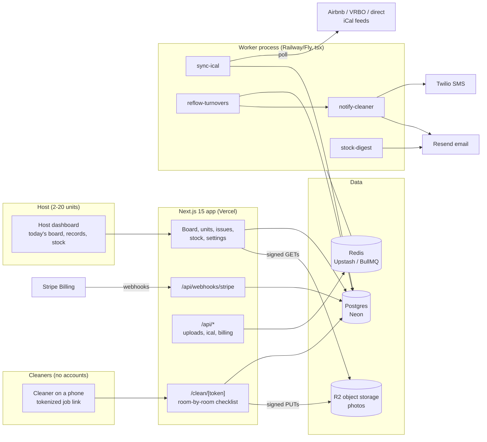

# TurnoverKit Architecture

## Stack & Rationale

| Layer | Choice | Why |
|---|---|---|
| Web app + API | **Next.js 15 (App Router) + TypeScript** | One deployable for the host dashboard, the cleaner's tokenized job pages (public token-keyed routes), marketing pages, and webhooks. |
| Database | **Postgres (Neon) + Drizzle ORM** | Relational domain (hosts -> units -> stays -> turnovers -> room checks -> photos; issues; stock counts). Drizzle typed schema-as-code; drizzle-kit migrations; Neon branches for previews. |
| Queue / workers | **BullMQ on Redis (Upstash), workers as standalone `tsx` processes** | iCal polling, turnover re-flow, cleaner notifications, and low-stock digests are recurring background work with retries and per-feed pacing -- a real queue, not cron-in-a-route. Workers share `src/db` and `src/lib` with the app. |
| Payments | **Stripe Billing** | Three subscription tiers by unit count; hosted checkout + customer portal; webhooks drive plan state. No money moves between hosts and cleaners in v1. |
| Object storage | **Cloudflare R2 (S3 API)** | Verification photos, damage evidence, unit reference photos. Client-side compression, signed PUTs, signed GETs only. |
| Email + SMS | **Resend (email) + Twilio (SMS)** | Cleaner job notifications (SMS-first -- cleaners live in texts), host alerts, low-stock digests. Per-cleaner SMS consent + STOP handling. |
| Auth | **Auth.js (NextAuth v5)** for hosts; **signed job tokens (jose)** for cleaners | Hosts are real accounts. Cleaners get signed, revocable, expiring job links -- no app install, no password, ever. |
| Styling | **Tailwind CSS v4** | Token-driven implementation of DESIGN.md. |

## System Diagram

## Data Model

All tables keyed by `id` (uuid), timestamps `created_at` / `updated_at` implied. Multi-tenancy: everything hangs off `host_id` (directly or through `units`).

- **hosts** -- tenant root. `name`, `email`, `plan` (solo|host|operator), `stripe_customer_id`, `stripe_subscription_id`, `trial_ends_at`, `timezone`, `settings` (jsonb: default working window, notification prefs).
- **users** -- host-side logins (a hosting couple, a co-host). `host_id`, `email`, `name`, `role` (owner|manager). Auth.js tables alongside.
- **units** -- the doors. `host_id`, `name` ("Cedar A-Frame"), `address`, `access_notes`, `checkin_time`, `checkout_time`, `default_cleaner_id`, `checklist_template_id`, `status` (active|paused), `cover_photo_key`.
- **ical_feeds** -- per-unit calendar sources. `unit_id`, `url`, `source` (airbnb|vrbo|direct|other), `last_synced_at`, `last_hash`, `status` (ok|error), `error_note`.
- **stays** -- normalized bookings from feeds. `unit_id`, `feed_id`, `external_uid` (iCal UID, unique per feed), `starts_on`, `ends_on`, `status` (active|cancelled), `raw_summary`. Idempotency key: `(feed_id, external_uid)`.
- **cleaners** -- host's own crew. `host_id`, `name`, `phone`, `email`, `sms_opt_in`, `sms_opted_out_at`, `notes`, `status` (active|inactive).
- **turnovers** -- the core object: one checkout-to-checkin gap. `unit_id`, `departing_stay_id`, `arriving_stay_id` (nullable -- open gap), `cleaner_id`, `window_starts_at`, `window_ends_at` (next check-in), `status` (scheduled|in_progress|verified|blocked|cancelled), `job_token_hash`, `started_at`, `completed_at`, `verified_photo_count`.
- **checklist_templates** -- per unit type. `host_id`, `name` ("2BR cabin"), `rooms` (jsonb: ordered list of `{key, label, tasks[], required_photos}`).
- **room_checks** -- one per room per turnover. `turnover_id`, `room_key`, `label`, `tasks_done` (jsonb), `required_photos`, `status` (pending|done), `completed_at`.
- **photos** -- verification and evidence. `turnover_id` (nullable), `room_check_id` (nullable), `issue_id` (nullable), `unit_id`, `storage_key`, `taken_by` (cleaner_id|user_id), `kind` (verification|damage|lost_item|reference), `taken_at`.
- **issues** -- damage / lost item / maintenance log. `unit_id`, `turnover_id` (nullable), `kind` (damage|lost_item|maintenance), `title`, `body`, `filed_by` (cleaner_id|user_id), `status` (open|resolved), `resolved_at`. Photos attach via `photos.issue_id`. Append-only edits: corrections add entries, evidence is never rewritten.
- **stock_items** -- consumables per unit. `unit_id`, `name` ("Toilet paper"), `unit_label` ("rolls"), `par_level`, `current_count`, `last_counted_at`, `low_since` (nullable).
- **stock_counts** -- count events. `stock_item_id`, `turnover_id` (nullable), `count`, `counted_by` (cleaner_id|user_id), `counted_at`.
- **notifications** -- per-recipient outcome. `host_id`, `cleaner_id` (nullable), `user_id` (nullable), `channel` (sms|email), `kind` (job_assigned|job_changed|low_stock|turnover_blocked|digest), `provider_message_id`, `status` (queued|sent|delivered|failed|opted_out), `occurred_at`.
- **webhook_events** -- Stripe idempotency ledger. `provider` (stripe), `external_id` (unique), `type`, `payload` (jsonb), `processed_at`.
- **audit_log** -- `host_id`, `actor` (user_id|cleaner_id|system), `action`, `target`, `metadata` (jsonb). Token mints/revokes, issue edits, and plan changes always logged.

## Key Flows

### 1. iCal sync -> turnover auto-scheduling

1. Host pastes each unit's iCal URL(s). The `sync-ical` worker polls every feed on a 15-minute repeatable job, per-feed jittered so providers see steady traffic.
2. Each poll parses VEVENTs into normalized stays, upserted by `(feed_id, external_uid)`. A feed-content hash short-circuits unchanged feeds. Feed failures mark `ical_feeds.status = error` and surface on the unit ("calendar unreachable since 2:10pm") -- never silently stale.
3. A stay diff (new / moved / cancelled) enqueues `reflow-turnovers` for the unit: every checkout gets a turnover whose window runs checkout-time to the next check-in (or the host's default window for open gaps). Existing turnovers are moved, not recreated -- assignments and any in-progress work survive a shifted booking.
4. Re-flow assigns the unit's default cleaner, mints the job token, and enqueues `notify-cleaner` (`job_assigned` or `job_changed` with old vs new window). Same-day changes escalate to SMS regardless of channel preference.
5. Collision detection: two turnovers for one cleaner with overlapping windows flag both on the host board ("Maria has 2 turnovers 11am-3pm Sat") -- the host resolves; the system never silently double-books.

### 2. The photo-verified checklist (cleaner on a phone)

1. Cleaner taps the SMS link -> `/clean/[token]`: unit name, access notes, window, and the room list. No install, no login.
2. Tapping "Start" stamps `started_at` and flips the board tile to IN PROGRESS.
3. Each room is a card: task list plus a photo requirement ("2 photos required"). Photos are compressed client-side and uploaded via signed PUTs; a room cannot be marked done below its photo count -- the gate is structural, not honor-system.
4. Progress persists server-side per room; a dropped connection or closed tab resumes exactly where the cleaner left off.
5. Filing a problem mid-clean (damage, lost item, broken fixture) takes two taps from any room card and never blocks checklist progress; it creates an `issues` row with photos attached.
6. Last room done -> end-of-job screen: stock counts for the unit's tracked items (par-level items pre-listed, one tap per count), then "Finish". `completed_at` stamps, status flips to `verified`, and the immutable turnover record is assembled.

### 3. The turnover record (the artifact)

1. A completed turnover page shows: photo strip by room, checklist state, start/finish times, cleaner, stock counts, and any issues filed -- the "photographed clean" proof.
2. Records are immutable after completion; host annotations append, never edit.
3. Host can export a record (or an issue with its photos) as a PDF for a platform damage claim or an owner-client report (Operator tier).

### 4. Restock loop

1. Stock counts land with each turnover (flow 2). A count at or below `par_level` sets `low_since` and enqueues a host alert -- immediate for zero, else batched into the daily `stock-digest` ("Cedar A-Frame: TP 2 rolls (par 6), coffee low").
2. Host marks items restocked from the unit's stock screen (or the digest email's deep link); `current_count` resets and `low_since` clears.
3. Restock history per unit reveals burn rates -- the growth-phase feature (auto par suggestions) hangs off this data.

### 5. Billing

1. Trial starts on signup (14 days, no card). Adding unit N+1 beyond plan limit prompts upgrade -- never blocks silently mid-trial.
2. Stripe hosted checkout for the three tiers; the customer portal handles card changes and cancellation.
3. Webhooks (`checkout.session.completed`, `customer.subscription.updated|deleted`, `invoice.payment_failed`): **verify signature -> insert `webhook_events` by Stripe event id (duplicate = ack and stop) -> enqueue `process-stripe-event` -> ack 200 fast.** The worker updates `hosts.plan` idempotently; failed payments get a grace period, then read-only mode (records remain visible -- evidence is never held hostage).

## Queue & Worker Jobs

| Job | Trigger | Behavior |
|---|---|---|
| `sync-ical` | Repeatable, every 15 min per feed (jittered) | Fetch, hash-compare, parse, upsert stays; diff -> enqueue `reflow-turnovers`. Retries 3x exponential; persistent failure marks the feed errored. |
| `reflow-turnovers` | Stay diff; unit/template edits | Recompute the unit's turnover set idempotently; move-not-recreate; collision flags; enqueue notifications. |
| `notify-cleaner` | Assignment/changes; same-day escalation | SMS via Twilio (opt-in enforced, STOP honored), email fallback; writes `notifications` row per send. |
| `stock-digest` | Daily per host, host-local morning | Aggregate low-stock items across units into one email; zero-count items escalate immediately instead. |
| `process-stripe-event` | Stripe webhook ack | Apply plan/subscription state from the persisted event; idempotent by event id. |
| `export-record-pdf` | Host request | Render turnover record / issue evidence PDF, store to R2, email signed link. |

Dead-letter queue + Sentry on repeated failure; graceful shutdown drains active jobs.

## Third-Party Services & Rough Pricing

| Service | Role | Rough cost |
|---|---|---|
| Neon (Postgres) | Primary DB | Free tier -> ~$19/mo |
| Upstash (Redis) | BullMQ | Free tier -> ~$10/mo |
| Cloudflare R2 | Photos | $0.015/GB-mo, zero egress; a 10-unit host generates ~1-2 GB/yr compressed |
| Stripe Billing | Subscriptions | 2.9% + 30c |
| Resend | Alerts, digests | Free 3k/mo -> $20/mo |
| Twilio | Cleaner SMS | ~$0.0079/SMS + ~$1.15/mo per number; ~10-20 SMS per host-week |
| Vercel | Hosting | Hobby free -> Pro $20/mo |
| Railway/Fly | Worker process | ~$5-10/mo |
| Sentry | Errors (sync + notify paths especially) | Free tier -> ~$26/mo |

## Estimated Monthly Running Cost

| Scale | Assumptions | Estimate |
|---|---|---|
| **0 customers (dev/preview)** | Free tiers + one Twilio number | **~$5-15/mo** |
| **300 hosts** | ~$10k MRR. ~2,500 feeds polled, ~60k SMS/mo, ~400 GB R2 | Neon $19 + Upstash $10 + Vercel $20 + worker $10 + Resend $20 + Twilio ~$500 + R2 ~$6 + Sentry $26 = **~$600/mo** (~6% of revenue; SMS dominates -- push email-first prefs) |
| **1,500 hosts** | ~$50k MRR | Infra ~$300 + Twilio ~$2,200 + Resend $90 = **~$2,600/mo** (~5% of revenue) |
