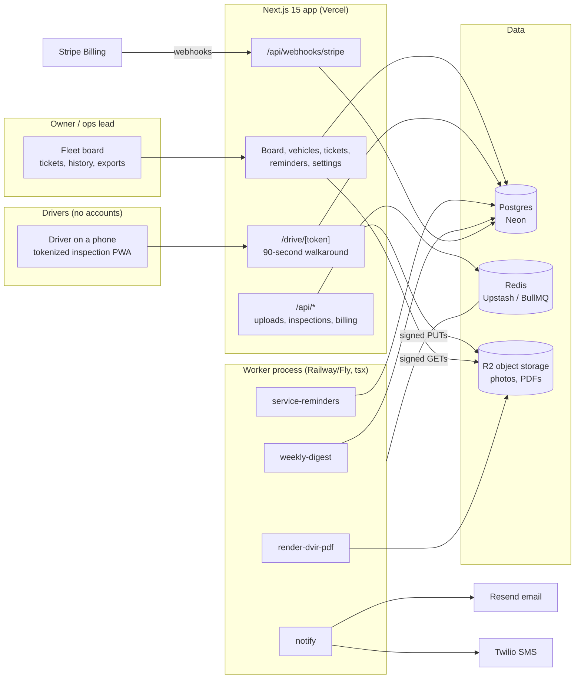

# FleetSnap Architecture

## Stack & Rationale

| Layer | Choice | Why |
|---|---|---|
| Web app + API | **Next.js 15 (App Router) + TypeScript** | One deployable for the office dashboard, the driver's tokenized inspection PWA (public token-keyed routes), marketing pages, and webhooks. |
| PWA | **Web manifest + service worker + IndexedDB drafts** | The driver surface installs to the home screen and tolerates dead zones: inspection drafts persist locally and sync when coverage returns. No app store, no native build -- the PWA is the app. |
| Database | **Postgres (Neon) + Drizzle ORM** | Relational domain (fleets -> vehicles -> inspections -> items -> defects -> work orders -> service history). Drizzle typed schema-as-code; drizzle-kit migrations; Neon branches for previews. |
| Queue / workers | **BullMQ on Redis (Upstash), workers as standalone `tsx` processes** | Reminder computation, notification fan-out, PDF rendering, and weekly compliance emails are recurring background work with retries -- a real queue, not cron-in-a-route. Workers share `src/db` and `src/lib` with the app. |
| Payments | **Stripe Billing** | Three flat subscription tiers by fleet size; hosted checkout + customer portal; webhooks drive plan state. |
| Object storage | **Cloudflare R2 (S3 API)** | Defect and inspection photos, vehicle photos, generated DVIR PDFs. Client-side compression, signed PUTs, signed GETs only. |
| Email + SMS | **Resend (email) + Twilio (SMS)** | Driver inspection links and out-of-service alerts by SMS (drivers live in texts); office notifications, weekly service digests, and compliance reports by email. Per-driver SMS consent + STOP handling. |
| Auth | **Auth.js (NextAuth v5)** for office users; **signed driver tokens (jose)** for drivers | Office logins are real accounts with roles. Drivers get signed, revocable, long-lived driver links -- no app install, no password, ever. |
| PDF | **pdf-lib** | FMCSA-format DVIR exports, per-vehicle service history packets. |
| Styling | **Tailwind CSS v4** | Token-driven implementation of DESIGN.md. |

## System Diagram

## Data Model

All tables keyed by `id` (uuid), timestamps `created_at` / `updated_at` implied. Multi-tenancy: everything hangs off `fleet_id` (directly or through `vehicles`).

- **fleets** -- tenant root. `name`, `plan` (crew|fleet|depot), `stripe_customer_id`, `stripe_subscription_id`, `trial_ends_at`, `timezone`, `settings` (jsonb: critical-defect item keys, digest day, yard names).
- **users** -- office logins. `fleet_id`, `email`, `name`, `role` (owner|dispatcher). Auth.js tables alongside.
- **drivers** -- the crew. `fleet_id`, `name`, `phone`, `sms_opt_in`, `sms_opted_out_at`, `driver_token_hash`, `status` (active|inactive).
- **vehicles** -- the assets. `fleet_id`, `unit_number` ("T-12"), `vin`, `plate`, `vehicle_class` (truck|van|trailer|equipment), `yard` (nullable), `status` (active|in_shop|out_of_service|retired), `photo_key`, `current_odometer`, `odometer_updated_at`.
- **inspection_templates** -- per vehicle class. `fleet_id`, `name` ("FMCSA standard -- truck"), `vehicle_class`, `groups` (jsonb: ordered `{key, label, items: [{key, label, critical}]}`), `is_default`.
- **inspections** -- one walkaround. `vehicle_id`, `driver_id`, `template_id`, `kind` (pre_trip|post_trip), `status` (draft|submitted), `odometer`, `started_at`, `submitted_at`, `duration_seconds`, `signature_name`, `defect_count`, `location` (jsonb, coarse lat/lng, transparent to the fleet).
- **inspection_items** -- one row per template item per inspection. `inspection_id`, `group_key`, `item_key`, `label`, `result` (pass|fail|na), `note`, `critical` (bool, denormalized from template at submit time).
- **defects** -- failed items promoted to record. `inspection_item_id` (unique -- one defect per failed item), `vehicle_id`, `reported_by_driver_id`, `severity` (critical|normal), `status` (open|ticketed|resolved), `resolved_at`.
- **work_orders** -- maintenance tickets. `vehicle_id`, `fleet_id`, `number` (yearly sequence, "2026-041"), `title`, `source` (defect|reminder|manual), `defect_id` (nullable), `service_reminder_id` (nullable), `status` (open|scheduled|in_shop|resolved), `vendor_note`, `cost_cents` (nullable), `odometer_at_service`, `scheduled_for`, `resolved_at`.
- **service_entries** -- the per-vehicle timeline. `vehicle_id`, `work_order_id` (nullable -- quick-logged services allowed), `kind` (oil|tires|brakes|repair|other), `summary`, `cost_cents`, `odometer`, `performed_on`.
- **service_reminders** -- recurring rules. `vehicle_id`, `name` ("Oil change"), `interval_miles` (nullable), `interval_days` (nullable), `last_done_odometer`, `last_done_on`, `next_due_odometer` (computed), `next_due_on` (computed), `status` (ok|due|overdue), `snoozed_until`.
- **photos** -- evidence. `fleet_id`, `vehicle_id`, `inspection_item_id` (nullable), `defect_id` (nullable), `work_order_id` (nullable), `storage_key`, `taken_by` ("driver:<id>"|"user:<id>"), `taken_at`.
- **notifications** -- per-recipient outcome. `fleet_id`, `driver_id` (nullable), `user_id` (nullable), `channel` (sms|email), `kind` (inspection_link|oos_alert|ticket_opened|service_due|digest), `provider_message_id`, `status` (queued|sent|delivered|failed|opted_out), `occurred_at`.
- **webhook_events** -- Stripe idempotency ledger. `provider`, `external_id` (unique), `type`, `payload` (jsonb), `processed_at`.
- **audit_log** -- `fleet_id`, `actor` (user_id|driver_id|system), `action`, `target`, `metadata` (jsonb). Out-of-service flips, ticket closures, template edits, and token mints always logged -- inspection records answer to auditors.

## Key Flows

### 1. The 90-second pre-trip (driver on a phone)

1. Driver taps their standing SMS link -> `/drive/[token]`: their assigned (or chosen) vehicle, then the template's item groups one screen at a time -- walkaround, engine bay, in-cab. No install, no login.
2. Every item defaults to pass on tap; fail flips the item open for a required photo (client-compressed, signed PUT) and an optional note. NA is one tap. The stopwatch runs quietly in the header -- the product's honesty metric.
3. Odometer entry is the single typed field, sanity-checked against the vehicle's last reading (a 90,000 -> 9,000 typo is caught inline, not in the office).
4. Signature (typed name, statutory attestation line) -> submit. Offline: the draft persists in IndexedDB and syncs when coverage returns, with an explicit "synced" confirmation -- never a silent drop.
5. Submission writes `inspections` + `inspection_items` transactionally, stamps `duration_seconds`, and enqueues defect processing.

### 2. Defect -> ticket automation

1. Each failed item creates a `defects` row (unique per item). Severity comes from the template's `critical` flag (brakes, steering, lights, tires ship critical in the default template).
2. Critical defects flip the vehicle `out_of_service` immediately and enqueue an SMS+email alert to the office -- before the driver leaves the yard. Normal defects open quietly.
3. Every defect auto-opens a `work_orders` ticket (source: defect) carrying the photo, item, vehicle, driver, and inspection reference. The office board shows it in the same beat.
4. Resolving the ticket closes the loop: the defect resolves, a `service_entries` row lands on the vehicle timeline, and -- if the vehicle was out of service -- the office explicitly returns it to `active` (never automatic; a human certifies roadworthiness, mirroring the DVIR mechanic-certification line).

### 3. Odometer-based service reminders

1. Every submitted inspection updates `vehicles.current_odometer` -- inspections are the odometer feed; no telematics needed.
2. The nightly `service-reminders` job recomputes `next_due_odometer` / `next_due_on` per rule and flips statuses (ok -> due at 90% of interval, overdue past it).
3. Due/overdue reminders surface on the fleet board tile and in the weekly digest; one tap converts a reminder into a scheduled work order (source: reminder).
4. Completing that work order (with odometer) resets the rule's baseline -- the cycle is closed-loop, not a nag list.

### 4. Compliance export (the audit answer)

1. Office picks a vehicle (or the fleet) and a date range; `render-dvir-pdf` assembles FMCSA-format DVIRs -- vehicle, driver, date, items with results, defects with photos referenced, driver signature, and the mechanic-certification line from ticket resolutions.
2. The PDF renders in the worker (pdf-lib), stores to R2, and emails a signed link; large ranges paginate per vehicle-month.
3. Exports are reproducible: the same range always renders the same records (inspections are immutable after submission; corrections are new records referencing the old).

### 5. Billing

1. Trial starts on signup (14 days, no card). Adding vehicle N+1 beyond plan limit prompts upgrade -- never blocks silently mid-trial.
2. Stripe hosted checkout for the three flat tiers; the customer portal handles card changes and cancellation.
3. Webhooks (`checkout.session.completed`, `customer.subscription.updated|deleted`, `invoice.payment_failed`): **verify signature -> insert `webhook_events` by Stripe event id (duplicate = ack and stop) -> enqueue `process-stripe-event` -> ack 200 fast.** The worker updates `fleets.plan` idempotently; failed payments get a grace period, then read-only mode (records remain exportable -- compliance evidence is never held hostage).

## Queue & Worker Jobs

| Job | Trigger | Behavior |
|---|---|---|
| `process-inspection` | Inspection submitted | Promote failed items to defects, apply critical/OOS rules, open work orders, enqueue notifications. Idempotent per inspection id. |
| `notify` | Defects, OOS flips, ticket events, links | SMS via Twilio (opt-in enforced, STOP honored), email via Resend; writes `notifications` row per send. |
| `service-reminders` | Nightly per fleet, fleet-local time | Recompute due/overdue from odometer + calendar; enqueue due alerts; idempotent recompute. |
| `render-dvir-pdf` | Office request | Assemble FMCSA-format PDF, store to R2, email signed link. |
| `weekly-digest` | Weekly per fleet | Open tickets, due services, inspection compliance rate ("41 of 44 pre-trips completed") in one email. |
| `process-stripe-event` | Stripe webhook ack | Apply plan/subscription state from the persisted event; idempotent by event id. |

Dead-letter queue + Sentry on repeated failure; graceful shutdown drains active jobs.

## Third-Party Services & Rough Pricing

| Service | Role | Rough cost |
|---|---|---|
| Neon (Postgres) | Primary DB | Free tier -> ~$19/mo |
| Upstash (Redis) | BullMQ | Free tier -> ~$10/mo |
| Cloudflare R2 | Photos, PDFs | $0.015/GB-mo, zero egress; a 20-vehicle fleet generates ~1-2 GB/yr compressed |
| Stripe Billing | Subscriptions | 2.9% + 30c |
| Resend | Alerts, digests, exports | Free 3k/mo -> $20/mo |
| Twilio | Driver SMS | ~$0.0079/SMS + ~$1.15/mo per number; ~5-15 SMS per fleet-week |
| Vercel | Hosting | Hobby free -> Pro $20/mo |
| Railway/Fly | Worker process | ~$5-10/mo |
| Sentry | Errors (submission + webhook paths especially) | Free tier -> ~$26/mo |

## Estimated Monthly Running Cost

| Scale | Assumptions | Estimate |
|---|---|---|
| **0 customers (dev/preview)** | Free tiers + one Twilio number | **~$5-15/mo** |
| **100 fleets** | ~$17k MRR. ~90k inspections/mo, ~20k SMS/mo, ~150 GB R2 | Neon $19 + Upstash $10 + Vercel $20 + worker $10 + Resend $20 + Twilio ~$170 + R2 ~$3 + Sentry $26 = **~$280/mo** (~2% of revenue) |
| **400 fleets** | ~$70k MRR | Infra ~$250 + Twilio ~$700 + Resend $90 = **~$1,000-1,100/mo** (~1.5% of revenue) |
