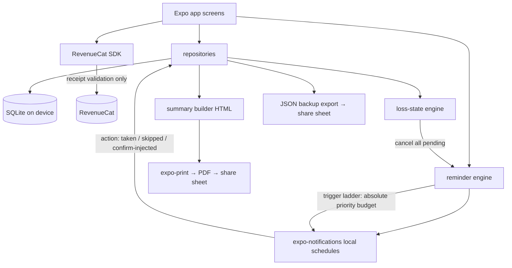

# StimTrack — Architecture

## Stack

| Layer | Choice | Rationale |
|---|---|---|
| App framework | Expo SDK 52 (React Native 0.76, TypeScript, expo-router) | Repo default for mobile; single codebase iOS-first, Android later |
| Local data | expo-sqlite (SQLite on device) | The product promise — treatment data on device, offline-always, queryable; architecturally immune to the incumbent's server-side data-loss failure |
| State | React state + a thin repository layer over SQLite | Simple, testable; screens call repositories directly — no store library at this size |
| Reminders | expo-notifications (local only) | Med schedules and the trigger ladder are pre-registered local notifications; no server, no push infrastructure, nothing to be down at T−1h |
| Purchases | react-native-purchases (RevenueCat) | Repo default; Cycle Pass (non-consumable window) + monthly + annual w/ trial, local entitlement cache |
| Charts | react-native-svg (hand-rolled marks) | E2/follicle progression charts under full redline control; no heavy chart lib |
| Cycle summary PDF | expo-print (HTML → PDF on device) + expo-sharing | The summary renders locally; nothing uploaded anywhere |
| Backup | JSON export via expo-file-system + expo-sharing (v1 plaintext; restore + AES encryption are ROADMAP Phase 2) | User-controlled backup file; no cloud of ours |
| Haptics | expo-haptics | Confirm-loop and countdown acknowledgments are felt, not just seen |
| Fonts | expo-font, self-hosted ttf in `assets/fonts` | Fonts must actually load (craft rule) |

**There is no backend.** No accounts, no API, no sync service, no analytics SDK, no crash-reporting SDK that exfiltrates content. The only network traffic is App Store/Play billing and RevenueCat receipt validation. This is a product feature (README differentiation #1 — the app cannot lose your cycle to someone else's outage) and a cost feature (infrastructure ≈ $0). Cross-device sync is deliberately out of scope for MVP (see non-goals); the backup file covers phone migration.

## System diagram



## Data model (SQLite)

```sql
-- A treatment cycle: the root object everything hangs off
cycle (id TEXT PK, kind TEXT CHECK(kind IN
  ('ivf_fresh','ivf_freeze_all','egg_freezing','fet','iui','other')),
  label TEXT,                        -- "IVF #2", "Egg freezing — CCRM"
  clinic TEXT,
  status TEXT CHECK(status IN
  ('planning','stimming','trigger','retrieval','transfer','waiting','ended')),
  start_date TEXT,                   -- YYYY-MM-DD
  ended_at TEXT,
  ended_reason TEXT CHECK(ended_reason IN
  ('completed','cancelled','no_fertilization','no_transfer','transfer_failed',
   'pregnancy_ended','converted','other') OR ended_reason IS NULL),
  -- loss-aware: ended_reason drives register/copy; silenced_at proves reminders stopped
  silenced_at TEXT, created_at TEXT);

-- Day-indexed protocol events: the calendar's rows (user-entered from clinic orders)
protocol_event (id TEXT PK, cycle_id TEXT REFS cycle, date TEXT,
  kind TEXT CHECK(kind IN
  ('baseline','stim_start','monitoring','trigger','retrieval','transfer',
   'freeze','beta','consult','instruction','other')),
  time TEXT,                         -- HH:MM, minute-exact for 'trigger'
  title TEXT, note TEXT, done INTEGER DEFAULT 0);

-- Medications: bundled library rows are seeded; custom allowed
medication (id TEXT PK, name TEXT, kind TEXT CHECK(kind IN
  ('injection','oral','patch','suppository','gel','other')),
  is_custom INTEGER DEFAULT 0, ref_slug TEXT);  -- links to bundled med reference card

-- A med as prescribed within a cycle; dose changes close a row and open the next
prescription (id TEXT PK, cycle_id TEXT REFS cycle,
  medication_id TEXT REFS medication,
  dose TEXT, route TEXT,
  schedule_json TEXT,                -- {"times":["09:00","21:00"],"days":"daily"}
  is_trigger INTEGER DEFAULT 0,      -- exactly one active trigger prescription per cycle
  trigger_at TEXT,                   -- ISO datetime, minute-exact (trigger only)
  start_date TEXT, end_date TEXT, created_at TEXT);

-- Every scheduled dose's outcome; the trigger row requires confirm-loop semantics
dose_log (id TEXT PK, prescription_id TEXT REFS prescription, due_at TEXT,
  status TEXT CHECK(status IN ('taken','skipped','confirmed_injected')),
  logged_at TEXT);                   -- trigger completion = status 'confirmed_injected'

-- Monitoring appointments: scans and bloodwork in one dated record
scan (id TEXT PK, cycle_id TEXT REFS cycle, date TEXT,
  e2 REAL, lh REAL, p4 REAL,         -- units stored per-field below
  e2_unit TEXT DEFAULT 'pg/mL', lh_unit TEXT DEFAULT 'mIU/mL', p4_unit TEXT DEFAULT 'ng/mL',
  lining_mm REAL,
  follicles_json TEXT,               -- {"left":[18,16,12],"right":[17,11]} sizes in mm
  note TEXT);

-- Storage: the multi-year object that outlives cycles
storage_item (id TEXT PK, cycle_id TEXT REFS cycle,
  kind TEXT CHECK(kind IN ('eggs','embryos','sperm','other')),
  count INTEGER, facility TEXT, stored_since TEXT,
  annual_fee_cents INTEGER, currency TEXT DEFAULT 'USD',
  renewal_date TEXT,                 -- drives 30-day and 7-day local reminders
  status TEXT CHECK(status IN ('stored','thawed','transferred','discarded','moved')),
  note TEXT);

-- Appointment prep questions, written any hour, surfaced at the right one
prep_note (id TEXT PK, cycle_id TEXT REFS cycle,
  protocol_event_id TEXT REFS protocol_event, text TEXT,
  resolved INTEGER DEFAULT 0, created_at TEXT);

settings (key TEXT PK, value TEXT);  -- reminder defaults, quiet hours, onboarding state, entitlement cache
```

Key derived views (computed in repositories, not stored): cycle-day number (days since `stim_start`), per-cycle E2/lead-follicle progression series, dose-change markers (prescription boundaries), storage annual-cost totals across facilities, cycle-comparison table (aligned by cycle day), and the reminder queue (next N notifications across prescriptions, trigger ladder, and storage renewals).

## Key flows

1. **Protocol calendar entry.** Onboarding (or a mid-cycle edit) captures the clinic's calendar as `protocol_event` rows and prescriptions. Everything is user-entered and editable in place — clinics change doses and dates after every monitoring visit, so editing is a first-class daily action, never buried. The calendar renders as a day-indexed timeline with cycle-day numbers.
2. **Reminder scheduling (budgeted).** The reminder engine compiles the next local notifications from all active prescriptions + storage renewals, nearest-first, within the iOS 64-pending limit, and re-registers on every app open and every dose log. The trigger ladder is budgeted first, always. Notification actions "Taken"/"Skipped" write `dose_log` without opening the app.
3. **The trigger shot (the signature flow).** Setting `trigger_at` registers the full ladder: T−24h, T−4h, T−1h, T−15m, T−0, then repeats every 5 minutes until a `confirmed_injected` dose_log exists (bounded repetition within the notification budget, re-armed on any app wake). Opening the app inside T−24h shows the full-screen countdown (DESIGN.md signature). Confirmation requires a deliberate press-and-hold, writes the timestamped log, cancels the ladder, and stands down the app's raised voice. Quiet hours never apply to the ladder.
4. **Monitoring day.** One entry screen per appointment: E2/LH/P4, follicle sizes per ovary (fast numeric entry), lining. Charts update immediately; the dose-change editor is one tap away because monitoring is when clinics change doses.
5. **Loss-aware ending.** "End this cycle" (always visible in cycle settings, free forever) asks only what happened (typed `ended_reason`), then: cancels every pending notification for the cycle in one transaction (`silenced_at` recorded), switches all copy to the neutral register, archives the cycle out of Today, and offers export. No confirmation guilt-tripping, no re-engagement prompts, no data deleted without a separate explicit action. Starting a later cycle carries nothing over except what the user chooses (meds list, clinic).
6. **Cycle summary.** Summary builder assembles a one-page HTML document: protocol timeline, prescriptions with dose-change history, scan table with E2/follicle chart, outcomes (retrieval counts, fertilization, transfer/freeze, storage). `expo-print` renders the PDF → system share sheet. Typeset per DESIGN.md — this artifact is the brand in a consult room.
7. **Storage lifecycle.** Retrieval outcome prompts storage entry; each `storage_item` schedules 30-day and 7-day renewal reminders annually. The storage screen totals annual costs across facilities and records thaw/move/discard decisions as status changes — the multi-year surface that keeps the app installed between cycles.
8. **Paywall.** RevenueCat offering fetched at gate touchpoints; entitlement cached in `settings` so lapses in connectivity (or a RevenueCat outage) never lock a paying user out mid-cycle. Cycle Pass maps to a 90-day entitlement window validated locally.

## Third-party services & running costs

| Service | Purpose | Cost at 1k / 10k users |
|---|---|---|
| RevenueCat | Entitlements, paywall experiments | Free < $2.5k MTR, then ~1% |
| Apple/Google developer accounts | Distribution | $99/yr + $25 once |
| CDN or none | Reference cards ship bundled in-app | $0 |
| **Total infra** | | **≈ $0/mo — no servers, no databases, no analytics** |

## Non-goals (MVP)

- **No protocol or dosing intelligence, ever.** The app never computes a calendar from a protocol name, never suggests a dose, never predicts a retrieval date or outcome. User-entered clinic instructions are the only source of truth. This is the regulatory line and it is architectural.
- No cloud sync / multi-device / partner sharing (would break the no-server promise; partner view is a Phase 3 question only with E2E encryption and explicit demand — the backup file covers phone migration).
- No clinic/EMR/portal integrations (B2B sales cycle, PHI exposure, and a dependency on exactly the systems patients complain about).
- No community/social features, no chat, no AI assistant. The app is an instrument, not a feed.
- No conception prediction, ovulation algorithms, or TTC content — that is the saturated side of the category and irrelevant inside a medicated cycle.
- Android ships after iOS (same codebase; Phase 3).
