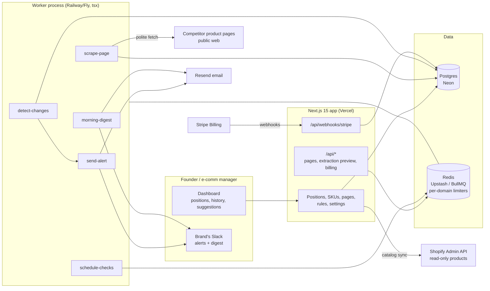

# PriceProbe Architecture

## Stack & Rationale

| Layer | Choice | Why |
|---|---|---|
| Web app + API | **Next.js 15 (App Router) + TypeScript** | One deployable for the dashboard, marketing pages, and webhooks. |
| Database | **Postgres (Neon) + Drizzle ORM** | Relational domain (brands -> products -> competitor pages -> snapshots -> change events -> alerts -> suggestions). Snapshots are append-only time series; Postgres handles this scale (millions of rows) comfortably with the right indexes. Drizzle typed schema-as-code; drizzle-kit migrations. |
| Queue / workers | **BullMQ on Redis (Upstash), workers as standalone `tsx` processes** | Scraping is the product's engine: a scheduler plans checks, per-domain limiter groups pace fetches politely, retries and failure states are first-class. A real queue with rate limiting, not cron-in-a-route. Workers share `src/db` and `src/lib` with the app. |
| Scrape fetching | **Plain HTTPS fetch + cheerio parsing; structured data first** | JSON-LD/OpenGraph/microdata survive redesigns and cover most commerce platforms; per-domain CSS selector fallbacks fill the rest. No headless browser in v1 (cost + arms-race posture); a Playwright pool is the documented growth-phase escape hatch for JS-only pages. |
| Payments | **Stripe Billing** | Three subscription tiers by tracked SKUs; hosted checkout + customer portal; webhooks drive plan state. |
| Email + Slack | **Resend (email) + Slack incoming webhooks** | Alerts and the morning digest. Slack via per-brand incoming-webhook URL (no OAuth app in v1 -- paste the URL, post JSON). |
| Auth | **Auth.js (NextAuth v5)** | Real accounts; brands are workspaces with unlimited users. |
| Shopify (read-only) | **Admin API, products scope only** | Optional own-catalog sync so "your price" stays current without CSV re-uploads. Read-only by architecture -- PriceProbe never writes to a store. |
| Styling | **Tailwind CSS v4** | Token-driven implementation of DESIGN.md. |

## System Diagram

## Data Model

All tables keyed by `id` (uuid), timestamps `created_at` / `updated_at` implied. Multi-tenancy: everything hangs off `brand_id` (directly or through `products`).

- **brands** -- tenant root. `name`, `plan` (watch|desk|floor), `stripe_customer_id`, `stripe_subscription_id`, `trial_ends_at`, `timezone`, `slack_webhook_url` (nullable), `settings` (jsonb: digest hour, noise threshold pct, currency).
- **users** -- logins. `brand_id`, `email`, `name`, `role` (owner|member). Auth.js tables alongside.
- **products** -- the brand's own SKUs. `brand_id`, `name`, `sku_code`, `your_price_cents`, `cost_floor_cents` (nullable), `currency`, `product_url`, `shopify_product_id` (nullable), `flagged` (bool -- hourly checks on Floor), `status` (active|archived).
- **scrape_domains** -- per-domain politeness state, shared across brands. `domain` (unique), `min_interval_seconds` (default 900), `robots_state` (jsonb: fetched_at, disallows), `consecutive_failures`, `blocked_until` (nullable), `selector_pack` (jsonb: price/stock CSS fallbacks maintained per domain).
- **competitor_pages** -- tracked URLs. `product_id`, `brand_id`, `url`, `domain` (FK -> scrape_domains.domain), `label` ("REI"), `extraction_method` (structured|selector|manual), `last_snapshot_id` (nullable), `status` (ok|warning|blocked|paused), `status_note` ("blocked since Tue"), `last_checked_at`, `next_check_at`.
- **snapshots** -- append-only reads. `competitor_page_id`, `price_cents` (nullable -- null = unreadable), `currency`, `in_stock` (boolean, nullable), `raw_extract` (jsonb: what was read and from which method), `fetched_at`, `content_hash`. Index: (competitor_page_id, fetched_at desc).
- **change_events** -- persisted deltas. `competitor_page_id`, `product_id`, `brand_id`, `kind` (price_drop|price_rise|back_in_stock|out_of_stock|first_read), `old_price_cents`, `new_price_cents`, `old_in_stock`, `new_in_stock`, `position_before`, `position_after`, `occurred_at`. Idempotency: unique (competitor_page_id, occurred_at).
- **alert_rules** -- per-brand routing. `brand_id`, `product_id` (nullable = all), `kind` (any_change|undercut|map_floor|margin_floor|stock_gap), `threshold` (jsonb: pct or cents), `channels` (email|slack), `muted_until` (nullable).
- **alert_events** -- per-recipient outcome. `alert_rule_id` (nullable -- digests too), `change_event_id` (nullable), `brand_id`, `channel` (email|slack), `status` (queued|sent|failed), `provider_message_id`, `occurred_at`.
- **suggestions** -- repricing advice, never executed. `product_id`, `brand_id`, `rule` (match_lowest|median_band|floor_guard), `suggested_price_cents`, `reasoning` (text -- rendered verbatim), `basis` (jsonb: rival prices used), `status` (open|accepted|dismissed|stale), `resolved_at`.
- **webhook_events** -- Stripe idempotency ledger. `provider`, `external_id` (unique), `type`, `payload` (jsonb), `processed_at`.
- **audit_log** -- `brand_id`, `actor` (user_id|system), `action`, `target`, `metadata` (jsonb). Rule edits, mutes, suggestion accepts, and catalog syncs always logged.

## Key Flows

### 1. Track a page (the extraction preview)

1. User pastes a competitor URL against a SKU. The API fetches once (respecting the domain's limiter), runs extraction -- JSON-LD first, then OpenGraph/microdata, then the domain's selector pack -- and returns the preview: "we read **$84.99, in stock** -- correct?"
2. Confirming creates `competitor_pages` (+ the `scrape_domains` row if the domain is new) and the first `snapshots` row (`first_read` change event). A wrong preview lets the user pick the right element once (manual method), which feeds the domain's selector pack.
3. Every page shows its provenance forever: last read value, method, and age ("$84.99 · structured · 22 min ago"). Trust is auditable.

### 2. The scrape loop (polite by construction)

1. `schedule-checks` runs every 5 minutes: selects pages where `next_check_at <= now()` (per-plan frequency; hourly for flagged SKUs on Floor), enqueues `scrape-page` jobs into per-domain BullMQ limiter groups (one group per domain, rate = the domain's `min_interval_seconds` with jitter).
2. `scrape-page` fetches (timeout, honest UA, robots-aware), short-circuits on unchanged `content_hash`, extracts, writes the snapshot, and sets `next_check_at`.
3. Failures: retry 2x with backoff; persistent failure flips the page to `warning` then `blocked` with a human-readable `status_note` and backs off the whole domain (`blocked_until`) -- never silently stale, never hammering.
4. Currency and sanity checks (a $8,499 read against an $84.99 history is quarantined for review, not alerted).

### 3. Change detection -> alert

1. `detect-changes` compares the new snapshot to the last: price delta past the noise threshold (default 1%) or stock flip -> `change_events` row with old/new values and the SKU's recomputed position (before/after).
2. Matching `alert_rules` fan out `send-alert` jobs: Slack post / email with old price, new price, your price, and the new position -- decision-ready in one glance. Muted rules and digest-only preferences short-circuit here.
3. Suggestions recompute for the affected SKU (flow 4); everything lands on the dashboard in the same beat.

### 4. Suggestions (never auto-push)

1. Rules per SKU or brand-wide: match lowest / stay within N% of median / never below cost floor. On any relevant change event, the suggestion recomputes: `suggested_price_cents` + a verbatim `reasoning` string ("Rival lowest is $79.99 (TrailShop). Matching would keep 22% margin over your $62.40 floor.").
2. Suggestions are advice rows, not actions. Accept marks it handled (audit-logged); dismiss hides it; a newer change marks older suggestions `stale`. There is no code path that writes a price anywhere -- read-only is architectural.

### 5. The morning digest

1. `morning-digest` per brand at their local digest hour: overnight change events, position moves, open suggestions, and pages needing attention, composed into one email and/or Slack post -- "while you slept."
2. No overnight changes = one quiet line ("No moves overnight. 214 pages checked."), because silence must be distinguishable from breakage.

### 6. Billing

1. Trial starts on signup (14 days, no card). Tracking SKU N+1 beyond plan limit prompts upgrade -- never blocks silently.
2. Stripe hosted checkout for the three tiers; the customer portal handles card changes and cancellation.
3. Webhooks (`checkout.session.completed`, `customer.subscription.updated|deleted`, `invoice.payment_failed`): **verify signature -> insert `webhook_events` by Stripe event id (duplicate = ack and stop) -> enqueue `process-stripe-event` -> ack 200 fast.** The worker updates `brands.plan` idempotently; failed payments get a grace period, then paused checks (history remains readable).

## Queue & Worker Jobs

| Job | Trigger | Behavior |
|---|---|---|
| `schedule-checks` | Repeatable, every 5 min | Select due pages, enqueue scrape-page into per-domain limiter groups. Idempotent: a page already queued is skipped (job id = page id + due slot). |
| `scrape-page` | schedule-checks | Fetch politely, hash short-circuit, extract, snapshot, set next_check_at; failure ladder to warning/blocked with domain backoff. |
| `detect-changes` | New snapshot | Delta vs previous, noise + sanity filters, write change_events, recompute position, enqueue alerts + suggestion recompute. Idempotent per snapshot. |
| `send-alert` | change_events x alert_rules | Slack webhook / Resend email; writes alert_events per send; respects mutes and digest-only prefs. |
| `recompute-suggestions` | Change events; rule edits | Re-derive open suggestions for the SKU; mark superseded ones stale. |
| `morning-digest` | Daily per brand, brand-local hour | Compose overnight summary; one email/Slack post; always sends (quiet line when nothing moved). |
| `process-stripe-event` | Stripe webhook ack | Apply plan/subscription state from the persisted event; idempotent by event id. |

Dead-letter queue + Sentry on repeated failure; graceful shutdown drains active jobs.

## Third-Party Services & Rough Pricing

| Service | Role | Rough cost |
|---|---|---|
| Neon (Postgres) | Primary DB (snapshots grow; ~2 KB/row) | Free tier -> ~$19-69/mo |
| Upstash (Redis) | BullMQ + per-domain limiters | Free tier -> ~$10-30/mo |
| Stripe Billing | Subscriptions | 2.9% + 30c |
| Resend | Alerts + digests | Free 3k/mo -> $20/mo |
| Slack | Incoming webhooks | Free |
| Vercel | Hosting | Hobby free -> Pro $20/mo |
| Railway/Fly | Worker process (scrape compute) | ~$10-40/mo (scales with pages) |
| Sentry | Errors (extraction + alert paths especially) | Free tier -> ~$26/mo |

## Estimated Monthly Running Cost

| Scale | Assumptions | Estimate |
|---|---|---|
| **0 customers (dev/preview)** | Free tiers | **~$0-10/mo** |
| **150 brands** | ~$13k MRR. ~60k tracked pages, ~350k checks/day (hash-short-circuited), ~30 GB snapshots/yr | Neon $69 + Upstash $30 + Vercel $20 + workers $40 + Resend $20 + Sentry $26 = **~$200-230/mo** (~1.7% of revenue) |
| **600 brands** | ~$50k MRR | Neon ~$200 + Upstash ~$80 + workers ~$150 + Resend $90 + observability ~$50 = **~$550-650/mo** (~1.3% of revenue) |

Costs scale with tracked pages -- the same axis as revenue. The growth-phase headless-browser pool (JS-only pages) is the one cost cliff, gated behind Floor-tier demand.
