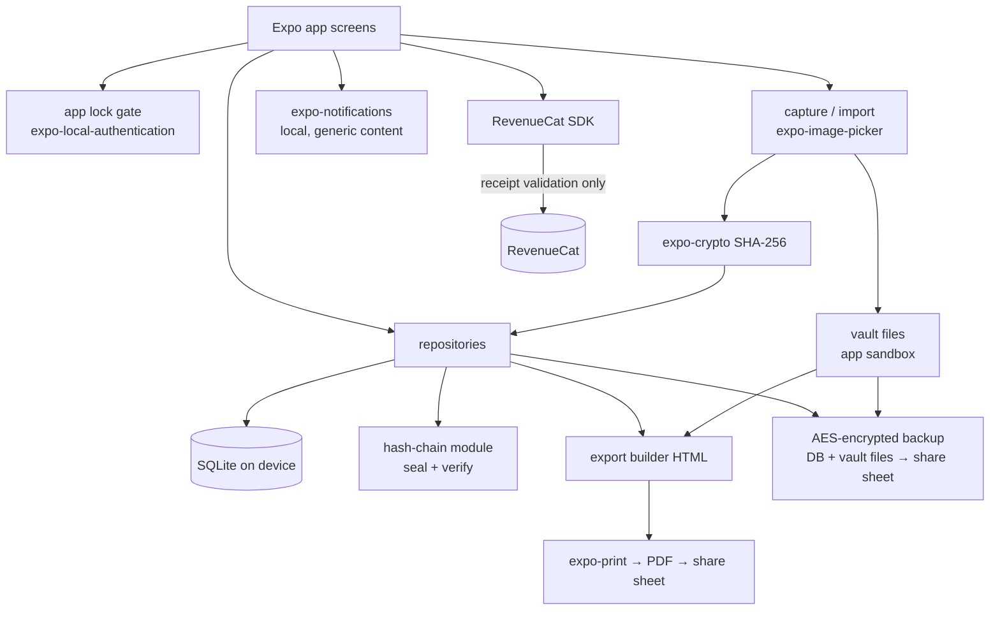

# SplitKit — Architecture

## Stack

| Layer | Choice | Rationale |
|---|---|---|
| App framework | Expo SDK 52 (React Native 0.76, TypeScript, expo-router) | Repo default for mobile; single codebase iOS-first, Android later |
| Local data | expo-sqlite (SQLite on device) | The product promise — inventory, log, and checklist state on device, queryable, fast |
| Vault files | expo-file-system (app sandbox) + expo-image-picker (capture/import) | Statements/deeds/prenups stored as files in the sandboxed documents directory; never uploaded |
| Hashing | expo-crypto (SHA-256) | Document hashes at capture; the log's entry hash chain; the export digest |
| App lock | expo-local-authentication (FaceID/TouchID + PIN fallback) | Privacy from one specific person is a purchase criterion; mandatory before first data entry |
| State | React state + a thin repository layer over SQLite | Simple, testable; screens call repositories directly — no store library needed at this size |
| Reminders | expo-notifications (local only) | Deadline and gathering nudges need no server; lock-screen content is generic by rule |
| Purchases | react-native-purchases (RevenueCat) | Repo default; event-monthly+trial offering, local entitlement cache |
| PDF export | expo-print (HTML → PDF on device) + expo-sharing | The court-ready log renders locally; nothing uploaded anywhere |
| Backup | AES-encrypted serialized DB + vault files via expo-file-system + expo-sharing | User-passphrase encrypted export she controls; restore lands Phase 2 |
| Charts/marks | react-native-svg (hand-rolled) | Scenario bars, totals marks, the seal stroke animation; no heavy chart lib |
| Fonts | expo-font, self-hosted ttf in `assets/fonts` | Fonts must actually load (craft rule) |

**There is no backend.** No accounts, no API, no analytics SDK, no crash-reporting SDK that exfiltrates content. The only network traffic is App Store/Play billing and RevenueCat receipt validation. This is a product feature (README differentiation #5 — no cloud a spouse can reach, nothing to subpoena a password reset for) and a cost feature (infrastructure ≈ $0). A document-vault app *could* justify cloud file storage; SplitKit deliberately rejects it — the threat model is one specific person with possible access to shared accounts, and the encrypted export she physically controls is the backup story instead.

## System diagram



## Data model (SQLite)

```sql
-- Onboarding & profile facts that drive state-aware content
settings (key TEXT PK, value TEXT);
-- keys include: us_state, stage ('considering','separating','filed','post_decree'),
-- has_minor_children, lock_configured, entitlement cache, reminder defaults

-- Financial-discovery checklist: bundled task defs joined to per-user status
checklist_status (task_key TEXT PK,        -- refs bundled task in src/data/checklists.ts
  status TEXT CHECK(status IN ('todo','in_progress','done','na')) DEFAULT 'todo',
  note TEXT, done_at TEXT);

-- Asset & account inventory
asset (id TEXT PK, name TEXT, kind TEXT CHECK(kind IN
  ('bank','retirement','pension','real_estate','vehicle','debt','insurance','business','other')),
  institution TEXT, account_last4 TEXT,
  titling TEXT CHECK(titling IN ('joint','hers','his','trust','unknown')),
  est_value_cents INTEGER,               -- signed; debts negative
  marital_flag TEXT CHECK(marital_flag IN ('marital','separate','unknown')) DEFAULT 'unknown',
  note TEXT, created_at TEXT, updated_at TEXT);

-- Document vault: files live in the sandbox; rows carry metadata + capture hash
document (id TEXT PK, title TEXT, kind TEXT CHECK(kind IN
  ('statement','deed','tax_return','prenup','pay_stub','insurance','correspondence','photo','other')),
  asset_id TEXT REFS asset,              -- nullable link into the inventory
  file_path TEXT, mime TEXT, byte_size INTEGER,
  sha256 TEXT NOT NULL,                  -- computed at capture, before any preview
  captured_at TEXT NOT NULL, source_note TEXT);

-- Communication / incident log: append-only, hash-chained
log_entry (id TEXT PK,
  seq INTEGER NOT NULL UNIQUE,           -- 1..n, dense; ordering is part of the chain
  occurred_at TEXT NOT NULL,             -- when it happened (user-stated)
  entered_at TEXT NOT NULL,              -- when it was sealed (device clock, set by app)
  channel TEXT CHECK(channel IN ('in_person','phone','text','email','third_party','other')),
  participants TEXT, summary TEXT NOT NULL, detail TEXT,
  document_id TEXT REFS document,        -- optional attached exhibit
  prev_hash TEXT NOT NULL,               -- entry n-1's entry_hash; genesis constant for seq 1
  entry_hash TEXT NOT NULL);             -- SHA-256 over (seq|prev_hash|occurred_at|entered_at|channel|participants|summary|detail|document_sha256)

-- Settlement scenario worksheets (arithmetic only; all inputs user-entered)
scenario (id TEXT PK, kind TEXT CHECK(kind IN ('house','pension','cashflow')),
  name TEXT, inputs_json TEXT,           -- typed shape per kind in src/lib/scenarios.ts
  created_at TEXT, updated_at TEXT);

-- Post-decree rebuild plan: bundled task defs joined to per-user status
rebuild_status (task_key TEXT PK,        -- refs bundled task in src/data/rebuild.ts
  status TEXT CHECK(status IN ('todo','done','na')) DEFAULT 'todo',
  due_date TEXT, done_at TEXT);

-- User-set reminders (mirrors scheduled local notifications)
reminder (id TEXT PK, title TEXT, body_generic INTEGER DEFAULT 1,
  fire_at TEXT, linked_kind TEXT, linked_key TEXT, delivered INTEGER DEFAULT 0);
```

Key derived views (computed in repositories, not stored): inventory totals by titling and marital flag (signed sums; debts net out), checklist progress per section, chain-head hash (entry with max `seq`), scenario outputs (pure functions of `inputs_json` — never persisted, always recomputed).

**Hash-chain rules (the integrity core):**
- Entries are append-only in the UI; there is no edit or delete of a sealed entry. Corrections are new entries referencing the old (`"Correction to entry #12: …"`), which is exactly how paper ledgers work and what makes the chain honest.
- `entry_hash = SHA-256(seq | prev_hash | occurred_at | entered_at | channel | participants | summary | detail | document_sha256?)`, canonical field order, `|` as separator, UTF-8. Genesis `prev_hash` is the constant `splitkit-genesis-v1`.
- `verifyChain()` recomputes every hash in sequence and reports the first break; it runs before every export and on demand in Settings.
- The claim is exact: the chain proves the record was not altered after sealing. It does not prove the truth of the events. The export's footer states both sentences.

## Key flows

1. **App lock gate.** Cold start and every return from background route through the lock screen; expo-local-authentication (biometric, PIN fallback) must succeed before any navigator with data mounts. Onboarding configures the lock *before* the first data-entry screen.
2. **Checklist.** Bundled tasks (typed, ~60, sectioned) are merged with `checklist_status` and filtered by `us_state` facts (community-property vs. equitable-distribution branch, state form names) and `stage`. Checking a task writes status + `done_at`. Fully offline.
3. **Vault capture.** Camera/library via expo-image-picker → file copied into the sandbox vault directory → SHA-256 computed via expo-crypto *before* the row is written → metadata row inserted with hash + `captured_at`. Linking to an asset is a picker on the document sheet.
4. **Sealing a log entry.** The entry form writes nothing until **Seal**: the repository assigns `seq` (chain head + 1), sets `entered_at` from the device clock, computes `entry_hash` from the canonical string, and inserts in one transaction. The UI then plays the record-seal signature (DESIGN.md). Sealed entries are immutable in the UI.
5. **Court-ready export.** `verifyChain()` runs first (a broken chain blocks export with an explanation). The export builder assembles chronological HTML: cover block (date range, entry count, chain-head hash), one block per entry (occurred/entered timestamps, channel, participants, summary/detail, exhibit hash if attached, `entry_hash` line in mono), and the method footer in plain language. expo-print renders PDF → system share sheet. Typeset per DESIGN.md — this artifact is the brand.
6. **Scenario worksheets.** Each kind is a pure function: house (buyout = equity × share − adjustments; monthly carrying cost; break-even), pension (marital fraction = years married overlapping service ÷ total service, × user-entered share), cashflow (monthly in/out table → net). Outputs render live as the user types; every output block carries the attorney/CDFA footer verbatim. No persistence of outputs, no thresholds, no recommendations.
7. **Rebuild plan.** Setting `stage = post_decree` (onboarding or Settings) activates the rebuild tab section; bundled tasks merge with `rebuild_status`; due dates schedule generic local notifications.
8. **Paywall.** RevenueCat offering fetched at gate touchpoints (11th log entry, 6th document, export tap, 2nd scenario, rebuild open); entitlement cached in `settings` so connectivity lapses (or a RevenueCat outage) never lock a paying user out.
9. **Encrypted backup.** Serialize DB + vault file manifest → archive → AES-256 encrypt with a key derived from the user's passphrase (PBKDF2, per-export salt) → share sheet. The passphrase is never stored; the UI says exactly that. Restore-from-file is ROADMAP Phase 2.

## Third-party services & running costs

| Service | Purpose | Cost at 1k / 10k users |
|---|---|---|
| RevenueCat | Entitlements, paywall experiments | Free < $2.5k MTR, then ~1% |
| Apple/Google developer accounts | Distribution | $99/yr + $25 once |
| Cloud file storage | None — vault is on-device by design; encrypted export is the backup | $0 |
| Content/education | Ships bundled in-app | $0 |
| **Total infra** | | **≈ $0/mo — no servers, no databases, no analytics** |

## Non-goals (MVP)

- Android ships after iOS (same codebase; Phase 3).
- No cloud sync / multi-device (the encrypted export covers migration; a server would break the no-cloud promise and the threat model — revisit only with E2E encryption and explicit demand).
- No messaging, no co-parenting features, no two-party anything. The counterparty is never a user.
- No legal-document assembly (petitions, agreements) and no e-filing — that is Hello Divorce's business and a UPL minefield.
- No OCR/AI ingestion of documents in MVP (candidate for Phase 3, on-device only); no AI chat, ever — the app is an instrument, not an advisor.
- No lawyer marketplace or referrals in MVP (Phase 3 revenue experiment, clearly labeled).
