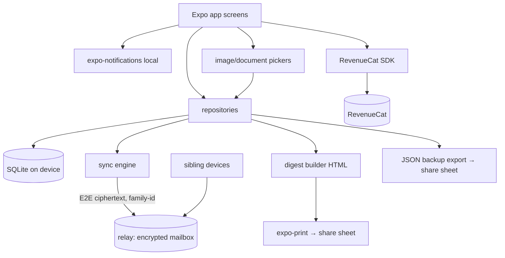

# KinDesk — Architecture

## Stack

| Layer | Choice | Rationale |
|---|---|---|
| App framework | Expo SDK 52 (React Native 0.76, TypeScript, expo-router) | Repo default for mobile; single codebase iOS-first |
| Local data | expo-sqlite | Local-first: the desk works fully offline; sync is additive |
| State | React state + a thin repository layer over SQLite | Screens call repositories directly; no store library at this size |
| Family sync | Tiny stateless relay (Cloudflare Worker + D1 index + R2 blobs) storing **ciphertext only**; E2E keys derived from the family share code via expo-crypto | Sibling coordination requires *some* shared state; the relay never sees plaintext — privacy is architectural, and the server stays a dumb encrypted mailbox |
| Media | expo-image-picker (receipts, vault photos) + expo-document-picker (PDFs) | Receipts and paperwork are the two capture paths |
| Reminders | expo-notifications (local) | Refill/appointment reminders need no server |
| Digest render | expo-print (HTML → PDF) + view-shot-style share image via the same HTML | The weekly digest is the brand artifact |
| Purchases | react-native-purchases (RevenueCat) | Family plan, 14-day trial, offerings remotely tunable |
| Fonts | expo-font, self-hosted variable fonts in `assets/fonts` | Fonts must actually load (craft rule) |

**Backend honesty:** unlike the portfolio's pure local-first apps, KinDesk's core promise (siblings see the same desk) requires a sync layer. The MVP relay is deliberately minimal: one endpoint pair (push/pull opaque encrypted records per family ID) on a Cloudflare Worker, D1 for the record index, R2 for encrypted blobs — no accounts, no plaintext, effectively $0–5/mo at thousands of families (see .env.example for the deploy contract). An iOS-only CloudKit shared-zone variant is evaluated in Phase 2.

## System diagram



## Data model (SQLite)

```sql
family   (id TEXT PK, name TEXT, care_recipient TEXT, created_at TEXT);
member   (id TEXT PK, family_id TEXT REFS family, display_name TEXT, is_payer INTEGER DEFAULT 0, joined_at TEXT);

task     (id TEXT PK, family_id TEXT, title TEXT, owner_member_id TEXT NULL,   -- NULL = "needs an owner"
          due_date TEXT NULL, recur_json TEXT NULL,                            -- {"every_days":30} | {"weekly":"Tue"}
          status TEXT CHECK(status IN ('open','done')) DEFAULT 'open',
          done_at TEXT NULL, created_by TEXT, created_at TEXT);

expense  (id TEXT PK, family_id TEXT, payer_member_id TEXT, amount_cents INTEGER,
          category TEXT, note TEXT, receipt_uri TEXT NULL, incurred_on TEXT,
          settled INTEGER DEFAULT 0, created_at TEXT);

document (id TEXT PK, family_id TEXT, title TEXT, tag TEXT,                    -- poa | insurance | directive | financial | medical-ref | other
          file_uri TEXT, mime TEXT, added_by TEXT, added_at TEXT);

contact  (id TEXT PK, family_id TEXT, name TEXT, role TEXT, phone TEXT, notes TEXT);

entry    (id TEXT PK, family_id TEXT, kind TEXT CHECK(kind IN ('visit','decision','note')),
          body TEXT, entry_date TEXT, created_by TEXT);

reminder (id TEXT PK, family_id TEXT, label TEXT, kind TEXT CHECK(kind IN ('refill','appointment')),
          next_at TEXT, recur_days INTEGER NULL);

sync_state (record_id TEXT PK, table_name TEXT, updated_at TEXT, pushed INTEGER DEFAULT 0);
settings   (key TEXT PK, value TEXT);
```

Derived (computed in repositories, never stored): per-member balances (sum of expenses by payer vs equal share among members, minus settlements), the "needs an owner" strip, digest aggregates (week's done/upcoming tasks, spend, next appointments).

## Key flows

1. **Family creation & invites.** Creating a family generates an id + a human share code; the E2E key is derived from the code (never sent to the relay). A sibling enters the code → derives the same key → pulls the encrypted record set.
2. **Sync.** Repositories mark writes in `sync_state`; the sync engine pushes changed records (encrypted client-side) and pulls peers' on open/foreground. Last-write-wins per record — acceptable at family scale; documents sync as encrypted blobs.
3. **Expense → balances.** Every expense has one payer; balances assume equal split among members (MVP), computed on read. "Settle up" marks a zeroing entry — arithmetic only, no money movement.
4. **The digest.** Sunday (or on demand): digest builder aggregates the week into typeset HTML → shared as image/PDF via the system sheet. The card carries the KinDesk mark — the growth loop.
5. **Reminders.** Refill/appointment reminders schedule local notifications per device (each member's own phone reminds them of tasks *they own*).
6. **Paywall.** Gates: first invite, 11th document, expense splitting. Entitlement cached locally; invited members inherit the family's entitlement from synced state.

## Third-party services & running costs

| Service | Purpose | Cost at 1k / 5k families |
|---|---|---|
| Relay (Cloudflare Worker + D1 + R2, free tiers) | Encrypted mailbox + blob store | ~$0–5/mo |
| RevenueCat | Entitlements, trials | Free < $2.5k MTR, then ~1% |
| Apple/Google accounts | Distribution | $99/yr + $25 once |
| **Total infra** | | **≈ $0–5/mo — no accounts DB, no plaintext at rest** |

## Non-goals (MVP)

- No clinical records, MAR, or dosing — meds are a reference list with refill reminders.
- No payments processing (balances are arithmetic; Venmo is a share-sheet away).
- No real-time collaborative editing; last-write-wins at family scale.
- No web app; Android after iOS (same codebase, Phase 3).
