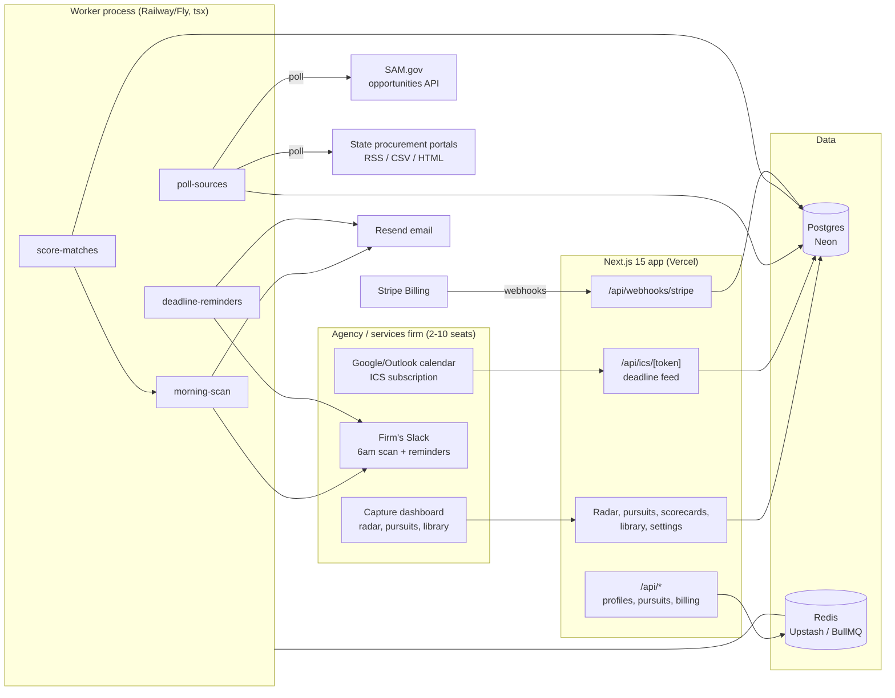

# RFPRadar Architecture

## Stack & Rationale

| Layer | Choice | Why |
|---|---|---|
| Web app + API | **Next.js 15 (App Router) + TypeScript** | One deployable for the capture dashboard, marketing pages, ICS feeds, and webhooks. |
| Database | **Postgres (Neon) + Drizzle ORM** | Relational domain (firms -> profiles -> matches -> pursuits -> scorecards -> deadlines; a shared opportunities store; the answer library with snapshot semantics). Postgres full-text search covers keyword matching in v1 -- no search cluster. Drizzle typed schema-as-code; drizzle-kit migrations. |
| Queue / workers | **BullMQ on Redis (Upstash), workers as standalone `tsx` processes** | Ingestion polling, scoring fan-out, the 6am scan, and deadline reminders are recurring background work with retries and per-source pacing -- a real queue, not cron-in-a-route. Workers share `src/db` and `src/lib` with the app. |
| Ingestion | **SAM.gov opportunities API (documented, keyed) + per-state connectors (RSS/CSV/HTML via cheerio)** | Federal is a real API; states are a connector framework with per-source schedules, health status, and polite pacing. Normalization into one opportunities store is the product's spine. |
| Payments | **Stripe Billing** | Three seat tiers; hosted checkout + customer portal; webhooks drive plan state. |
| Email + Slack | **Resend (email) + Slack incoming webhooks** | The morning scan, deadline reminders, and pursuit notifications. Slack via per-firm incoming-webhook URL (paste the URL, post JSON). |
| Auth | **Auth.js (NextAuth v5)**; **signed ICS-feed tokens (jose)** | Real accounts with seat roles. The calendar feed is a signed, revocable per-firm URL. |
| PDF | **pdf-lib** | Shared go/no-go scorecard exports, win/loss reports. |
| Styling | **Tailwind CSS v4** | Token-driven implementation of DESIGN.md. |

## System Diagram

## Data Model

All tables keyed by `id` (uuid), timestamps `created_at` / `updated_at` implied. Multi-tenancy: everything hangs off `firm_id` -- EXCEPT `sources` and `opportunities`, which are shared (public data, fetched once for all firms).

- **firms** -- tenant root. `name`, `plan` (scout|pursuit|capture), `stripe_customer_id`, `stripe_subscription_id`, `trial_ends_at`, `timezone`, `slack_webhook_url` (nullable), `ics_token_hash`, `settings` (jsonb: scan hour, score threshold).
- **users** -- seats. `firm_id`, `email`, `name`, `role` (admin|member). Auth.js tables alongside. Seat count enforced per plan.
- **keyword_profiles** -- what the firm hunts. `firm_id`, `name` ("Managed IT -- VA/MD"), `naics_codes` (text[]), `psc_codes` (text[]), `keywords` (text[]), `negative_keywords` (text[]), `states` (text[]), `agencies` (text[]), `value_band` (jsonb: min/max), `status` (active|paused).
- **sources** -- shared feed registry. `key` (unique: "sam", "va-eva", "tx-smartbuy", ...), `name`, `kind` (api|rss|csv|html), `poll_interval_minutes`, `last_polled_at`, `last_success_at`, `status` (ok|degraded|down), `status_note`, `config` (jsonb: urls, parser hints).
- **opportunities** -- the shared normalized store. `source_id`, `external_id`, `title`, `agency`, `state` (nullable -- federal), `naics_codes` (text[]), `psc_codes` (text[]), `description` (text, tsvector-indexed), `url`, `posted_at`, `questions_due_at` (nullable), `responses_due_at`, `est_value_band` (jsonb, nullable), `opp_status` (open|amended|cancelled|closed), `raw` (jsonb), `content_hash`. Unique: (source_id, external_id). Amendments update in place and append to `opportunity_events`.
- **opportunity_events** -- change trail per notice. `opportunity_id`, `kind` (posted|amended|date_changed|cancelled), `detail` (jsonb: old/new dates), `occurred_at`.
- **matches** -- profile x opportunity. `firm_id`, `keyword_profile_id`, `opportunity_id`, `score` (integer 0-100), `factors` (jsonb: [{key, weight, matched, reason}] -- rendered verbatim), `state` (new|seen|dismissed|pursued|suppressed), `dismiss_reason` (nullable -- feeds profile tuning), `scored_at`. Unique: (keyword_profile_id, opportunity_id).
- **pursuits** -- the workspace object. `firm_id`, `opportunity_id` (nullable -- manual/enterprise RFPs allowed), `title`, `stage` (watching|go_no_go|drafting|submitted|won|lost|no_bid), `owner_user_id`, `value_cents` (nullable), `outcome_note`, `closed_at`.
- **scorecards** -- go/no-go records. `pursuit_id` (unique), `criteria` (jsonb: [{key, label, weight, score_1_5, note}]), `verdict` (go|no_go|conditional), `decided_by_user_id`, `decided_at`. The recorded "no" is a first-class outcome.
- **deadlines** -- every date. `firm_id`, `pursuit_id` (nullable), `opportunity_id` (nullable), `kind` (questions|proposal|orals|custom), `label`, `due_at`, `completed_at` (nullable). Reminder ledger below makes sends exactly-once.
- **reminders** -- exactly-once sends. `deadline_id`, `offset_days` (7|3|1), `sent_at`. Unique: (deadline_id, offset_days).
- **answer_blocks** -- the library. `firm_id`, `kind` (boilerplate|past_answer|bio|past_performance|attachment_ref), `title`, `body` (text), `tags` (text[]), `version`, `last_reviewed_at`, `stale` (bool, computed >12 months), `won_with` (bool -- flagged from win records), `archived` (bool).
- **block_uses** -- link-and-snapshot. `pursuit_id`, `answer_block_id`, `snapshot_body` (text -- frozen at link time), `snapshot_version`, `requirement_label`, `linked_by_user_id`. Library edits never rewrite submitted history.
- **requirements** -- per-pursuit checklist. `pursuit_id`, `label`, `owner_user_id` (nullable), `due_at` (nullable), `status` (todo|drafting|done), `sort_order`.
- **notifications** -- per-recipient outcome. `firm_id`, `user_id` (nullable), `channel` (email|slack), `kind` (morning_scan|deadline|match|pursuit_event), `provider_message_id`, `status` (queued|sent|failed), `occurred_at`.
- **webhook_events** -- Stripe idempotency ledger. `provider`, `external_id` (unique), `type`, `payload` (jsonb), `processed_at`.
- **audit_log** -- `firm_id`, `actor` (user_id|system), `action`, `target`, `metadata` (jsonb). Scorecard decisions, library edits, ICS token rotations, and seat changes always logged.

## Key Flows

### 1. Ingestion -> the shared opportunities store

1. `poll-sources` runs per source on its `poll_interval_minutes` (SAM.gov API hourly with the since-cursor; state connectors 2-4x/day, politely paced per portal).
2. Each poll normalizes notices into `opportunities`, upserted by `(source_id, external_id)`; a `content_hash` short-circuits unchanged records. Date/scope changes update in place and append `opportunity_events` (amendment trail).
3. Source failures flip `sources.status` to degraded/down with a note; the radar shows per-source health honestly ("VA eVA: last success 9h ago") -- never silent staleness.
4. New/changed opportunities enqueue `score-matches` fan-out for every active profile.

### 2. Scoring (reasons or nothing)

1. `score-matches` evaluates profile x opportunity: keyword/negative-keyword hits against the tsvector, NAICS/PSC exact-and-prefix matches, state/agency filters, value-band fit.
2. Output is 0-100 with `factors` -- each factor a human sentence ("NAICS 541512 exact match", "'managed detection' found in scope §3.2"). The UI renders factors verbatim; there is no score without reasons.
3. Below the firm's threshold -> `suppressed` (queryable, never deleted -- the firm can audit what was filtered). At or above -> `new`, queued for the next morning scan (immediate alert only for >= 90 scores on due-soon notices).
4. Dismissals record a reason ("wrong vehicle", "too small") that feeds profile-tuning suggestions -- the precision loop.

### 3. The morning scan (the 6am artifact)

1. `morning-scan` per firm at their local scan hour: new matches sorted by score, changed deadlines on watched/pursued opportunities, pursuits expiring within 7 days, and per-source health -- one email and/or Slack post.
2. A no-new-matches morning sends the one quiet line ("No new matches. 3,412 notices scanned across 6 sources.") -- silence must be distinguishable from breakage.
3. Opening a match shows the score, factors, full notice, and one-tap actions: pursue (creates the pursuit + deadlines), watch, dismiss-with-reason.

### 4. Go/no-go -> pursuit -> library assembly

1. Pursuing an opportunity lands it at the `go_no_go` stage with the firm's scorecard template: criteria scored 1-5 with notes, weighted verdict computed live, decision recorded (who, when) -- ten minutes to an honest no. No-bids close immediately with the reason preserved (the win-rate denominator).
2. A "go" advances to `drafting`: the requirement checklist is built from the RFP (manual in v1), owners and due-dates assigned, deadlines feeding the calendar and reminder ladder (T-7/3/1, exactly-once via the `reminders` ledger).
3. Requirements pull from the answer library: linking a block snapshots its body into `block_uses` -- the pursuit's content is frozen; the library stays editable. Staleness flags (>12 months unreviewed) surface at link time ("bio last reviewed Jan 2025 -- review before use?").
4. Submission -> `submitted`; close -> `won|lost` with value and debrief note. Wins flag their used blocks `won_with` -- the library learns which answers win.

### 5. Deadlines everywhere

1. Every date (questions due, proposal due, orals) lives in `deadlines`; the ICS feed (signed token, revocable) mirrors them into Google/Outlook.
2. `deadline-reminders` nightly: due dates minus offsets, unsent per the ledger -> email/Slack; completing or closing a pursuit stops its ladder.

### 6. Billing

1. Trial starts on signup (14 days, no card). Inviting seat N+1 beyond plan limit prompts upgrade -- never blocks silently.
2. Stripe hosted checkout for the three tiers; the customer portal handles card changes and cancellation.
3. Webhooks (`checkout.session.completed`, `customer.subscription.updated|deleted`, `invoice.payment_failed`): **verify signature -> insert `webhook_events` by Stripe event id (duplicate = ack and stop) -> enqueue `process-stripe-event` -> ack 200 fast.** The worker updates `firms.plan` idempotently; failed payments get a grace period, then read-only mode (the library remains exportable -- the anti-lock-in promise holds even in dunning).

## Queue & Worker Jobs

| Job | Trigger | Behavior |
|---|---|---|
| `poll-sources` | Repeatable per source (`poll_interval_minutes`) | Fetch, normalize, upsert by (source, external_id), hash short-circuit, amendment events; failure ladder to degraded/down with status note. Idempotent re-runs. |
| `score-matches` | New/changed opportunities; profile edits | Fan out profile x opportunity scoring; upsert matches by (profile, opportunity); suppression below threshold; immediate-alert enqueue for hot matches. |
| `morning-scan` | Daily per firm, firm-local hour | Compose the scan (new matches, date changes, expiring pursuits, source health); always sends (quiet line when empty). |
| `deadline-reminders` | Nightly per firm | T-7/3/1 sends, exactly-once via the reminders ledger; stops on completion/close. |
| `refresh-staleness` | Weekly | Recompute answer_blocks.stale from last_reviewed_at. |
| `process-stripe-event` | Stripe webhook ack | Apply plan/subscription state from the persisted event; idempotent by event id. |

Dead-letter queue + Sentry on repeated failure; graceful shutdown drains active jobs.

## Third-Party Services & Rough Pricing

| Service | Role | Rough cost |
|---|---|---|
| SAM.gov API | Federal opportunities | Free (api.sam.gov key; rate-limited) |
| State portals | State opportunities | Free (public notices; polite fetching) |
| Neon (Postgres) | Primary DB (opportunities store grows ~1-2 GB/yr) | Free tier -> ~$19-69/mo |
| Upstash (Redis) | BullMQ | Free tier -> ~$10-30/mo |
| Stripe Billing | Subscriptions | 2.9% + 30c |
| Resend | Scans + reminders | Free 3k/mo -> $20/mo |
| Slack | Incoming webhooks | Free |
| Vercel | Hosting | Hobby free -> Pro $20/mo |
| Railway/Fly | Worker process | ~$5-15/mo |
| Sentry | Errors (ingestion + reminder paths especially) | Free tier -> ~$26/mo |

## Estimated Monthly Running Cost

| Scale | Assumptions | Estimate |
|---|---|---|
| **0 customers (dev/preview)** | Free tiers | **~$0-10/mo** |
| **120 firms** | ~$20k MRR. 6 sources polled, ~500k notices/yr stored, ~1,500 scans/day emailed | Neon $69 + Upstash $10 + Vercel $20 + worker $15 + Resend $20 + Sentry $26 = **~$160-180/mo** (<1% of revenue) |
| **450 firms** | ~$80k MRR, 20+ state sources | Neon ~$150 + Upstash ~$30 + workers ~$50 + Resend $90 + observability ~$50 = **~$370-420/mo** (<1% of revenue) |

Ingestion is shared across firms -- the store is fetched once, matched many times -- so marginal cost per firm is near zero; connector maintenance (state portals drifting) is the real operating cost, budgeted as engineering time, not infrastructure.
