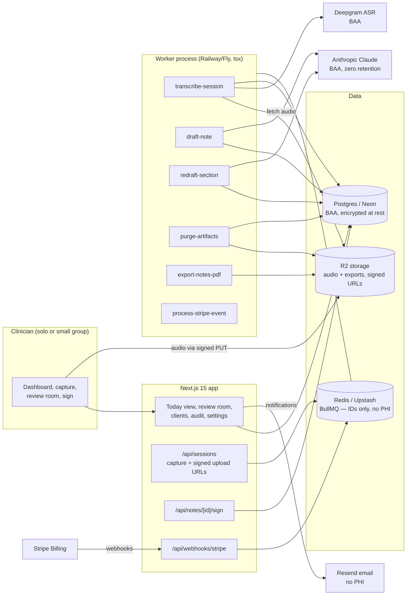

# SessionScribe Architecture

## Stack & Rationale

| Layer | Choice | Why |
|---|---|---|
| Web app + API | **Next.js 15 (App Router) + TypeScript** | One deployable for the clinician dashboard, the review room, marketing pages, and webhooks. Server components keep PHI off the client except where the clinician is actively reading it. |
| Database | **Postgres (Neon) + Drizzle ORM** | Relational domain (practices -> clinicians -> clients -> sessions -> transcripts -> notes -> signatures; append-only audit trail). Drizzle typed schema-as-code; drizzle-kit migrations; Neon supports encryption at rest and will sign a BAA on their Business plan — a Phase 0 checklist item, not an afterthought. |
| Queue / workers | **BullMQ on Redis (Upstash), workers as standalone `tsx` processes** | Transcription and drafting are long-running (30-90s per session) with retries, per-practice pacing, and visible progress — a real queue, not cron-in-a-route. The nightly retention purge and Stripe event processing run here too. Workers share `src/db` and `src/lib` with the app. Job payloads carry IDs only — **PHI never enters Redis**. |
| ASR | **Deepgram (Nova family) under a BAA** | HIPAA-eligible speech-to-text with speaker diarization and word-level timestamps — the timestamps power source-traceable drafting. Swappable behind `src/lib/transcription.ts`. |
| Drafting LLM | **Anthropic Claude under a BAA** (zero-retention API config) | Structured per-section drafting from transcript spans or shorthand. Conservative temperature; per-section regeneration; model name env-configured. Swappable behind `src/lib/drafting.ts`. |
| Object storage | **Cloudflare R2 (S3 API)** | Session audio and export PDFs. SSE encryption at rest, signed PUT/GET only, and lifecycle enforced by our own purge job (belt and suspenders with `purge_at`). |
| Payments | **Stripe Billing** | Three subscription tiers + 14-day trial without card; hosted checkout + customer portal; webhooks drive plan state. Stripe never sees PHI. |
| Email | **Resend** | Magic-link auth, receipts, "your draft is ready" notifications. **No PHI in any email, ever** — notifications say "Session draft ready", never a client name. |
| Auth | **Auth.js (NextAuth v5)**, email magic link + optional Google | Clinicians are real accounts with roles (clinician / supervisor / admin). Sessions are short-lived; every authenticated request writes to the audit log via a single helper. |
| PDF | **pdf-lib** | Signed-note exports with signature block, content hash, and audit footer. |
| Styling | **Tailwind CSS v4** | Token-driven implementation of DESIGN.md. |

**HIPAA posture (load-bearing, verified in Phase 0):** BAAs executed with Neon, Upstash, Cloudflare, Deepgram, Anthropic, and Vercel (or the app moves to a host that will sign one) before any real PHI flows. Encryption at rest everywhere; TLS everywhere; PHI-minimal client records (display label, not full demographics); audio/transcript auto-purge with a configurable window; append-only audit log of every access.

## System Diagram

## Data Model

All tables keyed by `id` (uuid), timestamps `created_at` / `updated_at` implied. Multi-tenancy: everything hangs off `practice_id` (directly or through `clients`). The full Drizzle schema in `src/db/schema.ts` is the source of truth.

- **practices** — tenant root. `name`, `plan` (solo|caseload|group), `stripe_customer_id`, `stripe_subscription_id`, `trial_ends_at`, `baa_accepted_at`, `retention_days` (default 30 — audio/transcript purge window), `timezone`, `settings` (jsonb: default format, notification prefs).
- **users** — clinician logins. `practice_id`, `email`, `name`, `credentials` ("LMFT #114382"), `role` (clinician|supervisor|admin), `default_format` (soap|dap), `signature_block`. Auth.js tables alongside.
- **clients** — PHI-minimal, deliberately not a chart. `practice_id`, `clinician_id`, `display_label` ("J.R." — clinician-chosen), `modality` (cbt|emdr|couples|play|sfbt|general), `default_template_id`, `recording_consent` (none|verbal|written), `consent_noted_at`, `status` (active|archived).
- **sessions** — one clinical encounter. `client_id`, `clinician_id`, `held_at`, `duration_minutes`, `capture_kind` (recording|upload|shorthand), `shorthand_text` (nullable), `status` (captured|transcribing|drafting|ready|signed|failed).
- **audio_artifacts** — `session_id`, `storage_key`, `mime`, `duration_seconds`, `byte_size`, `purge_at`, `purged_at` (nullable). A purged artifact keeps its row (the audit trail survives the audio).
- **transcripts** — `session_id`, `provider`, `segments` (jsonb: `{speaker, start_ms, end_ms, text}[]`), `word_count`, `purge_at`, `purged_at`. Segment offsets are the source spans the review room highlights.
- **templates** — note formats. `practice_id` (null = built-in), `name` ("EMDR — DAP"), `format` (soap|dap), `modality`, `sections` (jsonb: `{key, label, guidance}[]` — guidance steers the drafting prompt per section), `is_builtin`.
- **notes** — the draft and the record. `session_id` (unique), `clinician_id`, `template_id`, `format`, `status` (drafting|draft|signed|amended), `sections` (jsonb: `{key, text, source_spans: {start_ms, end_ms}[]}[]`), `model`, `draft_generated_at`, `current_version`.
- **note_versions** — immutable history. `note_id`, `version`, `sections` (jsonb snapshot), `reason` (draft|edit|amendment), `created_by`. Signed versions are never mutated; an amendment writes a new version.
- **signatures** — `note_id`, `version`, `signer_id`, `signer_credentials` (denormalized at signing time), `kind` (author|cosign), `content_hash` (HMAC-SHA256 of the canonicalized version content), `signed_at`. **There is no code path that marks a note signed without a row here.**
- **audit_events** — append-only. `practice_id`, `actor_id` (nullable), `actor_kind` (user|system), `action` (viewed|created|edited|signed|exported|purged|login|...), `target_kind`, `target_id`, `ip`, `user_agent`, `metadata` (jsonb). Surfaced to the clinician in-product — the audit log is a feature, not a liability.
- **usage_counters** — `practice_id`, `period` ("2026-07"), `notes_drafted`. Enforces the Solo tier's 40-note meter.
- **webhook_events** — Stripe idempotency ledger. `provider`, `external_id` (unique), `type`, `payload` (jsonb), `processed_at`.

## Key Flows

### 1. Capture -> transcript -> draft (the 3:00 -> 3:02 pipeline)

1. Session ends. The clinician records in-browser (MediaRecorder), uploads a file, or types shorthand. Audio goes straight to R2 via a signed PUT from `/api/sessions`; the session row is created with `status = captured` and `purge_at` stamped from the practice's retention window.
2. Audio paths enqueue `transcribe-session` (payload: session id only). The worker streams the audio from R2 to Deepgram, stores diarized segments with millisecond offsets, stamps `status = transcribing -> drafting`, and enqueues `draft-note`.
3. Shorthand paths skip ASR and enqueue `draft-note` directly — shorthand is a first-class citizen (recording consent is not universal; see README risk 3).
4. `draft-note` builds a per-section prompt from the client's template (format + modality guidance), calls the LLM with conservative settings, and requires the model to cite transcript span offsets per drafted sentence. Output is validated with zod; sections missing source spans are flagged, never silently accepted. Note lands as `status = draft`, version 1 written, dashboard flips to READY, and an email without PHI goes out if the clinician opted in.
5. Failures retry 3x with exponential backoff; a persistently failed job marks the session `failed` with a human-readable reason ("audio unreadable — re-upload or write shorthand"). Nothing disappears silently.

### 2. The review room -> sign & lock (never auto-filed)

1. The clinician opens the draft: sections on the right, transcript on the left. Tapping any drafted sentence highlights its source spans; tapping a transcript segment shows which sentences cite it.
2. Edits are inline and autosaved as the working copy. "Regenerate section" enqueues `redraft-section` for that section alone — the clinician's edits elsewhere are never touched.
3. Signing: the clinician confirms credentials, the server canonicalizes the current content, computes the HMAC content hash, writes the `note_versions` snapshot + `signatures` row in one transaction, and flips `status = signed`. The audit event and the between-sessions clock stamp land in the same beat.
4. Signed notes are immutable in the API — the update path rejects signed versions outright. An amendment opens a new version (reason = amendment) that must itself be signed; the export renders the full version chain. This is the "never auto-filed" architecture claim, enforced twice: no auto-sign code path exists, and signed content is write-protected.

### 3. Retention purge

1. `purge-artifacts` runs nightly per practice: any `audio_artifacts` / `transcripts` past `purge_at` are deleted from R2, their rows stamped `purged_at`, and an audit event written per purge.
2. The signed note is the durable record; purged sessions render the note with a quiet "source audio purged per your 30-day retention policy" line — a trust feature shown, not hidden.
3. Changing the retention window re-stamps future `purge_at` values only; it never resurrects purged media.

### 4. Supervisor co-sign (Group tier)

1. Pre-licensed associates' notes enter `awaiting cosign` after the author signs; the supervisor's queue lists them oldest-first.
2. The supervisor reviews the signed content (read-only), adds an optional supervision comment (stored as metadata, not edits), and co-signs — a second `signatures` row with `kind = cosign` over the same content hash.
3. Export renders both signature blocks. An edit after author-signature would require an amendment, which invalidates nothing but starts a new version both parties can see.

### 5. Billing

1. Trial starts on signup (14 days, no card). Note 41 on Solo prompts an upgrade — never blocks the review room for already-drafted notes.
2. Stripe hosted checkout for the three tiers; customer portal for changes/cancellation.
3. Webhooks (`checkout.session.completed`, `customer.subscription.updated|deleted`, `invoice.payment_failed`): **verify signature -> insert `webhook_events` by Stripe event id (duplicate = ack 200 and stop) -> enqueue `process-stripe-event` -> ack fast.** The worker applies plan state idempotently. Failed payment gets a grace period, then read-only mode — signed notes remain exportable forever; a clinician's records are never held hostage.

## Queue & Worker Jobs

| Job | Trigger | Behavior |
|---|---|---|
| `transcribe-session` | Audio capture/upload complete | Stream from R2 to Deepgram, persist diarized segments, enqueue `draft-note`. Retries 3x exponential; terminal failure marks the session `failed` with reason. |
| `draft-note` | Transcript ready, or shorthand capture | Per-section LLM drafting with mandatory source-span citations; zod-validated; writes version 1; flips status to `draft`. |
| `redraft-section` | Clinician request in the review room | Regenerates exactly one section against the same transcript; other sections and edits untouched. |
| `purge-artifacts` | Nightly repeatable, per practice-local midnight | Delete expired audio/transcripts from R2, stamp `purged_at`, audit each purge. |
| `export-notes-pdf` | Clinician request (single note or date range) | Render signed-note PDF(s) with signature block + hash footer to R2, return a short-lived signed link in-app (never emailed). |
| `process-stripe-event` | Stripe webhook ack | Apply plan/subscription state from the persisted event; idempotent by event id. |

Job payloads are IDs only; workers hydrate from Postgres. Dead-letter queue + Sentry (PHI-scrubbed) on repeated failure; graceful shutdown drains active jobs.

## Third-Party Services & Rough Pricing

| Service | Role | Rough cost |
|---|---|---|
| Neon (Postgres) | Primary DB (BAA on Business plan) | ~$69/mo (Business — the BAA tier) |
| Upstash (Redis) | BullMQ (IDs only) | Free tier -> ~$10/mo |
| Cloudflare R2 | Audio + exports | $0.015/GB-mo; a 30-day window keeps steady-state small (~1 GB per active clinician) |
| Deepgram | ASR w/ diarization | ~$0.26/audio-hour (Nova) — ~$0.22 per 50-min session |
| Anthropic | Drafting | ~$0.03-0.10 per note at current pricing (per-section prompts, transcript-span context) |
| Stripe Billing | Subscriptions | 2.9% + 30c |
| Resend | Auth + notifications (no PHI) | Free 3k/mo -> $20/mo |
| Vercel | Hosting | Pro $20/mo (BAA requires Enterprise — verify in Phase 0, else host the app alongside the worker on Railway/Fly with a BAA-capable setup) |
| Railway/Fly | Worker process | ~$5-10/mo |
| Sentry | Errors (PII scrubbing on) | Free tier -> ~$26/mo |

## Estimated Monthly Running Cost

| Scale | Assumptions | Estimate |
|---|---|---|
| **0 customers (dev/preview)** | Free/low tiers; Neon Business early for BAA discipline | **~$80-100/mo** |
| **250 clinicians** | ~$15k MRR. ~20k notes/mo, ~70% with audio (~14k ASR sessions) | Infra (Neon $69 + Upstash $10 + hosting ~$60 + R2/Sentry ~$60) ~$200 + ASR ~$3,100 (14k x ~$0.22) + LLM ~$1,200 = **~$4,500/mo (~30% of revenue)** — ASR dominates; per-note COGS is the business's real physics |
| **1,000 clinicians** | ~$60k MRR, ~80k notes/mo | Infra ~$500 + ASR ~$12k + LLM ~$5k = **~$17-18k/mo (~29% of revenue)** — margin improves with ASR volume pricing and model routing (cheap model for shorthand expansion) |

The cost table is honest on purpose: this is a COGS-real product, priced accordingly (README margins section), and per-note cost telemetry ships in the MVP.
