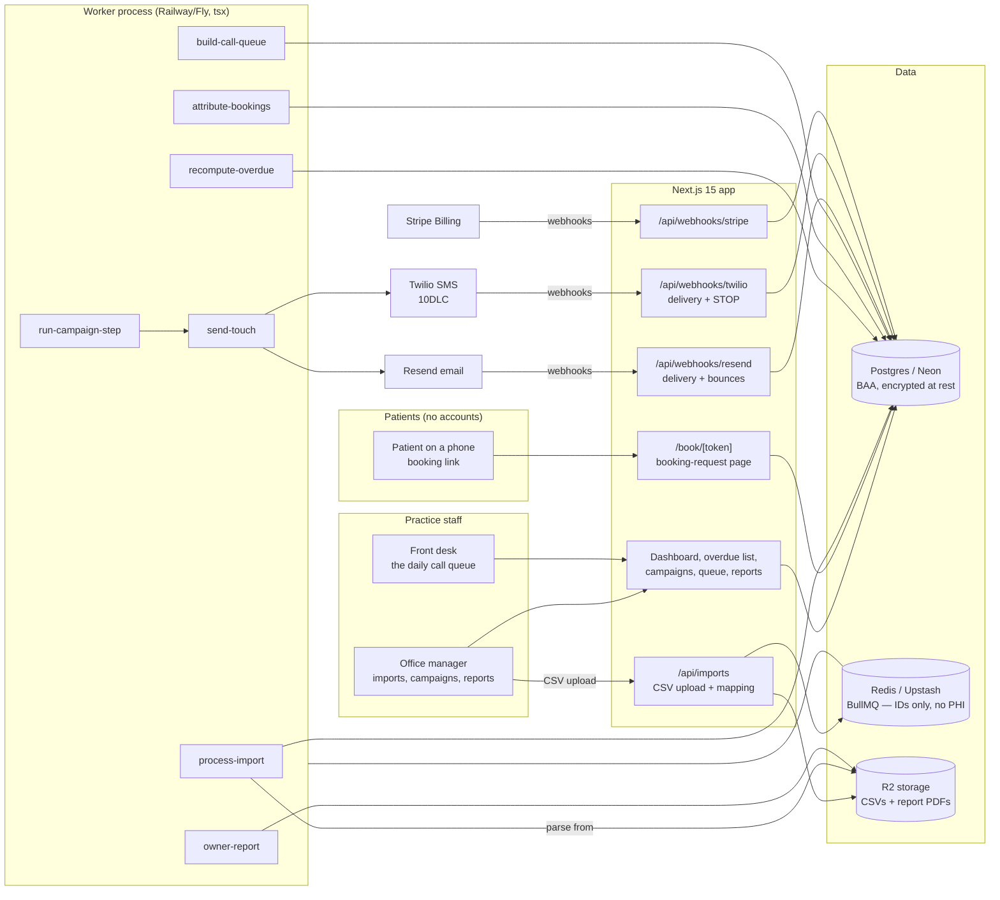

# RecallDesk Architecture

## Stack & Rationale

| Layer | Choice | Why |
|---|---|---|
| Web app + API | **Next.js 15 (App Router) + TypeScript** | One deployable for the practice dashboard, the patient booking-request pages (public token-keyed routes), marketing pages, and webhooks. |
| Database | **Postgres (Neon) + Drizzle ORM** | Relational domain (practices -> locations -> patients -> visits -> campaigns -> touches -> bookings -> attributions). Drizzle typed schema-as-code; drizzle-kit migrations; Neon Business for the BAA (patient data is PHI). |
| Queue / workers | **BullMQ on Redis (Upstash), workers as standalone `tsx` processes** | Import parsing, the nightly overdue recompute, campaign fan-out with pacing/quiet hours, attribution runs, and the daily queue build are real background work with retries — a queue, not cron-in-a-route. Workers share `src/db` and `src/lib` with the app. Job payloads carry IDs only — **PHI never enters Redis**. |
| Object storage | **Cloudflare R2 (S3 API)** | Uploaded CSV files (versioned per import) and generated owner-report PDFs. Signed URLs only. |
| Email + SMS | **Resend (email) + Twilio (SMS)** | Campaign touches and front-desk notifications. Per-patient consent enforced in one chokepoint; STOP handling global and permanent; 10DLC registration in Phase 0. Per-practice sending domains for deliverability. |
| Payments | **Stripe Billing** | Three tiers, per-location quantities, 14-day trial; hosted checkout + customer portal; webhooks drive plan state. Stripe never sees PHI. |
| Auth | **Auth.js (NextAuth v5)** for staff; **signed booking tokens (jose)** for patients | Staff are real accounts with roles. Patients never authenticate — each touch carries a signed, expiring, per-patient booking link. |
| CSV parsing | **csv-parse** + per-PMS recipe modules | Dentrix/Eaglesoft/Open Dental exports differ in columns, encodings, and date formats; recipes normalize them behind one interface. |
| PDF | **pdf-lib** | The monthly owner report (recovered production, holdout comparison). |
| Styling | **Tailwind CSS v4** | Token-driven implementation of DESIGN.md. |

**HIPAA posture:** patient rosters and visit history are PHI. BAAs with Neon, Upstash, Cloudflare, Resend, Twilio (and hosting) before real data; encryption at rest; no PHI in logs, analytics, or error reports; RecallDesk signs a BAA with each customer practice.

## System Diagram

## Data Model

All tables keyed by `id` (uuid), timestamps `created_at` / `updated_at` implied. Multi-tenancy: everything hangs off `practice_id`, with `location_id` scoping the operational tables. The full Drizzle schema in `src/db/schema.ts` is the source of truth.

- **practices** — tenant root. `name`, `plan` (chairside|recall_engine|group), `stripe_customer_id`, `stripe_subscription_id`, `trial_ends_at`, `baa_signed_at`, `settings` (jsonb: visit_value_cents default 30000, attribution_window_days default 30).
- **locations** — the billable unit. `practice_id`, `name`, `timezone`, `phone`, `booking_notice` (free text shown on the booking page), `sending_domain`, `sms_from_number`, `status` (active|paused).
- **users** — staff logins. `practice_id`, `email`, `name`, `role` (owner|office_manager|front_desk), `default_location_id`. Auth.js tables alongside.
- **imports** — CSV batches. `location_id`, `source` (dentrix|eaglesoft|opendental|other), `file_key` (R2), `mapping` (jsonb: column -> field, saved as preset), `status` (uploaded|previewed|committed|rolled_back|failed), `row_count`, `patient_count`, `anomalies` (jsonb: missing-phone %, unparseable dates), `committed_at`.
- **patients** — the roster. `location_id`, `external_id` (PMS chart id when present), `first_name`, `last_name`, `email`, `phone`, `email_consent` (bool), `sms_consent` (bool, imported flag or explicit opt-in only), `sms_opted_out_at`, `email_bounced_at`, `phone_failed_at`, `recall_interval_months` (default 6, per-patient override), `last_visit_on`, `next_due_on` (computed), `overdue_bucket` (current|m3_6|m6_12|m12_24|m24_plus — recomputed nightly), `do_not_contact` (bool), `status` (active|inactive|merged), `import_id` (provenance). Unique per location on `(external_id)` when present, else dedupe heuristics at import.
- **visits** — appointment history from imports (+ manual bookings marked kept). `patient_id`, `visited_on`, `kind` (hygiene|other), `import_id`.
- **campaigns** — `location_id`, `name` ("6-12 month winback"), `segment` (jsonb: buckets, filters, exclusions), `status` (draft|running|paused|completed), `max_touches_per_patient`, `started_at`.
- **campaign_steps** — the sequence. `campaign_id`, `step_order`, `offset_days` (from enrollment), `channel` (email|sms), `template_id`.
- **templates** — `practice_id`, `channel`, `name`, `subject` (email), `body` (merge fields: first_name, due_since, booking_link, location fields), `is_builtin`.
- **enrollments** — patient x campaign state. `campaign_id`, `patient_id`, `status` (active|completed|stopped_booked|stopped_opt_out|stopped_manual), `enrolled_at`, `next_step_order`, `next_send_at`. Unique `(campaign_id, patient_id)`.
- **touches** — every outreach event, the attribution's left-hand side. `patient_id`, `location_id`, `campaign_id` (nullable — call-queue outcomes are touches too), `channel` (email|sms|call), `template_id` (nullable), `provider_message_id`, `status` (queued|sent|delivered|bounced|failed|opted_out|answered|left_message), `booking_token_hash`, `occurred_at`.
- **booking_requests** — from the public page. `patient_id`, `touch_id` (the link that brought them), `preferred_windows` (jsonb), `note`, `status` (new|contacted|booked|closed), `created_at`.
- **bookings** — schedule wins, however they arrive. `patient_id`, `location_id`, `booked_at` (when the front desk confirmed), `appointment_on`, `source` (booking_link|call|front_desk_manual), `kept` (nullable bool, backfilled by later imports), `recorded_by`.
- **attributions** — the conservative ledger. `booking_id` (unique), `touch_id` (most recent qualifying touch), `window_days`, `production_cents` (practice's visit value at attribution time), `attributed_at`. **No qualifying touch within the window -> no row. Ever.**
- **call_tasks** — the daily queue. `location_id`, `patient_id`, `queue_date`, `rank`, `reason` (jsonb: bucket, value, last touch), `status` (todo|booked|left_message|call_back|skip|do_not_contact), `note`, `handled_by`, `handled_at`. Unique `(location_id, patient_id, queue_date)`.
- **webhook_events** — provider idempotency ledger. `provider` (stripe|twilio|resend), `external_id` (unique per provider), `type`, `payload` (jsonb), `processed_at`.
- **audit_log** — `practice_id`, `actor` (user_id|system), `action`, `target`, `metadata` (jsonb). Imports, rollbacks, consent changes, exports, and plan changes always logged.

## Key Flows

### 1. CSV import -> overdue list (the trial's money moment)

1. The office manager follows the per-PMS export recipe (docs ship in-product), uploads the CSV; the file lands in R2 and an `imports` row is created.
2. The mapping step suggests columns from the recipe's fingerprints (header names, date formats); the OM confirms or adjusts; mappings save as a preset per location.
3. `process-import` parses in the worker: normalizes names/phones/dates, dedupes by external_id (else name+DOB heuristic), computes `last_visit_on` from appointment rows, and produces a **dry-run preview** — counts, anomalies ("41% missing phone — check column F"), and a sample. Nothing touches the roster until the OM commits.
4. Commit upserts patients + visits with `import_id` provenance and enqueues `recompute-overdue`. Rollback flips the import's rows back in one action (provenance makes this cheap).
5. `recompute-overdue` stamps `next_due_on` (last hygiene visit + recall interval) and buckets every patient. The dashboard now shows the overdue list with its dollar total — the screen that converts the trial.

### 2. Campaign run (disciplined sequence, not a blast)

1. OM builds a campaign: segment (e.g. bucket 6-12mo, has email, not enrolled elsewhere), sequence (email day 0, email day 7, SMS day 14 on Recall Engine), and caps. Launch enrolls the segment snapshot; new matches can auto-enroll daily.
2. `run-campaign-step` (repeatable, every 15 min) finds due enrollments and enqueues `send-touch` per patient with pacing (per-location hourly send caps) and quiet hours (patient's location timezone, 9am-7pm default).
3. `send-touch` passes ONE consent chokepoint: channel consent present, no bounce/fail flag, not opted out, not do-not-contact, max-touch cap not exceeded — then renders the template (merge fields + tokenized booking link), sends via Resend/Twilio, writes the `touches` row. DRY_RUN logs instead of sending.
4. Provider webhooks update touch status; bounces and failed numbers flag the patient record (suppression hygiene). STOP replies flip `sms_consent` off permanently and stop enrollments.
5. A booking (any source) stops the patient's enrollments (`stopped_booked`) — nobody gets a "come back!" text the day after they booked.

### 3. Booking link -> front desk confirm (no PMS write-back in v1)

1. Every touch's link opens `/book/[token]`: the location's name, a friendly line, preferred-window picker (next two weeks, morning/afternoon), phone confirm field. Submitting writes a `booking_request` tied to the touch.
2. The front desk sees new requests at the top of the queue screen, calls or texts back, books the slot **in their PMS as usual**, then marks it booked in RecallDesk with the appointment date — one tap, which creates the `bookings` row.
3. Later imports backfill `kept` (the visit shows up in appointment history), keeping the ledger honest about no-shows.

### 4. Attribution (the conservative ledger)

1. Nightly, `attribute-bookings` scans new bookings: find the most recent touch to that patient within `attribution_window_days` (default 30). Qualifying touch found -> write `attributions` with `production_cents` from the practice setting. None -> no row; the booking still shows, unattributed.
2. Call outcomes logged by the front desk count as touches (they are outreach); "would have come back anyway" is addressed in the owner report with a holdout comparison — return rate of untouched overdue patients over the same period, computed from the same data.
3. The dashboard counter and the monthly `owner-report` PDF read exclusively from this ledger. There is no second, friendlier number anywhere in the product.

### 5. The daily call queue

1. `build-call-queue` (daily, per location, before opening) ranks uncontacted-lately overdue patients: dollar value x bucket urgency x days since last touch, minus anyone with an active enrollment mid-sequence, minus do-not-contact. Top N (configurable, default 20) become `call_tasks`.
2. Front desk works the list top to bottom: patient card (name, last visit, due since, phone, last outcomes), two-tap disposition, optional note. Booked -> the bookings flow; Do-not-contact -> permanent flag + audit row.
3. Dispositions are touches — they feed attribution and re-ranking. Unworked tasks expire at day's end; tomorrow's queue is rebuilt fresh (no guilt backlog).

### 6. Billing

1. Trial starts on signup (14 days, no card) and is scoped to one location; the trial's job is to reach the overdue-list screen ("See your overdue list" — the CTA is the activation metric).
2. Stripe hosted checkout with per-location quantities; customer portal for changes.
3. Webhooks: **verify signature -> insert `webhook_events` by event id (duplicate = ack 200 and stop) -> enqueue `process-stripe-event` -> ack fast.** The worker applies plan state idempotently. Failed payment: grace period, then campaigns pause (the roster and ledger stay readable — data is never held hostage).

## Queue & Worker Jobs

| Job | Trigger | Behavior |
|---|---|---|
| `process-import` | CSV upload confirmed | Parse from R2 via the PMS recipe, normalize, dedupe, dry-run preview; on commit, upsert with provenance and enqueue `recompute-overdue`. Retries safe: preview is pure, commit is idempotent by import id. |
| `recompute-overdue` | Import commit; nightly repeatable per location | Recompute `next_due_on` + buckets for the location's roster; update dashboard aggregates. |
| `run-campaign-step` | Repeatable, every 15 min | Find due enrollments; enqueue `send-touch` with pacing + quiet-hour scheduling. |
| `send-touch` | From `run-campaign-step` | The single consent chokepoint; render template + booking token; send; write `touches`. DRY_RUN=1 logs instead. |
| `attribute-bookings` | Nightly per location | Conservative window match; write `attributions`; never double-attribute (booking_id unique). |
| `build-call-queue` | Daily per location, pre-opening | Rank and materialize today's `call_tasks`; expire yesterday's unworked rows. |
| `owner-report` | Monthly per practice; on-demand | Render the PDF (recovered production, ledger excerpt, holdout comparison) to R2; notify the owner (no PHI in the email). |
| `process-stripe-event` | Stripe webhook ack | Apply plan/subscription state; idempotent by event id. |

Job payloads are IDs only. Dead-letter queue + Sentry (PII-scrubbed) on repeated failure; graceful shutdown drains active jobs.

## Third-Party Services & Rough Pricing

| Service | Role | Rough cost |
|---|---|---|
| Neon (Postgres) | Primary DB (BAA on Business) | ~$69/mo |
| Upstash (Redis) | BullMQ (IDs only) | Free tier -> ~$10/mo |
| Cloudflare R2 | CSVs + reports | $0.015/GB-mo; CSVs are megabytes — pennies |
| Resend | Campaign email | Free 3k/mo -> $20/mo (50k) -> $90/mo (200k); a location sends ~1-3k campaign emails/mo |
| Twilio | Campaign SMS | ~$0.0079/SMS + ~$1.15/number/mo + 10DLC fees; SMS volume is consent-bounded |
| Stripe Billing | Subscriptions | 2.9% + 30c |
| Vercel | Hosting | Pro $20/mo (verify BAA posture; else host app with the worker) |
| Railway/Fly | Worker process | ~$5-10/mo |
| Sentry | Errors (send + import paths) | Free tier -> ~$26/mo |

## Estimated Monthly Running Cost

| Scale | Assumptions | Estimate |
|---|---|---|
| **0 customers (dev/preview)** | Low tiers; Neon Business early for BAA discipline | **~$80-100/mo** |
| **100 locations** | ~$28k MRR. ~200k emails/mo, ~40k SMS/mo | Neon $69 + Upstash $10 + hosting ~$60 + Resend ~$90 + Twilio ~$400 + Sentry $26 = **~$650-700/mo (~2.5% of revenue)** |
| **400 locations** | ~$115k MRR. ~800k emails/mo, ~160k SMS/mo | Infra ~$400 + Resend ~$350 + Twilio ~$1,500 = **~$2,300/mo (~2% of revenue)** |

SMS is the only cost that scales with usage; it is consent-bounded and pooled per plan. The compliance-shaped work (10DLC, BAA renewals, per-PMS recipe upkeep) is operating cadence, not infra.
