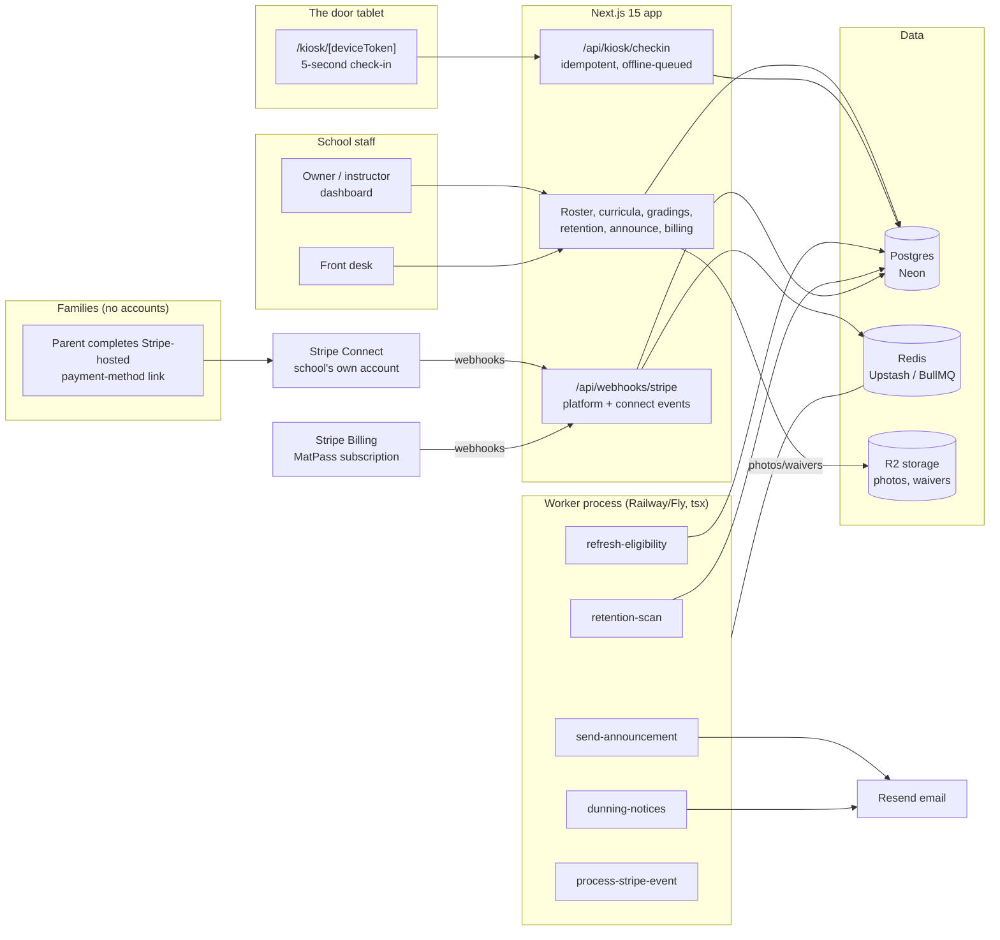

# MatPass Architecture

## Stack & Rationale

| Layer | Choice | Why |
|---|---|---|
| Web app + API | **Next.js 15 (App Router) + TypeScript** | One deployable for the owner/instructor dashboard, the kiosk (a device-token-locked route on a tablet), marketing pages, and webhooks. |
| Database | **Postgres (Neon) + Drizzle ORM** | Relational domain (schools -> programs -> curricula/ranks -> students -> enrollments -> check-ins -> promotions; families -> subscriptions). Drizzle typed schema-as-code; drizzle-kit migrations; Neon branches for previews. |
| Queue / workers | **BullMQ on Redis (Upstash), workers as standalone `tsx` processes** | The nightly eligibility refresh, retention scan, announcement fan-out, dunning notices, and Stripe event processing are recurring background work with retries — a real queue, not cron-in-a-route. Workers share `src/db` and `src/lib` with the app. |
| Payments | **Stripe Billing x2** | Family tuition runs on Stripe subscriptions under the school's own Stripe account (Stripe Connect Standard — tuition never touches our balance sheet); MatPass's own three tiers run on plain Stripe Billing. Payment-method collection via Stripe-hosted links parents complete themselves. |
| Object storage | **Cloudflare R2 (S3 API)** | Student photos and waiver documents. Signed URLs only; photos optional and access-controlled (minors). |
| Email | **Resend** | Announcements with delivery status, retention-outreach templates, dunning notices, magic-link auth. Guardian-centric: mail goes to the family, never the child. |
| Auth | **Auth.js (NextAuth v5)** for staff; **signed kiosk device tokens (jose)** for the door tablet | Staff are real accounts with roles. The kiosk route authenticates by device token — no staff credentials live on the mat, and a stolen tablet is revoked in one tap. |
| Offline kiosk | **Installable web app + client-side check-in queue** | Dojo wifi is flaky; check-ins queue locally and sync on reconnect with client-generated idempotency keys. |
| PDF/CSV | **pdf-lib + CSV export** | Certificate data exports, roster/report exports. |
| Styling | **Tailwind CSS v4** | Token-driven implementation of DESIGN.md. |

## System Diagram

## Data Model

All tables keyed by `id` (uuid), timestamps `created_at` / `updated_at` implied. Multi-tenancy: everything hangs off `school_id` (directly or through `programs`/`students`). The full Drizzle schema in `src/db/schema.ts` is the source of truth.

- **schools** — tenant root. `name`, `plan` (dojo|academy|federation), `stripe_customer_id` (our billing), `stripe_account_id` (their Connect account for tuition), `trial_ends_at`, `timezone`, `settings` (jsonb: retention thresholds, kiosk PIN policy).
- **locations** — Federation tier. `school_id`, `name`, `address`. Single-location schools get one implicit row.
- **users** — staff logins. `school_id`, `email`, `name`, `role` (owner|instructor|front_desk). Auth.js tables alongside.
- **programs** — "BJJ Adults", "Little Tigers". `school_id`, `name`, `description`, `status` (active|archived).
- **ranks** — the curriculum ladder. `program_id`, `name` ("Blue belt"), `display_order`, `belt_color_hex`, `stripes` (int — stripe steps within the rank), `min_classes` (since last promotion), `min_days_in_rank`, `requires_signoff` (bool). The progression engine reads exactly these fields.
- **families** — the household + billing unit. `school_id`, `name` ("The Okafor family"), `email`, `phone`, `stripe_customer_id` (on the school's Connect account), `notes`. Guardian contact lives here, never on the child.
- **students** — `school_id`, `family_id`, `first_name`, `last_name`, `birthdate` (nullable), `photo_key` (nullable, optional), `status` (active|paused|inactive), `joined_on`, `notes`.
- **enrollments** — student x program with rank state. `student_id`, `program_id`, `current_rank_id`, `current_stripes` (int), `promoted_at` (last promotion date — the time-in-rank clock), `status` (active|paused|ended). Unique `(student_id, program_id)`.
- **class_schedule** — recurring weekly classes. `program_id`, `location_id`, `weekday` (0-6), `starts_at_minutes` (minutes from midnight, tz from school), `duration_minutes`, `name` ("Adults Gi 6pm"), `instructor_id` (nullable), `status` (active|archived).
- **checkins** — the attendance ledger. `student_id`, `enrollment_id`, `class_schedule_id` (nullable — open mat), `checked_in_at`, `source` (kiosk|desk|import), `device_id` (nullable), `client_key` (client-generated idempotency key, unique — offline sync safety).
- **kiosk_devices** — the door tablets. `school_id`, `location_id`, `name` ("Front door iPad"), `token_hash`, `status` (active|revoked), `last_seen_at`.
- **grading_events** — `school_id`, `location_id`, `name` ("Summer grading"), `held_on`, `program_ids` (jsonb), `status` (draft|inviting|completed|cancelled), `graded_by` (user_id), `completed_at`.
- **grading_candidates** — the assembled list. `grading_event_id`, `enrollment_id`, `eligibility` (jsonb snapshot: classes done/required, days done/required, signoff state, near-miss deltas), `status` (eligible|near_miss|invited|confirmed|promoted|held_back|no_show). Unique `(grading_event_id, enrollment_id)`.
- **promotions** — the permanent rank record ("the wall and the record"). `enrollment_id`, `from_rank_id`, `from_stripes`, `to_rank_id`, `to_stripes`, `promoted_on`, `grading_event_id` (nullable — mat promotions happen), `graded_by` (user_id), `note`. Append-only; corrections append a reversal + new row.
- **membership_plans** — tuition products. `school_id`, `name` ("Family unlimited"), `amount_cents`, `interval` (month|year), `kind` (per_student|family_flat), `stripe_price_id` (on the Connect account), `status` (active|archived).
- **subscriptions** — family billing state. `family_id`, `membership_plan_id`, `stripe_subscription_id`, `status` (active|past_due|paused|canceled), `student_ids` (jsonb — who this covers), `current_period_end`, `past_due_since`.
- **retention_flags** — the drop-off alarm. `student_id`, `flagged_on`, `baseline_per_week` (numeric), `recent_per_week` (numeric), `last_seen_on`, `status` (open|contacted|recovered|lost), `outcome_note`, `handled_by`. One open flag per student (partial-unique enforced in code).
- **announcements** — `school_id`, `subject`, `body_md`, `audience` (jsonb: all|program ids), `sent_by`, `sent_at`.
- **deliveries** — per-recipient outcome. `announcement_id`, `family_id`, `provider_message_id`, `status` (queued|sent|delivered|bounced|failed), `occurred_at`.
- **webhook_events** — Stripe idempotency ledger. `provider`, `external_id` (unique), `type`, `payload` (jsonb), `processed_at`.
- **audit_log** — `school_id`, `actor` (user_id|system), `action`, `target`, `metadata` (jsonb). Promotions, billing changes, kiosk revocations, and flag outcomes always logged.

## Key Flows

### 1. Kiosk check-in (5 seconds at the door)

1. The tablet opens `/kiosk/[deviceToken]` — device-token locked, no staff login on the mat; a revoked token bricks the kiosk instantly.
2. Student types 3+ letters of their name (or their PIN); taps their card (photo if on file, belt bar always); taps today's class (the nearest scheduled class for their program is pre-selected). Done. Kid-sized 44px+ targets throughout.
3. The check-in POSTs with a client-generated idempotency key; offline it queues locally (installable web app) and syncs on reconnect — the unique `client_key` makes replays safe.
4. Server attaches the check-in to the enrollment, bumps the progress computation inputs, and the kiosk shows the student's belt bar with the class counter ticking (+1) — the signature detail, live at the door.
5. Desk fallback: front desk can check anyone in (late arrivals, forgotten PINs) from the roster with two taps.

### 2. Progression engine -> grading event (the self-assembling list)

1. Progress per enrollment = `classes since promoted_at` vs `rank.min_classes` + `days since promoted_at` vs `rank.min_days_in_rank` + sign-off state where required. Recomputed incrementally on check-in and nightly (`refresh-eligibility`) for drift.
2. The owner creates a grading event (date + programs). The candidate list assembles itself: eligible enrollments, plus near-misses with exact deltas ("2 classes short", "11 days short") — the near-miss list is the coaching tool.
3. Invitations go by family email; the desk confirms attendance. On event day, the grading screen is a checklist: promote / hold back / no-show per candidate.
4. Completing the event batch-writes `promotions` behind one review screen ("14 promotions — review before recording"), stamps the event, and resets each promoted enrollment's clock (`promoted_at`, `current_stripes`). Mat promotions (spontaneous stripe on the mat) use the same write path minus the event.
5. Every promotion is append-only with grader attribution — the record a parent, a franchise, or a federation can trust.

### 3. Family billing (tuition on the school's own Stripe)

1. School connects its Stripe account (Connect Standard) and defines membership plans; MatPass mirrors them as prices on the connected account.
2. A family subscribes: the desk picks the plan + covered students, and Stripe's hosted flow collects the payment method via a link the parent completes on their own phone — card numbers never pass through MatPass screens.
3. Subscriptions bill on Stripe's clock. Webhooks (`invoice.payment_failed`, `customer.subscription.updated`, ...) flow through the standard pipeline: **verify -> insert `webhook_events` by event id (duplicate = ack and stop) -> enqueue `process-stripe-event` -> ack fast.**
4. Failed payments flip the family to `past_due`, visible at the desk ("card failed Jul 3 — retry link sent") with `dunning-notices` emailing the parent a Stripe-hosted update link. Attendance and progression are never blocked by billing state — the kid still checks in; the desk has the conversation.
5. Pause state (summer, injury) pauses the Stripe subscription and marks students `paused` — retention scan ignores paused students (a pause is not a quiet quit).

### 4. Retention flags (the drop-off alarm)

1. `retention-scan` runs nightly: per active student, compare recent attendance (trailing 3 weeks) against their own baseline (trailing 12-week cadence). A student at <40% of their own baseline with >=10 days since last check-in gets an open flag — personal thresholds, not a global "inactive 30 days" blunt instrument.
2. The flagged list reads like a call sheet: "Marcus O. — last seen 19 days ago · was 3x/week · family: Okafor". One-tap outcomes: contacted (with note), recovered (auto-closes when check-ins resume), lost.
3. Flag -> outcome -> result is the loop the owner report celebrates: "7 flags this month, 4 recovered." The alarm's value is provable inside the product.

### 5. Announcements + MatPass billing

1. Announcements compose once, target all or per-program, fan out via `send-announcement` with per-family `deliveries` rows and delivery status ("42 delivered · 1 bounced — fix this address").
2. MatPass's own subscription: 14-day trial, student-count limits enforced softly (student 101 on Dojo prompts an upgrade, never blocks a check-in), hosted checkout + customer portal, webhooks through the same idempotent pipeline.

## Queue & Worker Jobs

| Job | Trigger | Behavior |
|---|---|---|
| `refresh-eligibility` | Nightly per school; after promotions batch | Recompute progress + eligibility snapshots for active enrollments (drift guard — incremental updates happen on check-in). |
| `retention-scan` | Nightly per school | Personal-baseline drop-off detection; open flags (one per student); auto-close recovered flags when check-ins resume. |
| `send-announcement` | Announcement send | Fan out per family via Resend; write `deliveries`; retries 3x; bounce statuses recorded. |
| `dunning-notices` | `invoice.payment_failed` event; daily follow-up | Email the family a Stripe-hosted payment-update link; escalate to a desk task after 2 failures; never blocks attendance. |
| `process-stripe-event` | Stripe webhook ack (platform + connect) | Apply subscription/plan state from persisted events; idempotent by event id. |
| `export-report` | Owner request | Roster/promotions/attendance CSV or certificate-data PDF to R2, signed link surfaced in-app. |

Dead-letter queue + Sentry on repeated failure; graceful shutdown drains active jobs.

## Third-Party Services & Rough Pricing

| Service | Role | Rough cost |
|---|---|---|
| Neon (Postgres) | Primary DB | Free tier -> ~$19/mo |
| Upstash (Redis) | BullMQ | Free tier -> ~$10/mo |
| Cloudflare R2 | Photos, waivers | $0.015/GB-mo; a school's media is ~1-2 GB — pennies |
| Stripe Connect | Tuition on the school's account | Schools pay standard Stripe fees; no platform cost |
| Stripe Billing | MatPass subscriptions | 2.9% + 30c |
| Resend | Announcements, dunning, auth | Free 3k/mo -> $20/mo (a 200-student school sends ~500-1,500 emails/mo) |
| Vercel | Hosting | Hobby free -> Pro $20/mo |
| Railway/Fly | Worker process | ~$5-10/mo |
| Sentry | Errors (kiosk sync + billing paths) | Free tier -> ~$26/mo |

## Estimated Monthly Running Cost

| Scale | Assumptions | Estimate |
|---|---|---|
| **0 customers (dev/preview)** | Free tiers | **~$5-10/mo** |
| **150 schools** | ~$13k MRR. ~150k emails/mo, ~200 GB R2 | Neon $19 + Upstash $10 + Vercel $20 + worker $10 + Resend ~$90 + R2 ~$3 + Sentry $26 = **~$180/mo (~1.4% of revenue)** |
| **800 schools** | ~$70k MRR | Neon ~$70 + infra ~$120 + Resend ~$300 + Sentry ~$80 = **~$570/mo (~0.8% of revenue)** |

Kiosk hardware is the customer's ($150 tablet); tuition processing fees are the school's at standard Stripe rates. The margin structure is classic SaaS — the operational work is curriculum templates and onboarding polish, not infra.
