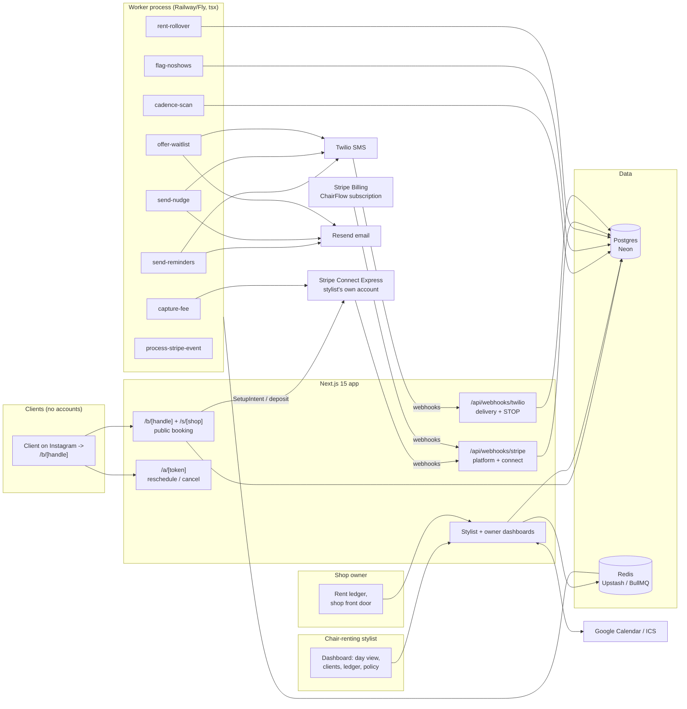

# ChairFlow Architecture

## Stack & Rationale

| Layer | Choice | Why |
|---|---|---|
| Web app + API | **Next.js 15 (App Router) + TypeScript** | One deployable for the stylist dashboard, the public booking pages (`/b/[handle]` and the shop front door), marketing pages, and webhooks. |
| Database | **Postgres (Neon) + Drizzle ORM** | Relational domain (stylists -> services -> clients -> appointments -> charges; policies with versions; shops -> chairs -> rent ledger). Drizzle typed schema-as-code; drizzle-kit migrations; Neon branches for previews. |
| Queue / workers | **BullMQ on Redis (Upstash), workers as standalone `tsx` processes** | Reminders, the nightly cadence scan, nudge sends, no-show auto-flagging, fee capture, waitlist offers, and rent-week rollovers are recurring background work with retries — a real queue, not cron-in-a-route. Workers share `src/db` and `src/lib` with the app. |
| Payments | **Stripe Connect (Express) + Stripe Billing** | The load-bearing decision: deposits and no-show fees are PaymentIntents/SetupIntents on the *stylist's own* Express account — client money never touches our balance sheet. Cards saved off-session with explicit policy agreement; fees charge off-session per policy. ChairFlow's own subscription runs on plain Stripe Billing. |
| Email + SMS | **Resend (email) + Twilio (SMS)** | Confirmations, reminders (48h/2h), rebooking nudges, waitlist offers. Booking-flow SMS consent, STOP honored globally, quiet hours, nudge caps; 10DLC registration in Phase 0. |
| Auth | **Auth.js (NextAuth v5)** for stylists/owners; **no client accounts, ever** | Clients book with name + phone (+ saved card via Stripe); manage-appointment links are signed tokens (jose). Client accounts are where booking conversion dies. |
| Calendar sync | **Google Calendar API + ICS feeds** (Book tier) | Availability honesty: external busy blocks mask booking slots; ChairFlow appointments push out. |
| Styling | **Tailwind CSS v4** | Token-driven implementation of DESIGN.md. |

## System Diagram

## Data Model

All tables keyed by `id` (uuid), timestamps `created_at` / `updated_at` implied. Multi-tenancy: everything hangs off `stylist_id`; shop tables hang off `shop_id`. The full Drizzle schema in `src/db/schema.ts` is the source of truth.

- **stylists** — tenant root. `user_id`, `handle` (unique — the booking URL), `display_name`, `trade` (stylist|barber|esthetician|nails), `timezone`, `plan` (chair|book|shop_member), `stripe_customer_id` (our billing), `stripe_account_id` (their Express account), `connect_status` (pending|active), `shop_id` (nullable), `working_hours` (jsonb per weekday), `settings` (jsonb: reminder offsets, quiet hours).
- **users** — logins (stylists and shop owners). `email`, `name`. Auth.js tables alongside.
- **shops** — Shop tier. `owner_user_id`, `name`, `slug` (front-door URL), `address`, `stripe_customer_id`, `settings`.
- **chairs** — `shop_id`, `label` ("Chair 4"), `stylist_id` (nullable — vacant), `weekly_rent_cents`, `status` (occupied|vacant).
- **services** — `stylist_id`, `name` ("Skin fade"), `duration_minutes`, `price_cents`, `deposit_rule` (jsonb: none | flat_cents | percent), `status` (active|archived).
- **policies** — versioned fee policy. `stylist_id`, `version`, `cancel_window_hours`, `late_cancel_fee_percent`, `no_show_fee_percent`, `policy_text` (rendered on the booking page), `effective_at`. Append-only: editing creates version N+1; every appointment stores the version it was booked under.
- **clients** — per stylist (the stylist's book, not a marketplace identity). `stylist_id`, `first_name`, `last_name`, `phone`, `email`, `sms_consent`, `sms_opted_out_at`, `stripe_customer_id` (on the stylist's Connect account), `default_payment_method_id` (card on file), `notes`, `no_show_count`, `status` (active|archived). Unique `(stylist_id, phone)`.
- **appointments** — the core object. `stylist_id`, `client_id`, `service_id`, `starts_at`, `ends_at`, `price_cents`, `status` (booked|completed|no_show|late_cancelled|cancelled|rescheduled), `policy_version`, `policy_agreed_at` (the timestamp that wins disputes), `deposit_payment_intent_id` (nullable), `deposit_cents`, `manage_token_hash`, `source` (booking_page|manual|nudge|waitlist), `marked_at`, `marked_by`.
- **charges** — the protection ledger's rows. `appointment_id`, `kind` (deposit|no_show_fee|late_cancel_fee|refund), `amount_cents`, `stripe_payment_intent_id`, `status` (held|captured|charged|waived|refunded|failed|disputed), `policy_version`, `occurred_at`, `waived_by` (nullable), `failure_reason`.
- **cadences** — per client x service rhythm. `client_id`, `service_id`, `median_interval_days`, `sample_count`, `last_visit_on`, `next_due_on`, `computed_at`. Recomputed nightly.
- **nudges** — rebooking touches. `client_id`, `cadence_id`, `channel` (sms|email), `status` (queued|sent|delivered|failed|opted_out|booked), `cycle_count` (caps at 2 per cycle), `booking_token_hash`, `sent_at`, `resulted_appointment_id` (nullable — the receipt).
- **waitlist_entries** — `stylist_id`, `client_id`, `service_id`, `day_preference` (jsonb), `status` (waiting|offered|claimed|expired), `offered_appointment_slot` (jsonb), `offer_expires_at`.
- **rent_periods** — the split ledger. `chair_id`, `stylist_id`, `week_start_on`, `amount_cents`, `status` (due|paid|late|waived), `paid_at`, `stripe_payment_link_id` (nullable), `note`. Unique `(chair_id, week_start_on)`.
- **messages** — every outbound comm. `stylist_id`, `client_id`, `appointment_id` (nullable), `kind` (confirmation|reminder_48h|reminder_2h|nudge|waitlist_offer|receipt), `channel`, `provider_message_id`, `status` (queued|sent|delivered|failed|opted_out), `occurred_at`.
- **webhook_events** — provider idempotency ledger. `provider` (stripe|twilio), `external_id` (unique per provider), `type`, `payload` (jsonb), `processed_at`.
- **audit_log** — `stylist_id` (nullable), `shop_id` (nullable), `actor` (user_id|system|client_token), `action`, `target`, `metadata`. Fee charges, waives, policy edits, and rent changes always logged.

## Key Flows

### 1. Booking with card on file (the protection starts here)

1. Client opens `/b/[handle]` from the stylist's bio: services with prices, real availability (working hours minus appointments minus external busy blocks). Picks service + slot.
2. Contact step: name + phone (+ optional email), SMS consent checkbox. **The policy panel renders the stylist's current policy text** ("Cancel free until 24h before. Late cancel 25%. No-show 50%.") — booking = agreement; `policy_version` + `policy_agreed_at` stamp the appointment.
3. Payment step per the service's deposit rule: no deposit -> SetupIntent saves the card off-session; deposit -> PaymentIntent (charged, applied to the service at checkout by the stylist's own flow) on the stylist's Connect account. No Connect yet? Booking works cardless until Express onboarding completes (protection nudges the stylist to finish).
4. Confirmation renders + emails/texts with the manage link (signed token). Reminder jobs (48h/2h) are scheduled; a reschedule/cancel inside the window is honored automatically and instantly frees the slot for the waitlist.

### 2. No-show -> fee (the awkward moment, automated)

1. The appointment ends unmarked -> `flag-noshows` flags it 30 minutes after end time; the day view asks: Completed / No-show / Late-arrival grace.
2. Marking no-show (or late-cancel arriving inside the window) enqueues `capture-fee`: deposit applied first (kept per policy), remainder charged off-session against the card on file per the **agreed policy version** — the charge metadata carries policy version + agreement timestamp + appointment details (Stripe dispute evidence pre-assembled).
3. Failures (expired card, decline) mark the charge `failed` with the reason and surface a retry with a hosted payment link — the stylist decides how hard to pursue.
4. **Waive is one tap** from the charge row (grace matters commercially); waives are logged with actor. Receipts to the client quote the policy text they agreed to.
5. The protection ledger aggregates fees collected, deposits kept, and waives — the dashboard's running "paid for itself" number and the landing device's data source.

### 3. Cadence nudges (the client who drifted)

1. Nightly `cadence-scan`: per client x service with 2+ completed visits, compute the median interval; `next_due_on = last_visit + median`. CSV-imported histories seed cold-start cadences.
2. When `today > next_due_on + grace (default 5 days)` and the client has no upcoming appointment: enqueue `send-nudge` — "It's been 5 weeks — your usual Thursday 6pm is open" with a one-tap tokenized booking link (pre-filled service).
3. Caps and courtesy: max 2 nudges per cycle, quiet hours, STOP honored globally, and a nudge-born booking stamps `resulted_appointment_id` — the feature proves itself in receipts, not claims.

### 4. Chair-rent split ledger (Shop tier)

1. Owner creates the shop, chairs, and weekly rent per chair; assigns renters (each renter is a ChairFlow stylist).
2. `rent-rollover` opens each week's `rent_periods` row per occupied chair (due Monday, shop-local). Renters see "Rent due $250" with a Stripe payment link to the owner's account (or mark-paid-manually for cash — both sides see the same row flip).
3. Late weeks escalate visually (due -> late at +3 days); the owner dashboard shows the grid of chairs x weeks — the crumpled-envelope ledger, replaced.
4. ChairFlow takes no cut of rent in v1; the ledger is the Shop plan's value, not a payments play.

### 5. Waitlist backfill

1. Clients joining the waitlist pick service + day preferences.
2. A freed slot (cancel/reschedule) enqueues `offer-waitlist`: the matching entries get the offer by SMS, first-tap claims (token link, atomic claim — losers see "just missed it"), offers expire in 60 minutes and cascade to the next match.
3. A claimed offer books through the normal flow — deposit rules and policy agreement included. Backfilled revenue lands in the protection ledger's "recovered" line.

### 6. Billing (ChairFlow's own)

1. 14-day trial, no card; the trial's activation goal is a live booking page with a saved-card booking.
2. Stripe hosted checkout for the three tiers; customer portal for changes; Shop plan bills the owner, renters keep their own Chair/Book plans.
3. Webhooks (platform + connect): **verify signature -> insert `webhook_events` by event id (duplicate = ack 200 and stop) -> enqueue `process-stripe-event` -> ack fast.** The worker applies subscription/connect state idempotently. Failed subscription payment: grace, then the booking page shows "fully booked" rather than dying publicly — the stylist's brand is never the hostage.

## Queue & Worker Jobs

| Job | Trigger | Behavior |
|---|---|---|
| `send-reminders` | Scheduled per appointment (48h/2h) | Email + SMS (consent-gated); writes `messages`; reschedule/cancel links honor the policy window. |
| `flag-noshows` | Repeatable, every 15 min | Appointments ended 30+ min ago and unmarked -> flagged state for the day view; never auto-charges without the stylist's mark (or explicit auto-charge opt-in later). |
| `capture-fee` | Stylist marks no-show/late-cancel | Deposit-first capture, off-session PaymentIntent on the Connect account, policy metadata attached; idempotency key `appointment:{id}:fee`; failures surfaced with retry links. |
| `cadence-scan` | Nightly per stylist | Recompute cadences; enqueue due nudges within caps/quiet hours. |
| `send-nudge` | From cadence-scan | Consent-gated SMS/email with tokenized one-tap booking link; stamps results. |
| `offer-waitlist` | Slot freed | Match -> offer -> atomic claim -> cascade; offers expire in 60 min. |
| `rent-rollover` | Weekly per shop (shop-local Monday) | Open the week's rent_periods rows; flip due -> late at +3 days; notify both sides. |
| `process-stripe-event` | Stripe webhook ack | Apply subscription/connect/payment state from persisted events; idempotent by event id. |

Dead-letter queue + Sentry on repeated failure; graceful shutdown drains active jobs. DRY_RUN=1 short-circuits outbound SMS/email and Stripe charges with structured logs.

## Third-Party Services & Rough Pricing

| Service | Role | Rough cost |
|---|---|---|
| Neon (Postgres) | Primary DB | Free tier -> ~$19/mo |
| Upstash (Redis) | BullMQ | Free tier -> ~$10/mo |
| Stripe Connect (Express) | Deposits + fees on the stylist's account | Stylists pay standard Stripe fees; optional platform fee on card volume is phase-2 revenue |
| Stripe Billing | ChairFlow subscriptions | 2.9% + 30c |
| Twilio | Reminders, nudges, waitlist offers | ~$0.0079/SMS + ~$1.15/number/mo + 10DLC; ~60-120 SMS per stylist-month |
| Resend | Email side of every comm | Free 3k/mo -> $20/mo |
| Google Calendar API | Busy-block sync (Book tier) | Free |
| Vercel | Hosting | Hobby free -> Pro $20/mo |
| Railway/Fly | Worker process | ~$5-10/mo |
| Sentry | Errors (fee capture path especially) | Free tier -> ~$26/mo |

## Estimated Monthly Running Cost

| Scale | Assumptions | Estimate |
|---|---|---|
| **0 customers (dev/preview)** | Free tiers + one Twilio number | **~$5-15/mo** |
| **500 stylists** | ~$15k MRR. ~45k SMS/mo, ~80k emails/mo | Neon $19 + Upstash $10 + Vercel $20 + worker $10 + Twilio ~$400 + Resend ~$20 + Sentry $26 = **~$500/mo (~3% of revenue; SMS dominates)** |
| **2,500 stylists** | ~$75k MRR | Infra ~$250 + Twilio ~$2,000 + Resend ~$90 = **~$2,300/mo (~3% of revenue)** |

The phase-2 platform fee on deposit/fee volume layers on top with zero marginal infrastructure. SMS cost is bounded per stylist by reminder/nudge caps.
