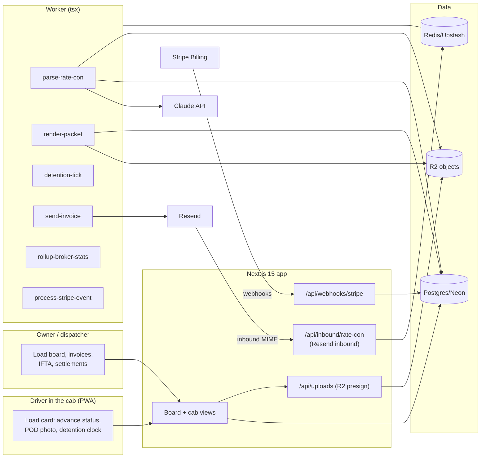

# DispatchDeck Architecture

## Stack & Rationale

| Layer | Choice | Why |
|---|---|---|
| Web app + API | **Next.js 15 (App Router) + TypeScript** | One deployable for the cab PWA, the office dashboard, marketing pages, and webhooks. The cab experience is a mobile web app pinned to the home screen — no app-store release cycle for an MVP. |
| Database | **Postgres (Neon) + Drizzle ORM** | Relational domain (carriers → trucks → loads → stops → documents → invoices → payments; jurisdictions ledger for IFTA). Drizzle typed schema-as-code; drizzle-kit migrations. |
| Queue / workers | **BullMQ on Redis (Upstash), workers as standalone `tsx` processes** | Rate-con parsing, packet rendering, detention ticking, invoice emailing, and days-to-pay rollups are background work with retries — a real queue, not cron-in-a-route. Workers share `src/db` and `src/lib` with the app. |
| Documents | **R2 (S3 API) for PDFs/photos; pdf-lib for packet assembly** | Rate cons, BOL photos, fuel receipts, and rendered packets are objects; the DB stores keys + metadata. Packet assembly merges pages server-side. |
| Parsing | **Claude API (rate-con extraction)** | Rate cons are unstructured broker PDFs; a forced tool call extracts broker/rate/stops/references with a confidence score. Low confidence → draft flagged for review, never silently wrong. |
| Payments | **Stripe Billing** | Three plans; hosted checkout + customer portal; webhooks drive plan state. |
| Email | **Resend** (inbound parse address + outbound packets) | Forward-the-rate-con intake and invoice sends with attachments. |
| Auth | **scrypt + jose session cookies** | Small team surface (owner, dispatcher, drivers); no OAuth dependency in the cab. |
| Styling | **Tailwind CSS v4** | Token-driven implementation of DESIGN.md. |

## System Diagram

## Data Model

All tables keyed by `id` (uuid), timestamps `created_at`/`updated_at` implied. Multi-tenancy: everything hangs off `carrier_id`.

- **carriers** — tenant root. `name`, `mc_number`, `dot_number`, `plan` (trial|solo|team|fleet), `stripe_customer_id`, `stripe_subscription_id`, `trial_ends_at`, `timezone`, `settings` (jsonb: detention free hours, default per-hour rate, invoice terms, factoring company profile).
- **users** — `carrier_id`, `email`, `password_hash`, `name`, `role` (owner|dispatcher|driver), `truck_id` (nullable default assignment).
- **trucks** — `carrier_id`, `unit_number`, `year_make_model`, `plate`, `status` (active|parked).
- **brokers** — the broker book. `carrier_id`, `name`, `mc_number`, `terms_days`, `contact_email`, `contact_phone`, `avg_days_to_pay` (computed), `notes`.
- **loads** — the core object. `carrier_id`, `truck_id`, `driver_user_id`, `broker_id`, `reference` (broker load #), `status` (booked|dispatched|at_shipper|in_transit|delivered|invoiced|paid|cancelled), `rate_cents`, `accessorials_cents` (computed from lines), `total_miles`, `deadhead_miles`, `equipment` (van|reefer|flatbed|other), `factored` (bool), `factoring_status` (null|submitted|advanced|settled), `booked_at`, `delivered_at`, `notes`.
- **stops** — ordered pickup/delivery. `load_id`, `seq`, `kind` (pickup|delivery), `facility`, `address`, `city`, `state`, `window_start`, `window_end`, `arrived_at`, `departed_at`, `appointment_ref`. Detention math reads arrived/departed.
- **accessorial_lines** — `load_id`, `kind` (detention|lumper|tonu|layover|other), `description`, `amount_cents`, `evidence` (jsonb: timestamps, stop_id), `status` (draft|billed|paid|rejected).
- **documents** — `carrier_id`, `load_id` (nullable), `kind` (rate_con|bol|pod_photo|fuel_receipt|packet|other), `r2_key`, `filename`, `content_type`, `size_bytes`, `pages`, `uploaded_by`.
- **rate_con_drafts** — parse output awaiting confirmation. `carrier_id`, `document_id`, `extracted` (jsonb: broker, rate, stops[], references), `confidence` (0–100), `status` (pending|confirmed|discarded), `load_id` (nullable once confirmed).
- **invoices** — `carrier_id`, `load_id`, `number` (per-carrier sequence), `amount_cents`, `status` (draft|sent|paid|void), `sent_at`, `paid_at`, `sent_to`, `packet_document_id`, `factoring_export_id` (nullable).
- **payments** — `carrier_id`, `invoice_id`, `amount_cents`, `method` (ach|check|factoring_advance|factoring_settlement), `received_on`, `note`. Days-to-pay rollups read these.
- **factoring_exports** — schedule-of-accounts batches. `carrier_id`, `format` (triumph|rts|otr|generic), `invoice_ids` (uuid[]), `csv_r2_key`, `exported_at`.
- **jurisdiction_legs** — IFTA raw entries. `carrier_id`, `truck_id`, `load_id` (nullable), `state`, `miles`, `entered_on`, `source` (odometer|manual).
- **fuel_purchases** — `carrier_id`, `truck_id`, `state`, `gallons`, `amount_cents`, `purchased_on`, `receipt_document_id`.
- **webhook_events** — Stripe idempotency ledger. `provider`, `external_id` (unique), `type`, `payload`, `processed_at`.
- **audit_log** — `carrier_id`, `actor`, `action`, `target`, `metadata`. Invoice sends, factoring exports, and rate edits always logged.

## Key Flows

### 1. Rate con → load (the 60-second intake)

1. Broker email forwarded to the carrier's unique parse address (Resend inbound), or the PDF is snapped/uploaded in the app → `documents` row → enqueue `parse-rate-con`.
2. The worker calls Claude with a forced extraction tool (broker, MC, rate, stops with windows, references); writes `rate_con_drafts` with confidence.
3. Confidence ≥ 80: the draft renders pre-filled for one-tap confirm → creates `loads` + `stops` + links the document. Below 80: draft opens in review mode with the PDF alongside. Parse failure: the document still lands; manual entry takes 60 seconds. Never silently wrong.

### 2. The cab lifecycle

1. The driver's view is one card: the current load, its next stop, and one advancing button (Dispatched → Arrived shipper → Loaded → Arrived receiver → Delivered). Each tap stamps a timestamp into `stops`.
2. Arrival at any stop starts the detention clock UI; past the carrier's free window (default 2h) the clock turns amber and `detention-tick` drafts an `accessorial_lines` row at the configured rate with both timestamps as evidence. The driver confirms or dismisses at departure.
3. Delivered requires the POD: camera → R2 presigned upload → `documents(kind: pod_photo)`; the load flips `delivered` with `delivered_at`.

### 3. Packet → invoice → factoring

1. Delivered loads show "Build packet": `render-packet` merges invoice PDF (generated) + rate con + POD photos into one `documents(kind: packet)` object, after a completeness check (rate con present? POD present? rate matches draft?) — missing pieces block with a named reason (the bounce-killer).
2. Send: email to broker (terms from the broker book) or mark factored. Factoring: invoices batch into `factoring_exports` as schedule-of-accounts CSV in the factor's column format; advances and settlements record as `payments` rows against the invoice.
3. `rollup-broker-stats` nightly recomputes `avg_days_to_pay` from real payments only.

### 4. IFTA quarter

1. State crossings from the cab (odometer prompt at state line — manual in MVP) or per-load leg entry write `jurisdiction_legs`; fuel receipts photographed → `fuel_purchases`.
2. Quarter view: per-state miles, gallons, MPG, and the summary export (CSV/PDF) matching the IFTA return's worksheet columns. No filing service in v1 — the honest scope is "your numbers, ready".

### 5. Billing

Stripe hosted checkout, portal, and webhooks (`checkout.session.completed`, `customer.subscription.updated|deleted`, `invoice.payment_failed`): **verify signature → insert `webhook_events` by event id (duplicate = ack and stop) → enqueue `process-stripe-event` → ack fast.** The worker applies plan state idempotently; dunning gives grace then read-only (exports always work).

## Queue & Worker Jobs

| Job | Trigger | Behavior |
|---|---|---|
| `parse-rate-con` | Inbound email / upload | Claude extraction → draft with confidence; retries with backoff; failure still lands the document. |
| `render-packet` | "Build packet" | Completeness check → pdf-lib merge → packet document; idempotent per (load, doc set hash). |
| `detention-tick` | Repeatable 5 min | Stops arrived past free window without departure → draft accessorial once (unique per stop). |
| `send-invoice` | Send tap | Resend email with packet attached; invoice → sent; DRY_RUN logs instead. |
| `rollup-broker-stats` | Nightly | avg_days_to_pay per broker from payments. |
| `process-stripe-event` | Stripe webhook ack | Idempotent plan state from persisted events. |

Dead-letter queue + Sentry on repeated failure; graceful shutdown drains active jobs.

## Third-Party Services & Rough Cost

| Service | Role | Rough cost |
|---|---|---|
| Neon | Postgres | Free tier → ~$19/mo |
| Upstash | Redis/BullMQ | Free tier → ~$10/mo |
| Cloudflare R2 | Documents | ~$0.015/GB/mo, no egress fees |
| Claude API | Rate-con extraction | ~$0.01–0.03/parse |
| Stripe Billing | Subscriptions | 2.9% + 30¢ |
| Resend | Inbound parse + packet sends | Free 3k/mo → $20/mo |
| Vercel + Railway/Fly | App + worker | ~$25–35/mo |
| Sentry | Errors | Free tier → ~$26/mo |

**Estimated monthly:** dev ~$0–15; 200 carriers (~$14k MRR) ≈ $150–250/mo — parsing volume (~30 loads/carrier/mo) dominates and stays under 2% of revenue.
