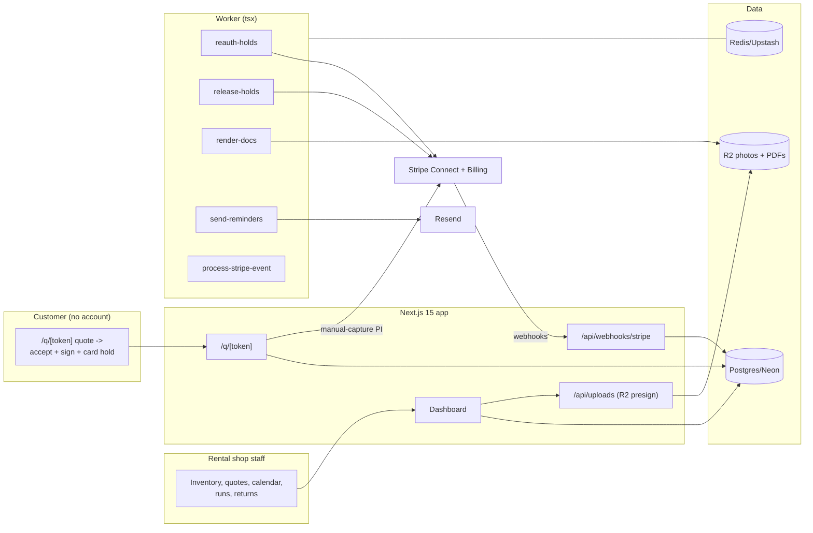

# RigRent Architecture

## Stack & Rationale

| Layer | Choice | Why |
|---|---|---|
| Web app + API | **Next.js 15 (App Router) + TypeScript** | One deployable for the shop dashboard, the customer-facing quote/sign pages, marketing, and webhooks. |
| Database | **Postgres (Neon) + Drizzle ORM** | Relational domain (accounts → items → orders → lines → runs → checks); availability is a SQL aggregation over date-overlapping confirmed lines — correctness lives in one query, not app memory. |
| Queue / workers | **BullMQ on Redis (Upstash), workers as standalone `tsx` processes** | Deposit auth expiry re-auths, run-sheet PDFs, reminder emails, and hold releases are background work with retries. Workers share `src/db` and `src/lib`. |
| Payments | **Stripe Connect (Standard) — the operator's own account** | Security deposits are manual-capture PaymentIntents (authorization holds) on the operator's Stripe; RigRent's own subscription is plain Stripe Billing. Holds expire ~7 days — the worker re-authorizes long rentals. |
| Documents/photos | **R2 (S3 API)** for condition photos and contract PDFs; **pdf-lib** for contracts and run sheets | Photo pairs are the damage evidence; objects in R2, keys + metadata in Postgres. |
| E-sign | **In-app signature + initials capture (canvas), sha256 doc hash** | Same audit pattern proven in LensCRM: render terms, capture signature + initials on the damage clause, hash the signed document. |
| Email | **Resend** | Quotes, contracts, receipts, return reminders. |
| Auth | **scrypt + jose session cookies** | Small-team shop staff; customer surfaces are tokenized links, no customer accounts. |
| Styling | **Tailwind CSS v4** | Token-driven implementation of DESIGN.md. |

## System Diagram

## Data Model

All tables keyed by `id` (uuid), timestamps implied. Multi-tenancy: everything hangs off `account_id`.

- **accounts** — tenant root. `name`, `plan` (trial|yard|fleet|pro), `stripe_customer_id`, `stripe_subscription_id`, `stripe_account_id` (Connect, for deposits), `trial_ends_at`, `timezone`, `settings` (jsonb: deposit defaults, tax rate, damage fee schedule defaults).
- **users** — `account_id`, `email`, `password_hash`, `name`, `role` (owner|staff|driver).
- **customers** — `account_id`, `name`, `email`, `phone`, `company`, `tax_exempt` (bool), `notes`.
- **items** — the catalog. `account_id`, `name` ("White folding chair"), `category`, `owned_count`, `replacement_cents`, `daily_rate_cents`, `weekend_rate_cents`, `damage_fees` (jsonb: [{label, amount_cents}]), `tracked_by` (quantity|serial), `status` (active|retired).
- **units** — optional serials. `item_id`, `serial`, `status` (in_service|maintenance|lost).
- **maintenance_holds** — `item_id`, `unit_id` (nullable), `quantity`, `starts_on`, `ends_on`, `reason`. Availability subtracts these.
- **orders** — quote → order, one object. `account_id`, `customer_id`, `status` (draft|sent|accepted|confirmed|out|returned|closed|cancelled), `event_start`, `event_end`, `out_on`, `due_back_on`, `delivery` (bool), `address`, `subtotal_cents`, `tax_cents`, `total_cents`, `deposit_cents`, `deposit_payment_intent_id`, `deposit_status` (none|held|captured_partial|captured|released|expired), `sign_token_hash`, `signed_at`, `signature_r2_key`, `doc_hash`, `notes`.
- **order_lines** — `order_id`, `item_id`, `quantity`, `rate_cents`, `line_total_cents`. Availability checks read confirmed lines overlapping [out_on, due_back_on].
- **runs** — delivery/pickup batches. `account_id`, `kind` (delivery|pickup), `run_on` (date), `truck_label`, `driver_user_id`, `stop_order` (uuid[] of orders), `status` (planned|loaded|out|done), `sheet_r2_key`.
- **checks** — per-line condition events. `order_line_id`, `direction` (out|in), `quantity_ok`, `quantity_damaged`, `quantity_missing`, `checked_by`, `checked_at`, `note`.
- **condition_photos** — `check_id`, `r2_key`, `taken_at`. The photo pair = out-check photos vs in-check photos for the same line.
- **damage_claims** — `order_id`, `order_line_id`, `kind` (damage|missing), `description`, `amount_cents`, `photo_ids` (uuid[]), `status` (draft|charged|waived|disputed), `stripe_capture_id`, `resolved_at`.
- **webhook_events** — Stripe idempotency ledger. `provider`, `external_id` (unique), `type`, `payload`, `processed_at`.
- **audit_log** — `account_id`, `actor`, `action`, `target`, `metadata`. Deposit captures, waives, contract signs, and inventory count edits always logged.

## Key Flows

### 1. Availability (the product's spine)

`available(item, from, to) = owned_count − SUM(confirmed+out lines overlapping [from,to]) − SUM(maintenance holds overlapping)`. One SQL query with date-range overlap (`out_on < :to AND due_back_on > :from`); computed live on every quote line render and re-checked inside the acceptance transaction. A failed re-check blocks acceptance with the conflicting order's number — never a silent oversell.

### 2. Quote → sign → hold

1. Staff builds the quote for the event window; each line renders live availability for that window; overbooked lines block at draft time.
2. Send → customer opens `/q/[token]`: line items, terms, the damage-fee schedule, and the deposit amount. Accept = signature + initials on the damage clause (canvas), doc rendered to PDF, sha256 hash stored.
3. Card step: manual-capture PaymentIntent for the deposit on the operator's Connect account → `deposit_status: held`. Order flips `confirmed`; availability now counts it.

### 3. Out and back (the photo pairs)

1. Delivery/pickup runs group orders per date; load lists aggregate per-item quantities per truck; drivers check off at load with out-photos per line (R2 presign from the van).
2. Return: check-in each line — clean/damaged/missing counts + in-photos. Clean order → `release-holds` cancels the authorization (money never moved). Damage → claim drafted from the fee schedule with the photo pair attached; capture draws exactly the claim amount from the hold (partial capture), remainder released.
3. Hold lifecycle: authorizations expire (~7 days); `reauth-holds` re-authorizes rentals whose due-back is beyond expiry (cancel + new PI, customer notified per Stripe rules).

### 4. Billing

RigRent's own three plans on Stripe Billing: hosted checkout, portal, webhooks with the standard law — **verify signature → insert `webhook_events` by event id (duplicate = ack and stop) → enqueue `process-stripe-event` → ack fast**; the worker applies plan state idempotently; dunning gives grace then read-only (exports always work).

## Queue & Worker Jobs

| Job | Trigger | Behavior |
|---|---|---|
| `reauth-holds` | Nightly | Holds expiring before due-back → cancel + re-authorize; failures surface on the order with a retry link. |
| `release-holds` | Clean return check-in | Cancel the authorization; write audit; email receipt. |
| `render-docs` | Sign / run planned | Contract PDF (pdf-lib, hashed) and run-sheet PDFs to R2. |
| `send-reminders` | Daily | Due-back tomorrow reminders; overdue returns escalate. |
| `process-stripe-event` | Webhook ack | Idempotent subscription/connect/capture state from persisted events. |

Dead-letter queue + Sentry on repeated failure; graceful shutdown; DRY_RUN short-circuits Stripe captures and email.

## Third-Party Services & Rough Cost

| Service | Role | Rough cost |
|---|---|---|
| Neon | Postgres | Free tier → ~$19/mo |
| Upstash | Redis/BullMQ | Free tier → ~$10/mo |
| Cloudflare R2 | Photos + PDFs | ~$0.015/GB/mo |
| Stripe Connect | Deposit holds on the operator's account | Operator pays standard Stripe fees |
| Stripe Billing | RigRent subscriptions | 2.9% + 30¢ |
| Resend | Quotes/contracts/reminders | Free 3k/mo → $20/mo |
| Vercel + Railway/Fly | App + worker | ~$25–35/mo |
| Sentry | Errors (hold lifecycle especially) | Free tier → ~$26/mo |

**Estimated monthly:** dev ~$0–10; 150 accounts (~$15k MRR) ≈ $120–180/mo (<2% of revenue). Photo storage grows ~2–5 GB/account/yr — R2's zero egress keeps it cheap.
