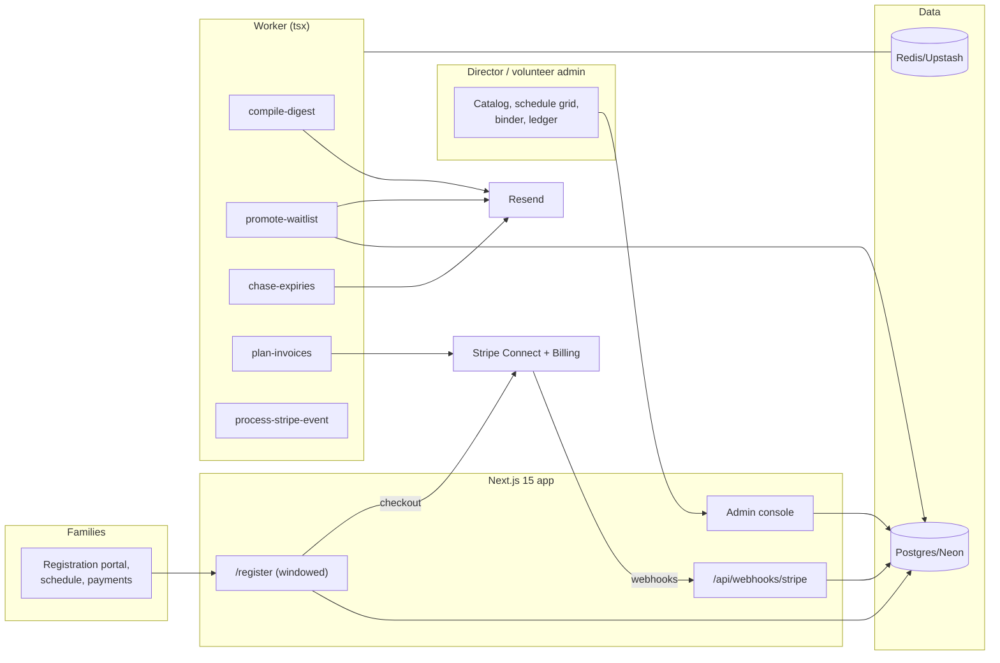

# CoopClass Architecture

## Stack & Rationale

| Layer | Choice | Why |
|---|---|---|
| Web app + API | **Next.js 15 (App Router) + TypeScript** | One deployable for the admin console, the family registration portal, marketing, and webhooks. Registration night is a burst-load web problem — server components + a capacity check in SQL handle it without drama. |
| Database | **Postgres (Neon) + Drizzle ORM** | Relational domain (co-ops → terms → periods/rooms → classes → families → students → enrollments; volunteers → checks). Capacity and conflicts are constraint problems — they live in transactional SQL, not app memory. |
| Queue / workers | **BullMQ on Redis (Upstash), workers as standalone `tsx` processes** | Digest compilation, waitlist promotion, check-expiry chasing, and payment-plan invoicing are scheduled background work with retries. |
| Payments | **Stripe Billing + Checkout** | The co-op's family fees run through the co-op's own Stripe account (Connect Standard): one checkout per family per term, payment plans as subscription schedules. CoopClass's own SaaS billing is plain Stripe Billing. |
| Email | **Resend** | Registration confirmations, waitlist promotions, the weekly digest, expiry chasing. |
| Auth | **scrypt + jose session cookies** | Two audiences, one system: admin/teacher roles and family logins. No OAuth dependency. |
| Styling | **Tailwind CSS v4** | Token-driven implementation of DESIGN.md. |

## System Diagram

## Data Model

All tables keyed by `id` (uuid), timestamps implied. Multi-tenancy: everything hangs off `coop_id`.

- **coops** — tenant root. `name`, `slug`, `plan` (trial|gathering|community|academy|paused), `stripe_customer_id`, `stripe_subscription_id`, `stripe_account_id` (Connect for family fees), `timezone`, `settings` (jsonb: sibling discount rules, family cap, registration tiers).
- **users** — logins. `coop_id`, `email`, `password_hash`, `name`, `role` (director|admin|teacher|parent), `family_id` (nullable).
- **families** — `coop_id`, `name` ("Hernandez"), `tier` (returning|new), `primary_user_id`, `phone`, `emergency_contact`, `notes`, `balance_cents` (derived cache).
- **students** — `family_id`, `first_name`, `last_name`, `grade_level`, `birthdate`, `allergies`, `notes`.
- **terms** — `coop_id`, `name` ("Fall 2026"), `starts_on`, `ends_on`, `status` (draft|registration|active|closed).
- **registration_windows** — `term_id`, `tier` (returning|new|all), `opens_at`, `closes_at`.
- **periods** — `term_id`, `label` ("Period 2"), `starts_at_time`, `ends_at_time`, `weekday`.
- **rooms** — `coop_id`, `name`, `capacity_note`.
- **classes** — `term_id`, `period_id`, `room_id`, `teacher_user_id`, `title`, `description`, `grade_min`, `grade_max`, `capacity`, `fee_cents`, `materials_fee_cents`, `prerequisite_class_id` (nullable), `status` (draft|open|full|cancelled).
- **enrollments** — the contended row. `class_id`, `student_id`, `family_id`, `status` (enrolled|waitlisted|dropped), `waitlist_position` (nullable), `enrolled_at`. Unique `(class_id, student_id)`. Capacity + conflict checks run in the enrollment transaction.
- **invoices** — per family per term. `coop_id`, `family_id`, `term_id`, `subtotal_cents`, `discount_cents`, `total_cents`, `status` (draft|sent|paid|plan_active|overdue|void), `stripe_checkout_session_id`, `stripe_subscription_schedule_id` (payment plans), `paid_at`. Line detail in `invoice_lines` (`invoice_id`, `enrollment_id`, `label`, `amount_cents`, `kind` (fee|materials|discount)).
- **volunteers** — the binder. `coop_id`, `user_id` (nullable), `name`, `role_label` ("Teacher", "Hall monitor"), `check_kind` (background|clearance|training), `completed_on`, `expires_on`, `document_note`, `status` (valid|expiring|lapsed) (derived).
- **attendance_records** — `class_id`, `student_id`, `met_on` (date), `present` (bool), `recorded_by`.
- **digests** — send ledger. `coop_id`, `family_id`, `week_of`, `sent_at`, `provider_message_id`.
- **webhook_events** — Stripe idempotency ledger. `provider`, `external_id` (unique), `type`, `payload`, `processed_at`.
- **audit_log** — `coop_id`, `actor`, `action`, `target`, `metadata`. Enrollment overrides, discount edits, and binder changes always logged.

## Key Flows

### 1. Registration night (the burst)

1. Window opens per tier (`registration_windows`); the portal shows the catalog with live capacity per class.
2. A family registers all siblings in one flow: pick classes per student → the enrollment transaction re-checks, atomically: window open? capacity left? grade band? prerequisite met? student free that period? room/teacher free? Failures name the reason ("Noah is already in Room 4 that period") and hold nothing.
3. Full classes offer the waitlist with the position shown honestly ("You'd be #3"). Waitlisted enrollments never bill.
4. The flow ends at one Stripe Checkout for the family's term total (fees + materials − sibling discount), or a payment-plan election (deposit now, N monthly payments as a subscription schedule on the co-op's Connect account).

### 2. Sibling discounts (the calculator, retired)

Discount rules live in `coops.settings` (e.g. 2nd child −10%, 3rd+ −20%, family cap $600/term). The engine computes at checkout-build time, writes explicit `invoice_lines(kind: discount)` rows — the math is shown line by line, never a mystery total.

### 3. Waitlist promotion

A drop frees a seat → `promote-waitlist` promotes position #1 atomically (same checks as registration), emails the family with a 48h claim link; unclaimed promotions cascade. Claims re-run the checkout delta.

### 4. The binder

`volunteers` rows carry expiry dates; `chase-expiries` (weekly) recomputes status (valid → expiring at T-60d → lapsed) and emails the volunteer + director at T-60/T-30/T-7 exactly once per threshold (send ledger in job data). The binder view is the audit answer: who is current, who lapses before term end, per role.

### 5. The digest

`compile-digest` (Sunday, co-op-local): per enrolled family — this week's schedule with room moves highlighted, teacher notes entered that week, upcoming dates. One email per family; the empty week sends the one quiet line. Send ledger in `digests`.

### 6. Billing (CoopClass's own)

Standard law on webhooks: **verify signature → insert `webhook_events` by event id (duplicate = ack and stop) → enqueue `process-stripe-event` → ack fast.** Both the SaaS subscription and the co-op's Connect events (checkout completed, plan invoice paid/failed) ride the same ledger. Summer pause is a plan state, not a cancellation.

## Queue & Worker Jobs

| Job | Trigger | Behavior |
|---|---|---|
| `compile-digest` | Weekly per co-op (Sunday local) | Per-family digest; quiet line on empty weeks; send ledger. |
| `promote-waitlist` | Seat freed | Atomic promotion with full checks; 48h claim links; cascade on expiry. |
| `chase-expiries` | Weekly | Recompute volunteer status; T-60/30/7 emails exactly once per threshold. |
| `plan-invoices` | Stripe schedule events | Reconcile payment-plan invoices to family balances. |
| `process-stripe-event` | Webhook ack | Idempotent subscription/checkout/plan state from persisted events. |

Dead-letter queue + Sentry; graceful shutdown; DRY_RUN short-circuits email and Stripe.

## Third-Party Services & Rough Cost

| Service | Role | Rough cost |
|---|---|---|
| Neon | Postgres | Free tier → ~$19/mo |
| Upstash | Redis/BullMQ | Free tier → ~$10/mo |
| Stripe Connect | Family fees on the co-op's account | Co-op pays standard Stripe fees |
| Stripe Billing | CoopClass subscriptions | 2.9% + 30¢ |
| Resend | Digests + chasing | Free 3k/mo → $20/mo (digests dominate) |
| Vercel + Railway/Fly | App + worker | ~$25–35/mo |
| Sentry | Errors (enrollment transaction especially) | Free tier → ~$26/mo |

**Estimated monthly:** dev ~$0–10; 150 co-ops (~$8k MRR) ≈ $120–170/mo (~2% of revenue) — digest email volume (150 co-ops × ~150 families weekly) is the main line; Resend's $20 tier covers ~100k/mo.
