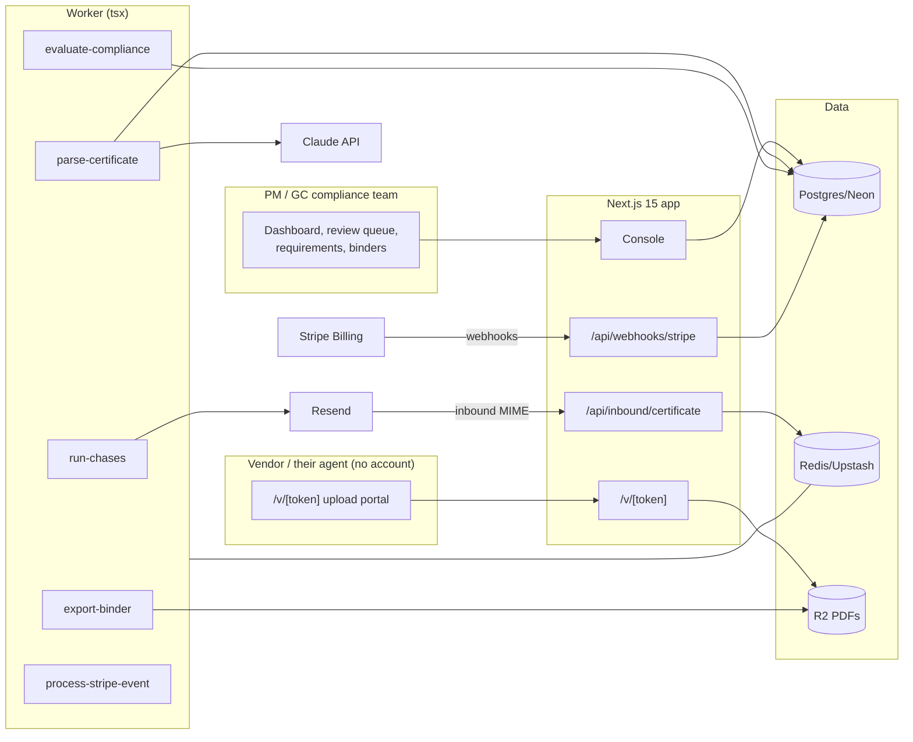

# CertShield Architecture

## Stack & Rationale

| Layer | Choice | Why |
|---|---|---|
| Web app + API | **Next.js 15 (App Router) + TypeScript** | One deployable for the compliance console, the vendor upload portal, marketing, and webhooks. |
| Database | **Postgres (Neon) + Drizzle ORM** | Relational domain (orgs → vendors → engagements → requirements → certificates → coverages → deficiencies → chases). Compliance is a deterministic join of parsed coverage against requirement rows — it lives in SQL + one pure function, testable to death. |
| Queue / workers | **BullMQ on Redis (Upstash), workers as standalone `tsx` processes** | Parsing, compliance re-evaluation, the chasing ladder, and binder exports are background work with retries. |
| Parsing | **Claude API (ACORD 25 extraction)** | ACORD forms are semi-structured PDFs; a forced tool call extracts carrier/policies/dates/limits/checkboxes with per-field confidence. Low confidence → review queue, never silent acceptance. |
| Documents | **R2 (S3 API)** for certificate PDFs and binder exports; **pdf-lib** for the binder assembly | The certificate PDF is legal evidence — stored immutably, hashed. |
| Payments | **Stripe Billing** | Three plans; hosted checkout + portal; webhooks drive plan state. |
| Email | **Resend** (chasing sequences + inbound cert intake) | Chases go to vendor + agent; an inbound address accepts emailed certificates. |
| Auth | **scrypt + jose session cookies**; tokenized vendor links | Office users log in; vendors never do. |
| Styling | **Tailwind CSS v4** | Token-driven implementation of DESIGN.md. |

## System Diagram

## Data Model

All tables keyed by `id` (uuid), timestamps implied. Multi-tenancy: everything hangs off `org_id`.

- **orgs** — tenant root. `name`, `kind` (property_mgmt|gc|other), `plan` (trial|ledger|portfolio|enterprise), `stripe_customer_id`, `stripe_subscription_id`, `trial_ends_at`, `timezone`, `settings` (jsonb: chase ladder offsets, escalation copy tone, default requirement template id).
- **users** — `org_id`, `email`, `password_hash`, `name`, `role` (admin|coordinator).
- **properties** — the org's units of exposure (properties or projects). `org_id`, `name`, `kind` (property|project), `address`, `status` (active|archived).
- **vendors** — `org_id`, `name`, `trade` ("Roofing"), `contact_name`, `contact_email`, `agent_name`, `agent_email`, `phone`, `upload_token_hash`, `status` (active|inactive), `notes`.
- **engagements** — vendor × property. `vendor_id`, `property_id`, `requirement_template_id`, `starts_on`, `ends_on` (nullable), `status` (active|ended). Compliance is evaluated per engagement (the same roofer can face different requirements on different properties).
- **requirement_templates** — `org_id`, `name` ("Standard vendor", "Sub — structural"), `lines` (jsonb: [{ coverage: "gl_each_occurrence", label, minCents }, …]), `flags` (jsonb: { additionalInsured: true, waiverOfSubrogation: true, primaryNonContributory: false }), `notes`.
- **certificates** — one per uploaded COI. `org_id`, `vendor_id`, `r2_key`, `sha256`, `source` (portal|inbound|manual), `parsed_status` (pending|parsed|needs_review|failed), `carrier`, `producer`, `holder_ok` (bool — certificate holder matches the org), `uploaded_at`, `reviewed_by` (nullable), `reviewed_at`.
- **coverages** — parsed lines. `certificate_id`, `kind` (gl_each_occurrence|gl_aggregate|auto_combined|umbrella_each|wc_each_accident|other), `label`, `limit_cents`, `policy_number`, `effective_on`, `expires_on`, `additional_insured` (bool|null), `waiver_of_subrogation` (bool|null), `confidence` (0–100).
- **evaluations** — compliance verdicts per engagement. `engagement_id`, `certificate_id` (the current best), `status` (compliant|deficient|expiring|expired|missing), `deficiencies` (jsonb: [{ line, reason }] — each a named sentence), `evaluated_at`. Latest row per engagement is the dashboard's truth; history kept.
- **chases** — the ladder's ledger. `engagement_id`, `kind` (renewal_t30|renewal_t14|renewal_t7|renewal_t1|lapsed|deficiency), `sent_to` (jsonb: emails), `sent_at`, `provider_message_id`. Unique `(engagement_id, kind, expiry_cycle)` — exactly once per cycle.
- **binder_exports** — `org_id`, `property_id`, `r2_key`, `requested_by`, `exported_at`.
- **webhook_events** — Stripe idempotency ledger. `provider`, `external_id` (unique), `type`, `payload`, `processed_at`.
- **audit_log** — `org_id`, `actor`, `action`, `target`, `metadata`. Manual overrides ("accept as compliant despite X") always logged with the named exception.

## Key Flows

### 1. Intake → parse → review

1. Vendor opens `/v/[token]` (or their agent emails the cert to the org's inbound address) → PDF to R2, `certificates` row, enqueue `parse-certificate`.
2. The worker calls Claude with a forced ACORD-25 extraction tool: carrier, producer, holder, per-line policy numbers, effective/expiry, limits, AI/WOS checkboxes — each with confidence.
3. All fields ≥ threshold → `parsed`; any below → `needs_review` with low-confidence fields highlighted next to the PDF. A human confirms; the certificate never silently enters compliance.

### 2. The compliance engine (deterministic, named reasons)

`evaluate(engagement)` joins the newest reviewed certificate's coverages against the engagement's requirement template:
- each required line present? limit ≥ minimum? within effective window?
- AI/WOS flags satisfied where required? holder correct?
Verdict + `deficiencies` (each a sentence: "GL each-occurrence $500,000 is below the required $1,000,000") written to `evaluations`. Re-runs on: new certificate, template edit, engagement change, and nightly (expiry rollover). Pure function + SQL — the test suite's centerpiece.

### 3. The chasing ladder

Nightly `run-chases` per engagement: expiring coverage → T-30/14/7/1 renewal requests to vendor + agent with the upload link; lapsed → the lapsed notice; deficient → the deficiency letter naming each gap. Exactly once per (engagement, kind, cycle) via the chases unique key; the ladder stops the moment a compliant replacement evaluates. Escalation copy is plain and firm, never robotic-legal.

### 4. Binders

`export-binder(propertyId)`: current certificate PDF for every active engagement + the compliance matrix page (pdf-lib) into one binder PDF in R2 — the audit answer in one object.

### 5. Billing

Standard law: **verify signature → insert `webhook_events` by event id (duplicate = ack and stop) → enqueue `process-stripe-event` → ack fast**; worker applies plan state idempotently; dunning → grace → read-only (binder exports still work).

## Queue & Worker Jobs

| Job | Trigger | Behavior |
|---|---|---|
| `parse-certificate` | Upload/inbound | Claude extraction with per-field confidence; needs_review below threshold; failure still lands the PDF. |
| `evaluate-compliance` | New cert reviewed / template edit / nightly | Deterministic verdicts with named deficiencies; history preserved. |
| `run-chases` | Nightly per org | The T-30/14/7/1 + lapsed + deficiency ladder; exactly-once per cycle; stops on compliance. |
| `export-binder` | Request | Assemble the property binder PDF. |
| `process-stripe-event` | Webhook ack | Idempotent plan state. |

Dead-letter queue + Sentry; graceful shutdown; DRY_RUN short-circuits email.

## Third-Party Services & Rough Cost

| Service | Role | Rough cost |
|---|---|---|
| Neon | Postgres | Free tier → ~$19/mo |
| Upstash | Redis/BullMQ | Free tier → ~$10/mo |
| Cloudflare R2 | Certificate PDFs + binders | ~$0.015/GB/mo |
| Claude API | ACORD extraction | ~$0.01–0.03/certificate |
| Stripe Billing | Subscriptions | 2.9% + 30¢ |
| Resend | Chases + inbound | Free 3k/mo → $20/mo |
| Vercel + Railway/Fly | App + worker | ~$25–35/mo |
| Sentry | Errors (parse + chase paths) | Free tier → ~$26/mo |

**Estimated monthly:** dev ~$0–10; 100 orgs (~$15k MRR, ~20k certs/yr parsed) ≈ $150–220/mo (~1.5% of revenue).
