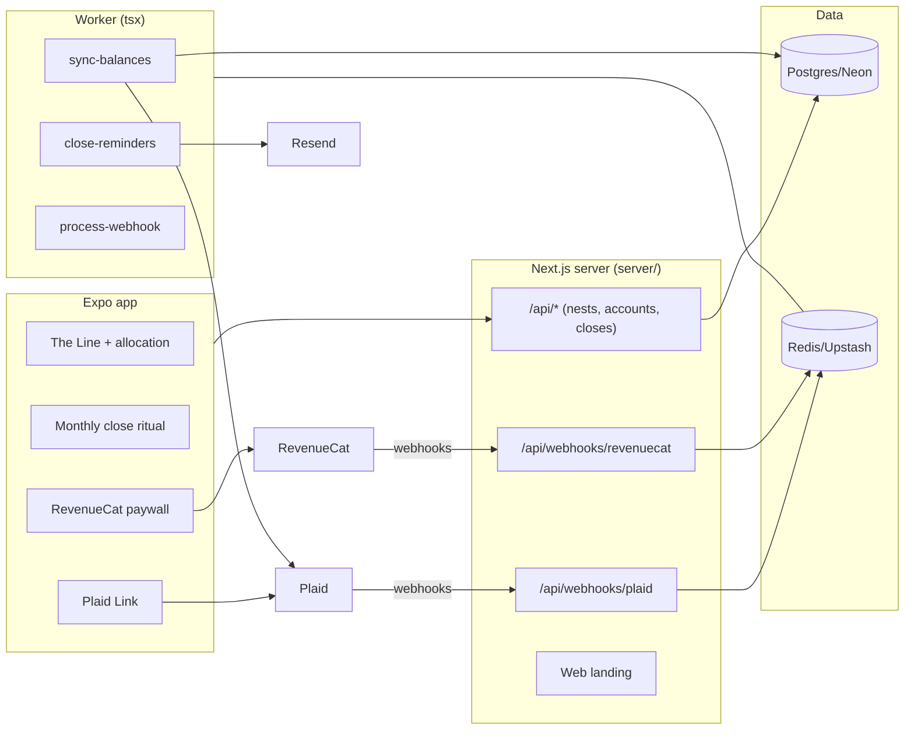

# NetNest Architecture

## Stack & Rationale

| Layer | Choice | Why |
|---|---|---|
| Mobile app | **Expo ~52 + expo-router + TypeScript** | One codebase, iOS first, Android at parity; OTA updates for chart/UI iteration. |
| Charts | **@shopify/react-native-skia** | The Line deserves 60fps custom drawing, not a charting kit's defaults. |
| Local state | **zustand + expo-sqlite cache** | The Line renders instantly from local cache; server is the source of truth. |
| Server | **Next.js 15 (App Router) in `server/` — API only** | Plaid webhooks, balance sync jobs, households, and the web landing page. Small by design. |
| Database | **Postgres (Neon) + Drizzle ORM** | nests → members → accounts → balances (append-only) → closes → manual assets. Append-only balances make history auditable. |
| Queue / workers | **BullMQ on Redis (Upstash), worker as standalone `tsx` process** | Nightly balance refreshes, webhook-driven syncs, close reminders. |
| Bank data | **Plaid** (Transactions NOT requested — Balance + Investments + Liabilities products only) | Balances-only scopes are the privacy architecture, not just copy. |
| Subscriptions | **RevenueCat (react-native-purchases)** | Free/Plus entitlements, paywall, receipt validation; server verifies entitlement via RC webhooks for household gating. |
| Auth | **Email magic links (jose tokens via Resend)** | No passwords on a money app's phone keyboard; sessions are long-lived refresh tokens. |
| Encryption | **Postgres at rest + app-layer AES-256-GCM for Plaid access tokens** | Tokens never at rest in plaintext (Briefcast's proven crypto pattern). |

## System Diagram

## Data Model (server Postgres)

- **nests** — the household. `name`, `plan` (free|plus) (mirrored from RevenueCat), `rc_app_user_id`, `timezone`, `settings` (jsonb: close day, currency).
- **members** — `nest_id`, `email`, `name`, `role` (owner|partner), `magic_token_hash`, `joined_at`.
- **institutions** — Plaid items. `nest_id`, `member_id`, `plaid_item_id` (unique), `access_token_ciphertext` (AES-256-GCM), `institution_name`, `status` (ok|reauth_needed|removed), `last_synced_at`.
- **accounts** — `institution_id` (nullable — manual), `nest_id`, `kind` (checking|savings|brokerage|retirement|credit|mortgage|loan|property|vehicle|valuable|other_asset|other_debt), `name`, `is_debt` (bool), `plaid_account_id` (nullable), `manual` (bool), `status` (active|hidden|closed).
- **balances** — append-only. `account_id`, `as_of` (date), `balance_cents`, `source` (plaid|manual|close). Latest per account per day wins; history never rewritten.
- **closes** — the monthly ritual. `nest_id`, `month` (date, first of month), `net_worth_cents`, `assets_cents`, `debts_cents`, `note`, `closed_by`, `closed_at`. Unique `(nest_id, month)`. The Line draws through closes; between closes it draws the live provisional point in a lighter weight.
- **webhook_events** — Plaid + RevenueCat idempotency ledger. `provider`, `external_id` (unique per provider), `type`, `payload`, `processed_at`.
- **audit_log** — `nest_id`, `actor`, `action`, `target`, `metadata`. Links, unlinks, deletes, and export requests always logged. `delete-my-data` cascades and leaves only the audit stub required for accounting.

## Key Flows

### 1. Linking (balances only)

1. App requests a link token from the server; Plaid Link runs natively; the public token exchanges server-side; the access token is AES-encrypted before the `institutions` row is written.
2. Products requested: Balance, Investments (holdings values), Liabilities. Transactions is never requested — the scope screen users see matches the privacy page.
3. Initial sync writes `accounts` + today's `balances`; nightly `sync-balances` refreshes; Plaid webhooks (holdings/liabilities updates, item errors) enqueue targeted syncs; `reauth_needed` surfaces in-app as a calm banner, not a scare modal.

### 2. The Line

Server composes the series: one point per close + today's provisional point (sum of latest balances, manual estimates included). The app caches the series in SQLite and renders instantly, then reconciles. Skia chart: single 2px line, monthly tick marks, pinch ranges (1y/3y/all), no gridlines-everywhere — the line IS the interface.

### 3. Monthly close

On the nest's close day, `close-reminders` nudges once ("February is ready to close"). The ritual screen: each account's latest balance (stale manual estimates flagged: "Home estimate is 4 months old"), confirm/adjust each, add the one-line note, close. Writes `closes` + `balances(source: close)` for adjusted rows. A closed month is immutable; corrections happen in the next close (append-only honesty).

### 4. Household sharing (Plus)

Owner invites partner by email (magic link); both members see the same nest. RevenueCat entitlement gates: server verifies via RC webhook-mirrored `plan` before allowing the second member or the 4th linked account. Downgrade never deletes data — extra links go read-only.

### 5. Webhooks

Both providers follow the law: **verify (Plaid JWT / RC auth header) → insert `webhook_events` by event id (duplicate = ack and stop) → enqueue `process-webhook` → ack fast.** The worker applies item states and entitlement changes idempotently.

## Queue & Worker Jobs

| Job | Trigger | Behavior |
|---|---|---|
| `sync-balances` | Nightly per institution + webhook-targeted | Refresh balances/holdings/liabilities; append `balances`; flip item status on errors honestly. |
| `close-reminders` | Monthly per nest (close day) | One nudge; never repeats within a cycle. |
| `process-webhook` | Plaid/RC webhook ack | Item states, entitlement mirror, reauth flags — idempotent by event id. |

DLQ + Sentry; graceful shutdown; DRY_RUN short-circuits Plaid calls (fixture data) and email.

## Third-Party Services & Rough Cost

| Service | Role | Rough cost |
|---|---|---|
| Plaid | Balances/holdings/liabilities | ~$0.30–1.20/linked item/mo depending on products — the free tier's 3-link cap exists because of this line |
| RevenueCat | Subscriptions | Free < $2.5k MTR, then 1% |
| Neon + Upstash | DB + queue | Free tiers → ~$30/mo |
| Vercel + Railway/Fly | Server + worker | ~$25–35/mo |
| Resend | Magic links + reminders | Free 3k/mo → $20/mo |
| Sentry | Errors (sync path) | Free tier → ~$26/mo |
| Apple/Google | Store fees | 15% (Small Business Program) |

**Estimated monthly:** dev ~$0–15; 2,000 free + 400 Plus (~$3.6k MRR) ≈ $500–900/mo — Plaid dominates; the paywall placement of unlimited links is the unit-economics lever.
