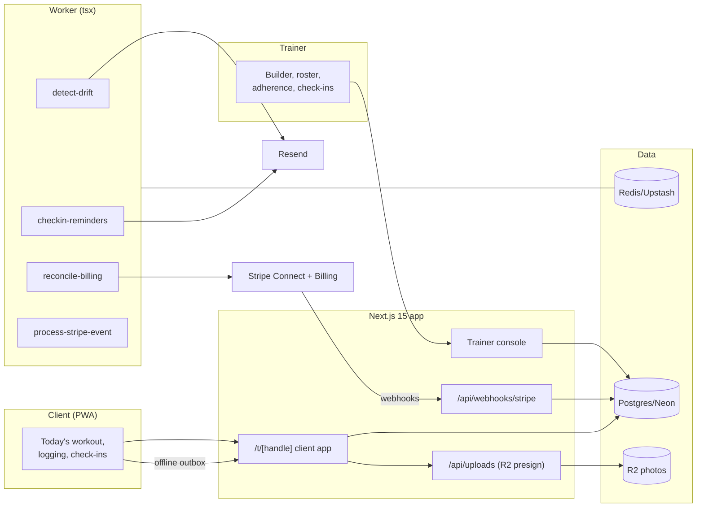

# TrainerBase Architecture

## Stack & Rationale

| Layer | Choice | Why |
|---|---|---|
| Web app + API | **Next.js 15 (App Router) + TypeScript** | One deployable: trainer console, the client PWA (installable, offline-capable logging), marketing, webhooks. |
| Database | **Postgres (Neon) + Drizzle ORM** | Relational domain (trainers → clients → programs → blocks/days/rows → assignments → logged sets → check-ins). Program structure is a tree with substitution overlays — normalized tables, not a JSON blob, so progress queries stay sane. |
| Offline logging | **Service worker + IndexedDB outbox** | Mid-session gym basements have no signal. Set logs queue locally and sync with idempotency keys (`assignment:{id}:day:{d}:ex:{e}:set:{s}`). |
| Queue / workers | **BullMQ on Redis (Upstash), workers as standalone `tsx` processes** | Drift detection, check-in reminders, video thumbnail fetches, and billing reconciliation are background work. |
| Payments | **Stripe Connect (Standard) for client billing; Stripe Billing for TrainerBase** | Client subscriptions live on the trainer's own account; overdue flags come from Connect webhooks. |
| Media | **R2 (S3 API)** for check-in photos | Progress photos are sensitive: private bucket, signed GETs, strict lifecycle. |
| Email | **Resend** | Client invites, check-in reminders, drift digests. |
| Auth | **scrypt + jose session cookies** (trainer); **magic-link tokens** (clients) | Clients never manage passwords; the invite link signs them in on their phone. |
| Styling | **Tailwind CSS v4** | Token-driven implementation of DESIGN.md. |

## System Diagram

## Data Model

All tables keyed by `id` (uuid), timestamps implied. Multi-tenancy: everything hangs off `trainer_id`.

- **trainers** — tenant root. `user email/password_hash/name` inline (solo login), `handle` (client-app URL), `plan` (trial|coach|studio|roster), `stripe_customer_id`, `stripe_subscription_id`, `stripe_account_id` (Connect), `timezone`, `settings` (jsonb: drift threshold days, check-in day).
- **clients** — `trainer_id`, `name`, `email`, `phone`, `status` (invited|active|paused|archived), `magic_token_hash`, `billing_package_id` (nullable), `stripe_subscription_id` (on the trainer's account), `billing_status` (ok|overdue|none), `started_on`, `notes`.
- **exercises** — the trainer's library. `trainer_id`, `name`, `cues`, `video_url`, `equipment`, `muscle_groups` (text[]), `archived`.
- **programs** — `trainer_id`, `name`, `description`, `is_template` (bool), `weeks_count`.
- **program_days** — `program_id`, `week_index`, `day_index`, `label` ("Upper A").
- **program_rows** — the prescription. `program_day_id`, `seq`, `exercise_id`, `sets`, `reps` (text: "8-10"), `rpe` (text), `tempo`, `rest_seconds`, `superset_group` (nullable int), `note`.
- **assignments** — program × client. `client_id`, `program_id`, `starts_on`, `status` (active|completed|abandoned), `current_week`, `current_day`.
- **substitutions** — per-assignment overlays. `assignment_id`, `program_row_id`, `exercise_id` (the swap), `note`. The program is never forked.
- **workout_sessions** — a client's day. `assignment_id`, `week_index`, `day_index`, `opened_at`, `completed_at` (nullable), `client_note`.
- **logged_sets** — `workout_session_id`, `program_row_id`, `set_index`, `weight_grams` (int — kilos×1000 avoids float drift), `reps`, `rpe`, `logged_at`, `idempotency_key` (unique — the offline outbox's dedupe).
- **checkin_forms** — `trainer_id`, `fields` (jsonb: [{key, label, kind: number|text|photo|scale}]), `cadence` (weekly), `day_of_week`.
- **checkins** — `client_id`, `form_snapshot` (jsonb — the form as it was), `answers` (jsonb), `photo_keys` (text[]), `submitted_at`, `reviewed_at`, `reply` (text).
- **messages** — context-anchored comments. `trainer_id`, `client_id`, `anchor_kind` (workout_session|checkin), `anchor_id`, `author` (trainer|client), `body`, `read_at`.
- **packages** — billing products. `trainer_id`, `name` ("Online coaching"), `amount_cents`, `interval` (month), `stripe_price_id` (on the Connect account), `active`.
- **webhook_events** — Stripe idempotency ledger. `provider`, `external_id` (unique), `type`, `payload`, `processed_at`.
- **audit_log** — `trainer_id`, `actor`, `action`, `target`, `metadata`.

## Key Flows

### 1. Build → assign → substitute

1. The builder edits the program tree (blocks → days → rows) with duplicate-week-forward; templates are programs with `is_template`.
2. Assigning stamps `assignments` with a start date; the client's calendar derives from `starts_on` + day indices (rest days are absent day_indices).
3. Substitutions overlay per assignment: the row renders the swapped exercise with the trainer's note; the underlying program is untouched (one program, thirty clients, thirty knees).

### 2. The session (offline-first)

1. Client opens today: `workout_sessions` row on first open (`opened_at` — the adherence signal).
2. Each set logs locally to the IndexedDB outbox and POSTs with its idempotency key; reconnection drains the outbox; the server upserts by key — double-taps and retries can't duplicate.
3. Completing stamps `completed_at`; the trainer's dashboard flips the day green.

### 3. Drift detection (the retention product)

`detect-drift` nightly per trainer: active clients whose last `opened_at` exceeds the threshold (default 5 days) → flagged on the dashboard + one line in the trainer's morning digest ("Maya hasn't opened a workout in 6 days"). Never messages the client directly — the coach coaches; the tool points.

### 4. Check-ins

On the client's check-in day: reminder → form (snapshot frozen at send) → photos to R2 (signed PUTs) → trainer review queue with side-by-side photo history → inline reply (anchored message). Unreviewed check-ins age visibly on the dashboard.

### 5. Billing (two rails)

TrainerBase SaaS on Stripe Billing; client subscriptions on the trainer's Connect account (packages create Prices there; invites attach Checkout). Overdue = flag on the roster, never an auto-cutoff — the coach decides. Webhooks follow the law: **verify → insert `webhook_events` by event id (duplicate = ack and stop) → enqueue `process-stripe-event` → ack fast.**

## Queue & Worker Jobs

| Job | Trigger | Behavior |
|---|---|---|
| `detect-drift` | Nightly per trainer | Flag stale clients; compose the morning digest; never client-facing. |
| `checkin-reminders` | Client's check-in day | One reminder; snapshot the form. |
| `reconcile-billing` | Connect webhook + nightly sweep | Mirror subscription states to `billing_status`. |
| `process-stripe-event` | Webhook ack | Idempotent plan/subscription state. |

DLQ + Sentry; graceful shutdown; DRY_RUN short-circuits email and Stripe.

## Third-Party Services & Rough Cost

| Service | Role | Rough cost |
|---|---|---|
| Neon + Upstash | DB + queue | Free tiers → ~$30/mo |
| Cloudflare R2 | Check-in photos | ~$0.015/GB/mo |
| Stripe Connect | Client billing on the trainer's account | Trainer pays standard fees |
| Stripe Billing | TrainerBase subscriptions | 2.9% + 30¢ |
| Resend | Invites/reminders/digests | Free 3k/mo → $20/mo |
| Vercel + Railway/Fly | App + worker | ~$25–35/mo |
| Sentry | Errors (outbox sync path) | Free tier → ~$26/mo |

**Estimated monthly:** dev ~$0–10; 400 trainers (~$18k MRR) ≈ $150–220/mo (~1% of revenue).
