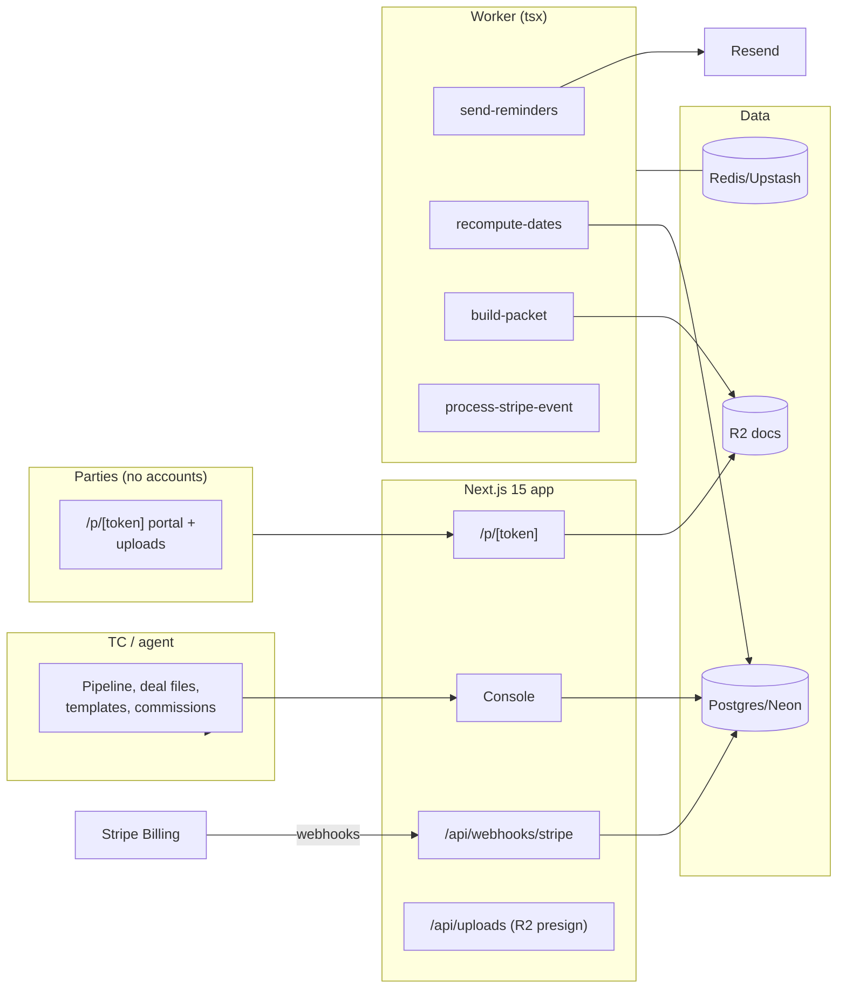

# ListingLoop Architecture

## Stack & Rationale

| Layer | Choice | Why |
|---|---|---|
| Web app + API | **Next.js 15 (App Router) + TypeScript** | One deployable: TC console, party portal links, marketing, webhooks. |
| Database | **Postgres (Neon) + Drizzle ORM** | Relational domain (accounts → deals → parties → tasks → dates → documents → reminders). Date rules are data (jsonb rules), computed dates are rows — recomputation is a deterministic function with a diffable output. |
| Queue / workers | **BullMQ on Redis (Upstash), workers as standalone `tsx` processes** | Reminder fan-out, recompute jobs, packet zips. |
| Documents | **R2 (S3 API)**; zips via archiver in the worker | Party uploads and the closing packet. |
| Payments | **Stripe Billing** | Three plans; hosted checkout + portal; webhooks drive plan state. |
| Email | **Resend** | Reminders, party requests, portal links. |
| Auth | **scrypt + jose session cookies**; tokenized party links | TCs/agents log in; parties never do. |
| Date math | **date-fns + a holiday table** | Business-day arithmetic with US federal + per-state holiday calendars stored as data, versioned per year. |
| Styling | **Tailwind CSS v4** | Token-driven implementation of DESIGN.md. |

## System Diagram

## Data Model

All tables keyed by `id` (uuid), timestamps implied. Multi-tenancy: everything hangs off `account_id`.

- **accounts** — tenant root. `name`, `plan` (trial|solo|desk|office), `stripe_customer_id`, `stripe_subscription_id`, `trial_ends_at`, `timezone`, `state` (two-letter — drives the holiday calendar default), `settings` (jsonb: reminder offsets, business-day rules).
- **users** — `account_id`, `email`, `password_hash`, `name`, `role` (owner|tc|agent).
- **holidays** — shared calendar data. `year`, `date`, `label`, `scope` ("us" | state code). Versioned inserts; date math reads this table.
- **checklist_templates** — `account_id`, `name`, `contract_type` (listing|buyer|dual|lease), `tasks` (jsonb: [{key, label, ownerRole, docRequired, dateRule?}]). `dateRule`: { anchor: "contract_date"|"acceptance_date"|…, offsetDays, businessDays: bool, observeHolidays: bool }.
- **deals** — the file. `account_id`, `address`, `mls_number`, `contract_type`, `status` (active|pending_items|clear_to_close|closed|terminated), `price_cents`, `contract_date`, `acceptance_date`, `closing_date`, `template_id`, `commission` (jsonb: { rateBps, split: [{label, bps}], tcFeeCents }), `notes`.
- **parties** — `deal_id`, `role` (buyer|seller|buyer_agent|listing_agent|lender|title|hoa|tc|other), `name`, `email`, `phone`, `portal_token_hash` (nullable), `notify` (bool).
- **tasks** — instantiated checklist. `deal_id`, `key`, `label`, `owner_role`, `status` (todo|waiting|done|na), `doc_required` (bool), `completed_at`, `completed_by`, `sort_order`.
- **critical_dates** — computed rows. `deal_id`, `task_id` (nullable), `key`, `label`, `rule` (jsonb — the source rule), `due_on` (date), `computed_from` (jsonb: { anchor, anchorValue }), `status` (upcoming|met|missed|waived), `met_at`.
- **date_recomputes** — the diff ledger. `deal_id`, `changed_anchor`, `old_value`, `new_value`, `diff` (jsonb: [{key, oldDue, newDue, reason}]), `applied_by`, `applied_at`. The preview the TC approves IS this row, pre-applied.
- **reminders** — exactly-once ledger. `critical_date_id`, `offset_days`, `sent_to` (jsonb), `sent_at`. Unique `(critical_date_id, offset_days)`.
- **documents** — `deal_id`, `task_id` (nullable), `label`, `r2_key`, `filename`, `version`, `uploaded_by` (user id or party id), `uploaded_at`.
- **activity_log** — the file's memory. `deal_id`, `actor`, `action`, `target`, `metadata`, `occurred_at`.
- **webhook_events** — Stripe idempotency ledger. `provider`, `external_id` (unique), `type`, `payload`, `processed_at`.
- **audit_log** — account-level. `account_id`, `actor`, `action`, `target`, `metadata`.

## Key Flows

### 1. Open a deal → the timeline exists

1. New deal picks a template + anchor dates (contract, acceptance, closing). Instantiation writes `tasks` and computes `critical_dates` from each task's rule via the date engine (business days, holiday table, weekend roll rules).
2. The timeline renders immediately — the product's first-minute magic. Every date shows its derivation ("contract + 10 business days, MLK Day observed") on hover/tap: the math is never a black box.

### 2. Anchor edits → diff preview → recompute

Editing an anchor date runs the engine in preview: a `date_recomputes` diff (old → new per affected date, with reasons) renders BEFORE saving. Apply writes the new `critical_dates` values + the recompute row; reminder ledgers for moved dates reset for unsent offsets only (sent history is never rewritten).

### 3. Reminder fan-out

Nightly + on-change `send-reminders`: for each upcoming date, offsets T-7/3/1 unsent per the ledger → email to owning parties (per `parties.notify` and the date's owner role). One email per party per day (digest coalescing when multiple dates hit the same offset). Exactly-once via the unique key.

### 4. Documents and the portal

Tasks with `doc_required` render named placeholders; "request from party" emails a tokenized upload link; uploads version into `documents` and flip tasks to done (TC confirms). The party portal (`/p/[token]`) is a read view: done / next / needed-from-you with the upload inline. Plain language, no login.

### 5. Commission + close

The commission jsonb computes per-deal totals (rate × price, splits, TC fee) shown as lines; the pipeline view sums expected by month of `closing_date`. Closing runs the closing checklist subset, then `build-packet` zips documents + checklist + timeline PDF into the closing packet.

### 6. Billing

Standard law: **verify → insert `webhook_events` by event id (duplicate = ack and stop) → enqueue `process-stripe-event` → ack fast**; worker applies plan state idempotently; dunning → grace → read-only (packet exports still work).

## Queue & Worker Jobs

| Job | Trigger | Behavior |
|---|---|---|
| `send-reminders` | Nightly + date changes | Ledger-gated T-7/3/1 fan-out with per-party digesting. |
| `recompute-dates` | Anchor edit applied | Engine re-run + diff row (also runnable in preview mode synchronously). |
| `build-packet` | Deal closed / request | Zip docs + checklist + timeline PDF to R2. |
| `process-stripe-event` | Webhook ack | Idempotent plan state. |

DLQ + Sentry; graceful shutdown; DRY_RUN short-circuits email.

## Third-Party Services & Rough Cost

| Service | Role | Rough cost |
|---|---|---|
| Neon + Upstash | DB + queue | Free tiers → ~$30/mo |
| Cloudflare R2 | Documents + packets | ~$0.015/GB/mo |
| Stripe Billing | Subscriptions | 2.9% + 30¢ |
| Resend | Reminders + requests | Free 3k/mo → $20/mo |
| Vercel + Railway/Fly | App + worker | ~$25–35/mo |
| Sentry | Errors (date engine + reminder paths) | Free tier → ~$26/mo |

**Estimated monthly:** dev ~$0–10; 300 accounts (~$18k MRR) ≈ $130–190/mo (~1% of revenue).
