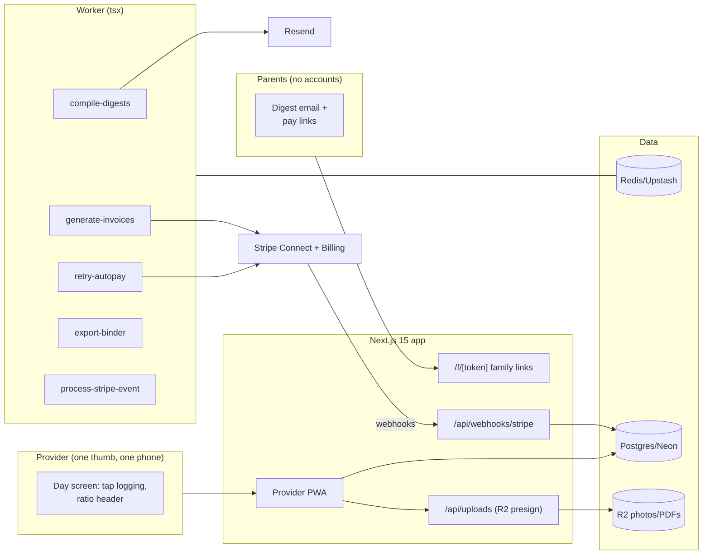

# SproutLog Architecture

## Stack & Rationale

| Layer | Choice | Why |
|---|---|---|
| Web app + API | **Next.js 15 (App Router) + TypeScript** | One deployable: the provider PWA (the one-thumb day), parent digest links, marketing, webhooks. |
| Database | **Postgres (Neon) + Drizzle ORM** | Relational domain (providers → children → enrollments → log_events → digests → invoices). Log events are one append-only stream; every compliance artifact is a projection of it. |
| Queue / workers | **BullMQ on Redis (Upstash), workers as standalone `tsx` processes** | Digest compilation at pickup time, invoice generation, autopay retries, binder exports. |
| Payments | **Stripe Connect (Standard) for tuition; Stripe Billing for SproutLog** | Tuition autopay on the provider's own account (card/ACH on file per family); late fees as invoice items. |
| Media | **R2 (S3 API)** for photos and signed PDFs | Child photos are sensitive: private bucket, signed GETs, parents see only their child. |
| Email | **Resend** | Digests, invoices, incident copies. |
| Auth | **scrypt + jose cookies** (provider); tokenized links (parents) | Parents never manage accounts; digest and payment links are signed tokens. |
| Styling | **Tailwind CSS v4** | Token-driven implementation of DESIGN.md. |

## System Diagram

## Data Model

All tables keyed by `id` (uuid), timestamps implied. Multi-tenancy: everything hangs off `provider_id`.

- **providers** — tenant root. `name`, `home_name` ("Little Sprouts"), `email`, `password_hash`, `plan` (trial|nest|grove|orchard), `stripe_customer_id`, `stripe_subscription_id`, `stripe_account_id` (Connect), `license_capacity` (int), `timezone`, `settings` (jsonb: digest send time, late-fee rules, state format).
- **assistants** — Orchard plan. `provider_id`, `name`, `email`, `password_hash`, `active`.
- **families** — `provider_id`, `name`, `emails` (text[]), `phone`, `stripe_customer_id` (on the Connect account), `payment_method_ok` (bool), `digest_opt_out` (bool).
- **children** — `provider_id`, `family_id`, `first_name`, `last_name`, `birthdate`, `allergies`, `authorized_pickups` (jsonb: [{name, relation, phone}]), `emergency_contacts` (jsonb), `enrolled` (bool), `schedule` (jsonb: weekdays), `tuition` (jsonb: { amountCents, interval: weekly|monthly }).
- **log_events** — the append-only stream. `provider_id`, `child_id` (nullable — house events), `kind` (arrival|departure|meal|nap_start|nap_end|diaper|potty|incident|photo|note|ratio_flag), `at` (timestamptz), `data` (jsonb: meal components, diaper details, note text, photo r2_key, incident id), `logged_by`. Index `(provider_id, at)`, `(child_id, at)`.
- **incidents** — structured reports. `provider_id`, `child_id`, `occurred_at`, `description`, `action_taken`, `parent_notified_at`, `signature_r2_key` (nullable), `signed_at`, `pdf_r2_key`.
- **menus** — `provider_id`, `week_of` (date), `meals` (jsonb: per day per meal, CACFP components).
- **digests** — send ledger. `provider_id`, `family_id`, `for_date` (date), `compiled` (jsonb — the sentences + photo keys), `sent_at`, `provider_message_id`. Unique `(family_id, for_date)`.
- **invoices** — tuition. `provider_id`, `family_id`, `period_start`, `period_end`, `amount_cents`, `late_fee_cents`, `status` (draft|scheduled|paid|past_due|void), `stripe_invoice_id` (on Connect), `paid_at`. 
- **attendance_days** — projection cache for registers. `child_id`, `date`, `arrived_at`, `departed_at`, `hours` (numeric). Rebuilt from log_events; never hand-edited (corrections are new log events).
- **webhook_events** — Stripe idempotency ledger. `provider`, `external_id` (unique), `type`, `payload`, `processed_at`.
- **audit_log** — `provider_id`, `actor`, `action`, `target`, `metadata`. Log-event corrections, invoice edits, and export requests always logged.

## Key Flows

### 1. The one-thumb day

1. The Day screen lists today's expected children (from schedules) with arrival buttons; each tap appends a `log_events` row with the timestamp — attendance is a side effect of the natural gesture.
2. Meal taps open the component checklist pre-filled from this week's menu (CACFP: milk/grain/fruit-veg/protein); nap start/end pairs; diaper/potty quick-taps; photos via presigned upload.
3. The ratio header derives live from arrival/departure events vs. `license_capacity`; an over-ratio moment appends a `ratio_flag` event — the log is honest because it's the same stream the binder prints.

### 2. The digest

At the provider's send time, `compile-digests` per family: the day's events for their children rendered as plain sentences with photos, one email. No events (absent day) sends nothing. The compiled digest is stored (send ledger, unique per family/date) — what the parent saw is reproducible.

### 3. Tuition autopay

1. `generate-invoices` on the enrollment cadence (weekly Fridays / monthly 1st): invoice rows + Stripe invoices on the provider's Connect account with autopay (default payment method).
2. Payment failures → `retry-autopay` ladder (3 attempts over 5 days) → `past_due` flag + a plain email; late fees per settings applied as invoice items, always visible in the parent link.
3. The Friday text is retired: parents get the receipt, the provider gets the paid flag.

### 4. Compliance projections

`attendance_days` (registers), meal-count tables (CACFP claim shape), nap checks, and incident PDFs are all projections of `log_events` — rebuilt deterministically, exported per the state's format from settings. The binder export zips a date range of everything.

### 5. Billing

Standard law: **verify → insert `webhook_events` by event id (duplicate = ack and stop) → enqueue `process-stripe-event` → ack fast**; both rails (SaaS + Connect tuition) ride the same ledger.

## Queue & Worker Jobs

| Job | Trigger | Behavior |
|---|---|---|
| `compile-digests` | Daily per provider (send time) | Per-family digest; ledger-unique; absent days skip. |
| `generate-invoices` | Enrollment cadence | Idempotent per (family, period); Stripe invoices with autopay. |
| `retry-autopay` | Payment failure | 3-attempt ladder; past_due flag; plain-language emails. |
| `export-binder` | Request | Date-range zip of registers/meal counts/incidents to R2. |
| `process-stripe-event` | Webhook ack | Idempotent subscription/invoice state. |

DLQ + Sentry; graceful shutdown; DRY_RUN short-circuits email and Stripe.

## Third-Party Services & Rough Cost

| Service | Role | Rough cost |
|---|---|---|
| Neon + Upstash | DB + queue | Free tiers → ~$30/mo |
| Cloudflare R2 | Photos + PDFs | ~$0.015/GB/mo |
| Stripe Connect | Tuition on the provider's account | Provider pays standard fees (ACH recommended for tuition) |
| Stripe Billing | SproutLog subscriptions | 2.9% + 30¢ |
| Resend | Digests + invoices | Free 3k/mo → $20/mo (digests dominate) |
| Vercel + Railway/Fly | App + worker | ~$25–35/mo |
| Sentry | Errors (digest + autopay paths) | Free tier → ~$26/mo |

**Estimated monthly:** dev ~$0–10; 300 providers (~$13k MRR) ≈ $150–220/mo — digest volume (300 × ~8 families daily) fits Resend's $20 tier at ~70k/mo.
