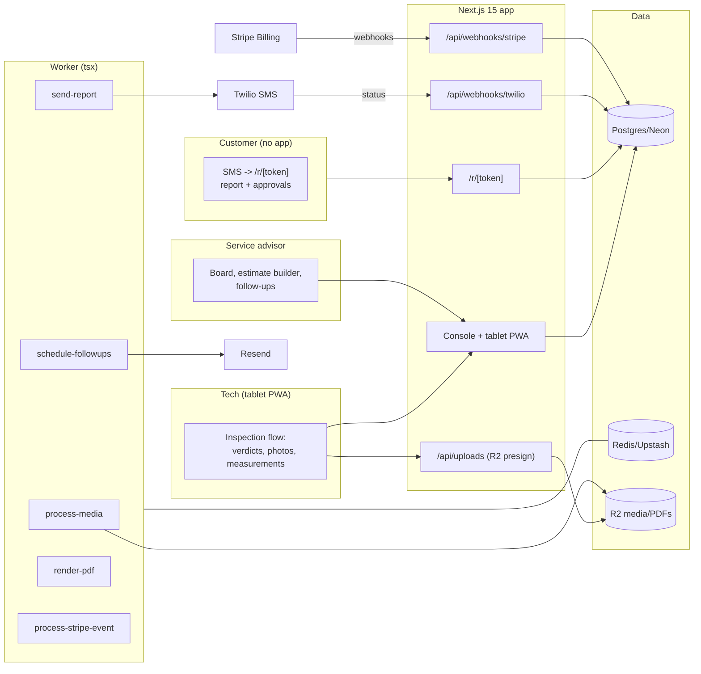

# WrenchView Architecture

## Stack & Rationale

| Layer | Choice | Why |
|---|---|---|
| Web app + API | **Next.js 15 (App Router) + TypeScript** | One deployable: the tablet PWA (bay flow), advisor board, the customer report link, marketing, webhooks. |
| Database | **Postgres (Neon) + Drizzle ORM** | Relational domain (shops → vehicles → inspections → items → findings → estimate lines → approvals). The approval trail is rows, not logs. |
| Queue / workers | **BullMQ on Redis (Upstash), workers as standalone `tsx` processes** | Media processing (thumbnails), SMS sends, follow-up scheduling, PDF renders. |
| Media | **R2 (S3 API)** + **sharp** (thumb/web sizes) in the worker | Photos are the product's evidence; fast loading on customer phones matters more than fidelity. |
| SMS | **Twilio** | The text link IS the delivery channel; delivery status tracked; STOP honored. |
| Payments | **Stripe Billing** | Three flat plans; hosted checkout + portal; webhooks drive plan state. |
| Email | **Resend** | Declined-work follow-ups, report copies. |
| Auth | **scrypt + jose session cookies**; device-scoped tablet tokens; tokenized customer links | Techs tap a tablet already signed into the bay; customers never log in. |
| PDF | **pdf-lib** | The DVI report for the RO jacket. |
| Styling | **Tailwind CSS v4** | Token-driven implementation of DESIGN.md. |

## System Diagram

## Data Model

All tables keyed by `id` (uuid), timestamps implied. Multi-tenancy: everything hangs off `shop_id`.

- **shops** — tenant root. `name`, `plan` (trial|bay|shop|garage_group), `stripe_customer_id`, `stripe_subscription_id`, `trial_ends_at`, `timezone`, `phone`, `settings` (jsonb: follow-up offsets, tax rate, labor rate default).
- **users** — `shop_id`, `email`, `password_hash`, `name`, `role` (owner|advisor|tech).
- **devices** — bay tablets. `shop_id`, `label` ("Bay 2 iPad"), `token_hash`, `last_seen_at`, `active`.
- **customers** — `shop_id`, `name`, `phone`, `email`, `sms_consent`, `sms_opted_out_at`.
- **vehicles** — `shop_id`, `customer_id`, `year`, `make`, `model`, `vin` (nullable), `plate`, `mileage_latest`.
- **templates** — point lists. `shop_id`, `name`, `groups` (jsonb: [{label, items: [{key, label, kind: verdict|measurement, unit?, cannedPhrases: {yellow, red}}]}]).
- **inspections** — `shop_id`, `vehicle_id`, `template_id`, `ro_number` (the shop's SMS reference, free text), `tech_user_id`, `device_id`, `status` (in_progress|tech_done|estimated|sent|viewed|decided|archived), `mileage`, `started_at`, `completed_at`, `sent_at`, `first_viewed_at`.
- **inspection_items** — the taps. `inspection_id`, `group_label`, `item_key`, `item_label`, `verdict` (green|yellow|red|na), `measurement` (jsonb: { value, unit }), `note`, `seq`.
- **media** — `inspection_item_id`, `kind` (photo|video), `r2_key`, `thumb_key`, `web_key`, `duration_seconds` (nullable), `seq`.
- **findings** — customer-readable sentences. `inspection_item_id` (unique), `sentence` (text — composed from canned phrase + measurement, advisor-editable), `urgency` (now|soon|watch).
- **estimate_lines** — `inspection_id`, `finding_id` (nullable — misc lines allowed), `label`, `labor_cents`, `parts_cents`, `tax_cents`, `total_cents`, `status` (draft|sent|approved|declined), `decided_at`.
- **approvals** — the authorization trail. `estimate_line_id`, `decision` (approved|declined), `decided_at`, `ip`, `user_agent`, `link_token_hash` — who/when/from-what, immutable.
- **report_links** — `inspection_id`, `token_hash`, `sent_to_phone`, `sent_at`, `provider_message_id`, `delivery_status`, `expires_at`.
- **followups** — declined-safety reminders. `estimate_line_id`, `send_on` (date), `kind` (day30|day90), `sent_at`, `provider_message_id`. Unique `(estimate_line_id, kind)`.
- **webhook_events** — Stripe + Twilio idempotency ledger. `provider`, `external_id` (unique per provider), `type`, `payload`, `processed_at`.
- **audit_log** — `shop_id`, `actor`, `action`, `target`, `metadata`. Estimate edits after send always logged.

## Key Flows

### 1. The bay flow (beat paper or die)

1. Advisor opens an inspection (vehicle + template + RO#); it appears on the bay tablet (device token).
2. The tech taps item by item: verdict → optional photo (presigned R2 upload; `process-media` makes thumb/web sizes) → measurement → next. Yellow/red verdicts pre-fill the canned finding phrase with the measurement interpolated.
3. `tech_done` hands off to the advisor: findings review (edit sentences), estimate lines priced per finding, then Send.

### 2. The text link

`send-report` texts the tokenized link (Twilio; delivery status tracked; consent respected). `/r/[token]`: findings grouped by urgency (now/soon/watch), each with its photos, each estimate line with Approve/Decline toggles and the running approved total; submit records `approvals` rows (decision, timestamp, ip, user-agent) and flips line statuses. `first_viewed_at` stamps on first open — the advisor board's read receipt.

### 3. The board

Advisor board = today's inspections with the state machine visible: in bay → ready to price → sent (delivered? viewed?) → decided (3 of 4 approved). Waiting-too-long flags (sent 2h, unviewed) prompt the old-fashioned phone call — the tool points, the advisor calls.

### 4. Declined-work follow-ups

Declined lines with urgency "now"/"soon" schedule `followups` (30/90 days, exactly-once per kind). The email is plain: the finding sentence, the photo, the original price, one button to book. Vehicle history shows declined work at the next visit.

### 5. Billing

Standard law: **verify → insert `webhook_events` by event id (duplicate = ack and stop) → enqueue `process-stripe-event` → ack fast.** Twilio status callbacks ride the same ledger pattern.

## Queue & Worker Jobs

| Job | Trigger | Behavior |
|---|---|---|
| `process-media` | Upload complete | sharp thumb/web renditions; video passthrough with poster frame. |
| `send-report` | Advisor sends | Twilio SMS with the link; consent + STOP respected; delivery tracked. |
| `schedule-followups` | Line declined / nightly sweep | 30/90-day rows; send via Resend; exactly-once per kind. |
| `render-pdf` | Request / on decided | The DVI report PDF to R2. |
| `process-stripe-event` | Webhook ack | Idempotent plan state. |

DLQ + Sentry; graceful shutdown; DRY_RUN short-circuits SMS/email.

## Third-Party Services & Rough Cost

| Service | Role | Rough cost |
|---|---|---|
| Neon + Upstash | DB + queue | Free tiers → ~$30/mo |
| Cloudflare R2 | Photos/videos/PDFs | ~$0.015/GB/mo (media-heavy: ~1–3 GB/shop/mo) |
| Twilio | Report links + follow-ups | ~$0.0079/SMS + number; ~200–600 SMS/shop/mo |
| Stripe Billing | Subscriptions | 2.9% + 30¢ |
| Resend | Follow-ups + copies | Free 3k/mo → $20/mo |
| Vercel + Railway/Fly | App + worker | ~$25–35/mo |
| Sentry | Errors (send + approval paths) | Free tier → ~$26/mo |

**Estimated monthly:** dev ~$5–15; 80 shops (~$16k MRR) ≈ $400–600/mo (SMS + media dominate; ~3% of revenue).
