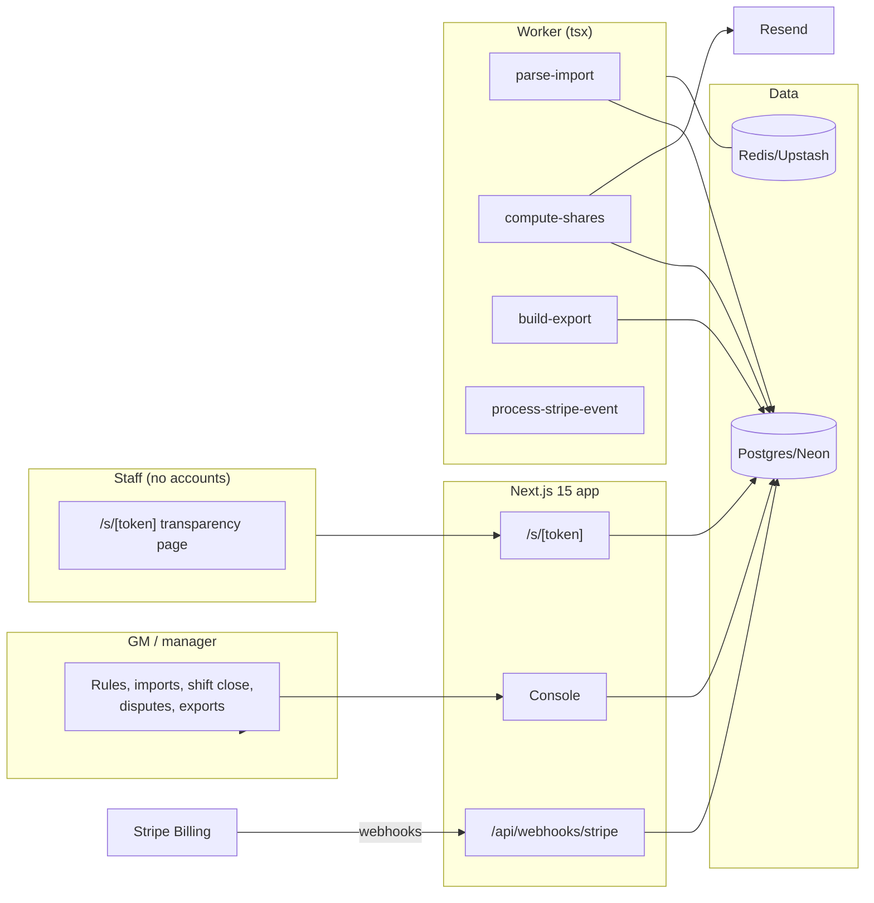

# TipTally Architecture

## Stack & Rationale

| Layer | Choice | Why |
|---|---|---|
| Web app + API | **Next.js 15 (App Router) + TypeScript** | One deployable: manager console, staff transparency links, marketing, webhooks. |
| Database | **Postgres (Neon) + Drizzle ORM** | Relational domain (restaurants → pools → rule versions → employees → shifts → entries → shares → disputes). Money math in integer cents; shares carry their full derivation as data. |
| Queue / workers | **BullMQ on Redis (Upstash), workers as standalone `tsx` processes** | Import parsing, share computation, export generation, dispute notifications. |
| Payments | **Stripe Billing** | Three plans; hosted checkout + portal; webhooks drive plan state. TipTally never touches tip money — computation only. |
| Email | **Resend** | Transparency links, dispute notifications, export confirmations. |
| Auth | **scrypt + jose session cookies**; tokenized staff links | Managers log in; staff never do. |
| Styling | **Tailwind CSS v4** | Token-driven implementation of DESIGN.md. |

## System Diagram

## Data Model

All tables keyed by `id` (uuid), timestamps implied. Multi-tenancy: everything hangs off `restaurant_id` (locations under a `group_id` for multi-location plans).

- **groups** — billing root. `name`, `plan` (trial|house|group|hospitality), `stripe_customer_id`, `stripe_subscription_id`, `trial_ends_at`.
- **restaurants** — locations. `group_id`, `name`, `state` (two-letter — drives compliance notes), `timezone`, `settings` (jsonb: dispute window hours, rounding rule).
- **users** — managers. `group_id`, `email`, `password_hash`, `name`, `role` (owner|manager), `restaurant_ids` (uuid[]).
- **employees** — `restaurant_id`, `name`, `role_key` ("server"), `external_ids` (jsonb: per import source), `email`, `phone`, `link_token_hash`, `status` (active|inactive).
- **pools** — `restaurant_id`, `name` ("FOH pool"), `status` (active|archived).
- **rule_versions** — effective-dated, append-only. `pool_id`, `version`, `effective_on` (date), `rules` (jsonb: { participants: [{roleKey, points}], hoursWeighted: bool, tipShares: [{fromRole?, percentOfSalesBps?, percentOfTipsBps?, toRoleKey}], exclusions: [roleKey] }), `note`, `created_by`. Past shifts always compute against the version effective on their date.
- **import_sources** — saved mappings. `restaurant_id`, `name` ("Toast tips export"), `column_map` (jsonb), `last_used_at`.
- **shifts** — `restaurant_id`, `service_date` (date), `meal` (lunch|dinner|all_day), `status` (draft|imported|flagged|closed|locked), `pool_totals` (jsonb: per pool cents), `closed_by`, `closed_at`.
- **shift_entries** — imported per-employee rows. `shift_id`, `employee_id` (nullable until matched), `raw_name`, `role_key`, `hours` (numeric), `tips_collected_cents`, `sales_cents`, `flags` (jsonb: unmatched|missing_hours|zero_sales), `resolved` (bool).
- **shares** — the output. `shift_id`, `pool_id`, `employee_id`, `amount_cents`, `derivation` (jsonb: ordered steps [{label, expression, valueCents?}] — rendered verbatim on the transparency page), `rule_version_id`, `computed_at`. Unique `(shift_id, pool_id, employee_id)`.
- **disputes** — `share_id`, `note`, `status` (open|resolved_adjusted|resolved_upheld), `resolution_note`, `opened_at`, `resolved_by`, `resolved_at`. Openable only within the window.
- **payroll_exports** — `restaurant_id`, `period_start`, `period_end`, `format` (gusto|adp|paychex|generic), `csv_content` (text), `exported_by`, `exported_at`. Export LOCKS the period's shifts.
- **compliance_notes** — shared content. `state` ("us" | code), `topic` (participation|tip_credit|pooling), `body` (text), `sources` (jsonb: [{label, url}]), `updated_on`.
- **webhook_events** — Stripe idempotency ledger. `provider`, `external_id` (unique), `type`, `payload`, `processed_at`.
- **audit_log** — `restaurant_id`, `actor`, `action`, `target`, `metadata`. Rule changes, share adjustments, and period locks always logged.

## Key Flows

### 1. Rules once, versions forever

The rule editor writes `rule_versions` rows (append-only, effective-dated). Editing rules never rewrites history: a shift on March 3 computes against the version effective March 3, even when recomputed in May. The version's rules render as sentences ("Servers 10 points, hours-weighted; bussers receive 3% of food sales").

### 2. Import → flags → close

1. Manager uploads the POS export CSV; `parse-import` applies the saved column map, writes `shift_entries`, matches employees by external id/name (unmatched → flags).
2. The close screen shows entries with flags to resolve (match employee, fill missing hours); pool totals compute live.
3. Close → `compute-shares`: per pool, per the effective rule version — points × hours weights → percentages → integer-cent allocation (largest-remainder rounding so cents sum exactly) — each share's `derivation` stored step by step.

### 3. Shown math (the product)

The transparency page (`/s/[token]`) lists the employee's shifts and shares; expanding a share renders `derivation` verbatim: "10 pts × 6.5h = 65 weight → 65/290 = 22.4% → $412.61 of $1,842.00". The same rendering appears in the manager console and dispute views — one source of truth, three surfaces.

### 4. Disputes

Within the window (default 48h), a staffer flags a share with a note → manager queue with the math attached → resolve as upheld (note) or adjusted (recompute path with audit). Adjustments create new share values with the old preserved in the audit log.

### 5. Payroll export + lock

Period export renders the format's CSV (tips as earnings codes per employee) and locks the period's shifts (`locked`) — post-lock changes require an explicit unlock with an audit reason. No money moves; payroll stays the system of payment.

### 6. Billing

Standard law: **verify → insert `webhook_events` by event id (duplicate = ack and stop) → enqueue `process-stripe-event` → ack fast.**

## Queue & Worker Jobs

| Job | Trigger | Behavior |
|---|---|---|
| `parse-import` | CSV upload | Column map, entries, matching, flags. |
| `compute-shares` | Shift close / adjustment | Effective-version rules; largest-remainder cent allocation; derivations stored; transparency notifications (email, opt-in). |
| `build-export` | Period export | Format CSV + period lock. |
| `process-stripe-event` | Webhook ack | Idempotent plan state. |

DLQ + Sentry; graceful shutdown; DRY_RUN short-circuits email.

## Third-Party Services & Rough Cost

| Service | Role | Rough cost |
|---|---|---|
| Neon + Upstash | DB + queue | Free tiers → ~$30/mo |
| Stripe Billing | Subscriptions | 2.9% + 30¢ |
| Resend | Links + notifications | Free 3k/mo → $20/mo |
| Vercel + Railway/Fly | App + worker | ~$25–35/mo |
| Sentry | Errors (compute + export paths) | Free tier → ~$26/mo |

**Estimated monthly:** dev ~$0–10; 250 locations (~$16k MRR) ≈ $100–150/mo (<1% of revenue) — no money movement means no per-transaction costs; computation is nearly free to serve.
