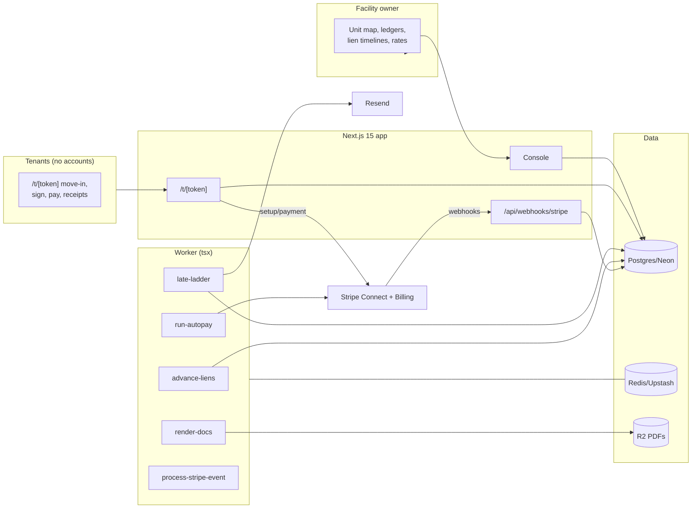

# UnitKeeper Architecture

## Stack & Rationale

| Layer | Choice | Why |
|---|---|---|
| Web app + API | **Next.js 15 (App Router) + TypeScript** | One deployable: owner console (the map), tenant move-in/sign/pay links, marketing, webhooks. |
| Database | **Postgres (Neon) + Drizzle ORM** | Relational domain (facilities → units → tenancies → ledger entries → lien cases → notices). The tenant ledger is append-only; the lien case is a state machine with dated steps. |
| Queue / workers | **BullMQ on Redis (Upstash), workers as standalone `tsx` processes** | Autopay runs, late-ladder steps, lien-step advancement, notice PDFs, statements. |
| Payments | **Stripe Connect (Standard) for rent; Stripe Billing for UnitKeeper** | Autopay = subscriptions or off-session PaymentIntents on the owner's account (ACH encouraged for rent); late fees as ledger entries + invoice items. |
| Documents | **R2 (S3 API)**; **pdf-lib** for leases, notices, statements, lien packets | Notices must be certified-mail-ready PDFs; leases hashed like LensCRM's contracts. |
| E-sign | **In-app signature capture + sha256 doc hash** (the proven pattern) | Move-in leases signed on the tenant's phone. |
| Email | **Resend** | Receipts, late notices (email copies — statutory notices also print), statements. |
| Auth | **scrypt + jose session cookies**; tokenized tenant links | Owners log in; tenants use signed links. |
| Lien rules | **Per-state rule data (jsonb, versioned) + a pure timeline engine** | Statutes as data with citations; the engine computes dates and hard stops; content reviewed and dated per state. |
| Styling | **Tailwind CSS v4** | Token-driven implementation of DESIGN.md. |

## System Diagram

## Data Model

All tables keyed by `id` (uuid), timestamps implied. Multi-tenancy: everything hangs off `owner_id`; units off `facility_id`.

- **owners** — tenant root. `name`, `email`, `password_hash`, `plan` (trial|keeper|yard|depot), `stripe_customer_id`, `stripe_subscription_id`, `stripe_account_id` (Connect), `settings` (jsonb: late ladder [{day, action, feeCents}], prorate rule).
- **facilities** — `owner_id`, `name`, `address`, `state` (drives lien rules), `timezone`, `gate_system` (text label).
- **units** — `facility_id`, `label` ("B-14"), `size` ("10x10"), `monthly_rate_cents` (street rate), `map_position` (jsonb: {row, col, w, h}), `status` (vacant|occupied|overdue|lien|maintenance), `notes`.
- **tenants** — `owner_id`, `name`, `email`, `phone`, `address` (legal notice address), `alternate_contact` (jsonb), `stripe_customer_id` (Connect).
- **tenancies** — unit × tenant. `unit_id`, `tenant_id`, `rate_cents` (the agreed rate), `started_on`, `ended_on` (nullable), `status` (active|delinquent|lien|ended), `lease_r2_key`, `lease_hash`, `signed_at`, `gate_code`, `gate_code_status` (active|revoked|overlocked), `autopay` (bool), `stripe_subscription_id` (nullable).
- **ledger_entries** — append-only per tenancy. `tenancy_id`, `kind` (rent|late_fee|lien_fee|payment|credit|refund|adjustment), `amount_cents` (signed), `description`, `occurred_on`, `stripe_payment_intent_id` (nullable), `balance_after_cents` (derived cache). The lien packet prints this.
- **lien_rules** — per-state statute data, versioned. `state`, `version`, `steps` (jsonb: [{key, label, citation, offsetDays, from: "delinquency"|"prior_step", requires: ["certified_mail"|"publication"|...]}]), `reviewed_on`, `notes`.
- **lien_cases** — the state machine. `tenancy_id`, `rule_version_id`, `delinquent_since` (date), `status` (open|paused|resolved|sale_eligible|closed), `current_step_key`, `steps_state` (jsonb: per step {dueOn, completedOn, noticeR2Key, trackingNumber}), `hard_stop_until` (date, nullable), `resolved_reason` (paid|vacated|sold|error).
- **notices** — generated documents. `lien_case_id` (nullable — rate-change letters too), `tenancy_id`, `kind` (late|lien_default|lien_sale|rate_change|statement), `r2_key`, `generated_at`, `sent_via` (jsonb: email/certified flags + tracking).
- **rate_changes** — `unit_id`, `tenancy_id` (nullable), `old_cents`, `new_cents`, `effective_on`, `notice_id`, `status` (noticed|applied).
- **webhook_events** — Stripe idempotency ledger. `provider`, `external_id` (unique), `type`, `payload`, `processed_at`.
- **audit_log** — `owner_id`, `actor`, `action`, `target`, `metadata`. Lien-step completions, gate-code changes, and ledger adjustments always logged.

## Key Flows

### 1. Move-in (ten minutes to occupied)

1. From a vacant unit on the map: tenant info → the lease renders (state template + owner terms + rate) → tokenized link to the tenant's phone → signature + sha256 hash → card/ACH SetupIntent on the owner's Connect account → prorated first charge → gate code issued → unit flips occupied. Every artifact (lease PDF, receipt) lands in R2 + the ledger.

### 2. Autopay and the late ladder

1. `run-autopay` monthly per tenancy (anniversary or 1st per settings): off-session charge → ledger `payment` row. 
2. Failures start the ladder from `owners.settings`: retry day 3 → late fee day 6 (ledger + email) → overlock flag day 11 (gate code → overlocked; the map shows it) → lien case opens at the state-permitted delinquency day. Every step is a dated, logged, reversible-by-payment event; payment at any point pauses/resolves downstream steps automatically.

### 3. The lien timeline engine (the feature with teeth)

1. A lien case binds the tenancy to the CURRENT state rule version (frozen thereafter). The engine computes each statutory step's due date from `delinquent_since` (calendar per statute), renders the timeline with citations, and generates each notice PDF from the ledger + tenancy data (certified-mail-ready, addressed from the legal notice address).
2. HARD STOPS are enforced in software: the next step's action button stays disabled until its date, with the sentence ("Waiting period ends June 12 — Tex. Prop. Code §59.044"). Completing a step records date + tracking number. Payment resolves the case and reverses the overlock.
3. `advance-liens` nightly flags due steps; nothing auto-executes — the owner acts, the engine counts. The lien packet (all notices + full ledger) exports as one PDF for the sale file.

### 4. Rates

Street-rate edits apply to new move-ins. Existing-tenant changes generate the required-notice letter (days per state data), track `noticed → applied`, and post the new rate to autopay on the effective date.

### 5. Billing

Standard law on webhooks: **verify → insert `webhook_events` by event id (duplicate = ack and stop) → enqueue `process-stripe-event` → ack fast.**

## Queue & Worker Jobs

| Job | Trigger | Behavior |
|---|---|---|
| `run-autopay` | Monthly per tenancy | Off-session charge; ledger rows; failures start the ladder. |
| `late-ladder` | Daily | Fire due ladder steps exactly once (ledger-keyed); payment reverses. |
| `advance-liens` | Nightly | Recompute due steps; flag for the owner; never auto-executes. |
| `render-docs` | Move-in / notices / statements | pdf-lib to R2, hashed where legal. |
| `process-stripe-event` | Webhook ack | Idempotent subscription/payment state. |

DLQ + Sentry; graceful shutdown; DRY_RUN short-circuits charges and email.

## Third-Party Services & Rough Cost

| Service | Role | Rough cost |
|---|---|---|
| Neon + Upstash | DB + queue | Free tiers → ~$30/mo |
| Cloudflare R2 | Leases/notices/packets | ~$0.015/GB/mo |
| Stripe Connect | Rent on the owner's account | Owner pays fees; ACH 0.8% capped $5 — pushed hard in onboarding |
| Stripe Billing | UnitKeeper subscriptions | 2.9% + 30¢ |
| Resend | Receipts/notice copies | Free 3k/mo → $20/mo |
| Vercel + Railway/Fly | App + worker | ~$25–35/mo |
| Sentry | Errors (autopay + lien paths) | Free tier → ~$26/mo |

**Estimated monthly:** dev ~$0–10; 200 facilities (~$18k MRR) ≈ $120–180/mo (<1% of revenue). Lien-rule content maintenance (statute review per state, dated) is the real recurring cost — budgeted as editorial time.
