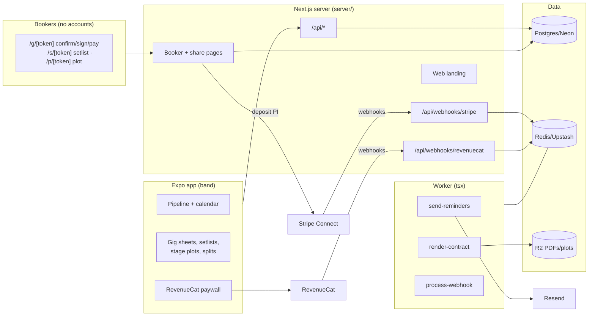

# GigBag Architecture

## Stack & Rationale

| Layer | Choice | Why |
|---|---|---|
| Mobile app | **Expo ~52 + expo-router + TypeScript** | Musicians live on phones; iOS first, Android at parity; OTA updates. |
| Local state | **zustand + expo-sqlite cache** | Gig sheets and setlists render instantly offline (green rooms have no signal); server reconciles. |
| Server | **Next.js 15 (App Router) in `server/` — API + booker links + landing** | Booker-facing surfaces (request page, confirm/sign/pay links, setlist/stage-plot share links) are web pages; the app talks to the same API. |
| Database | **Postgres (Neon) + Drizzle ORM** | bands → members → gigs → contracts → payments → splits; songs → setlists; plots. Split math is integer cents with the largest-remainder property. |
| Queue / workers | **BullMQ on Redis (Upstash), worker as standalone `tsx` process** | Reminders (advance/settle), contract PDF renders, webhook processing. |
| Payments | **Stripe Connect (Standard) for deposits — the band's own account**; **RevenueCat** for GigBag Band | Gig money never touches GigBag; subscription entitlements gate band features, mirrored server-side via RC webhooks. |
| E-sign | **Signature capture + sha256 doc hash** (the proven pattern) | The booking agreement signs on the booker's phone. |
| Email | **Resend** | Contract/deposit links, gig-day reminders, settle-up summaries. |
| Auth | **Email magic links (jose via Resend)** | No passwords; members join by invite link into the band. |

## System Diagram

## Data Model (server Postgres)

- **bands** — tenant root. `name`, `plan` (free|band) (RC-mirrored), `rc_app_user_id`, `leader_member_id`, `stripe_account_id` (Connect), `timezone`, `settings` (jsonb: default split rule, contract terms, reminder offsets).
- **members** — `band_id`, `email`, `name`, `instrument`, `role` (leader|member|sub), `magic_token_hash`, `default_rate_cents` (subs), `status` (active|inactive).
- **venues** — `band_id`, `name`, `address`, `contact_name`, `contact_email`, `contact_phone`, `notes` (load-in quirks live here).
- **gigs** — the pipeline object. `band_id`, `venue_id` (nullable early), `title`, `status` (inquiry|hold|confirmed|played|paid|cancelled), `date` (date), `load_in_at`, `soundcheck_at`, `downbeat_at`, `end_at`, `fee_cents`, `deposit_cents`, `deposit_status` (none|requested|paid), `booker_name`, `booker_email`, `booker_phone`, `dress`, `notes`, `setlist_id` (nullable), `plot_id` (nullable), `lineup` (jsonb: [{memberId, instrument, rateCents?}]), `link_token_hash`.
- **contracts** — `gig_id` (unique), `terms_snapshot` (text), `pdf_r2_key`, `doc_hash`, `signed_at`, `signer_name`, `signer_ip`, `signature_r2_key`.
- **payments** — money received (recorded, and deposit-collected via Stripe). `gig_id`, `kind` (deposit|balance|other), `amount_cents`, `method` (stripe|cash|check|venmo|zelle|other), `stripe_payment_intent_id` (nullable), `received_on`, `recorded_by`.
- **splits** — per-gig member shares. `gig_id`, `member_id`, `rule_applied` (jsonb), `amount_cents`, `status` (computed|settled), `settled_on` (nullable). Sum(splits) = sum(payments) per gig — largest-remainder, exact.
- **songs** — the band's book. `band_id`, `title`, `artist`, `key`, `tempo_bpm`, `duration_seconds`, `charts_url` (nullable), `tags` (text[]).
- **setlists** — `band_id`, `name`, `sets` (jsonb: [[songId, ...], ...]), `share_token_hash`, `updated_by`.
- **plots** — stage plots. `band_id`, `name`, `layout` (jsonb: items with positions on the stage grid), `input_list` (jsonb: [{channel, source, mic}]), `share_token_hash`, `pdf_r2_key` (nullable).
- **webhook_events** — Stripe + RC idempotency ledger. `provider`, `external_id` (unique per provider), `type`, `payload`, `processed_at`.
- **audit_log** — `band_id`, `actor`, `action`, `target`, `metadata`. Contract sends, split recomputes, and settle-ups always logged.

## Key Flows

### 1. The pipeline (DM thread, retired)

1. Inquiry lands (in-app or via the public request page with the real-availability date checker) → `inquiry`.
2. HOLD stamps the calendar; two holds on one date render the conflict warning with the other gig named — the double-booked Saturday dies here.
3. Confirm requires the discipline: the contract (terms snapshot + gig details) goes to the booker's link → signature (hash, ip) → deposit PaymentIntent on the band's Connect account → only then `confirmed`. Cardless confirm allowed with an explicit "skip protection" tap, logged.

### 2. Setlists and plots

Songs carry keys/tempos/durations; the builder drags songs into sets with total time computing live. Share links render the music-stand view (huge type, dark, screen-wake) and the tech's plot/input-list page. Both are tokens, not accounts.

### 3. Money and splits

Payments record as they land (deposit via Stripe automatically; balance often cash — recorded honestly by method). Each recorded payment recomputes splits per the gig's rule (equal / weighted / leader-cut / fixed sideman rates from the lineup) — exact-cent allocation. `played → paid` when payments cover the fee; the settle-up view aggregates who's owed what across gigs. GigBag records; Venmo moves; arguments end.

### 4. Entitlements

RevenueCat gates band features (members > 1, contracts/deposits, splits) — enforced SERVER-side from the RC-mirrored plan; the app's paywall is UX. Downgrade never loses data: band features go read-only.

### 5. Webhooks

Both providers follow the law: **verify → insert `webhook_events` by event id (duplicate = ack and stop) → enqueue `process-webhook` → ack fast.**

## Queue & Worker Jobs

| Job | Trigger | Behavior |
|---|---|---|
| `send-reminders` | Gig-relative offsets | Advance sheet to lineup (T-3d), day-of times, settle-up nudge (T+3d unpaid); exactly-once per (gig, kind). |
| `render-contract` | Confirm initiated | Terms + gig details -> PDF -> R2, hashed. |
| `process-webhook` | Stripe/RC ack | Deposit status, entitlement mirror — idempotent. |

DLQ + Sentry; graceful shutdown; DRY_RUN short-circuits Stripe/email.

## Third-Party Services & Rough Cost

| Service | Role | Rough cost |
|---|---|---|
| Neon + Upstash | DB + queue | Free tiers → ~$30/mo |
| Cloudflare R2 | Contract PDFs + plots | ~$0.015/GB/mo |
| Stripe Connect | Deposits on the band's account | Band pays standard fees |
| RevenueCat | Subscriptions | Free < $2.5k MTR, then 1% |
| Resend | Links + reminders | Free 3k/mo → $20/mo |
| Vercel + Railway/Fly | Server + worker | ~$25–35/mo |
| Sentry | Errors | Free tier → ~$26/mo |
| Apple/Google | Store fees | 15% (Small Business Program) |

**Estimated monthly:** dev ~$0–10; 2,000 free + 500 Band bands (~$6k MRR) ≈ $120–180/mo (~2% of revenue).
